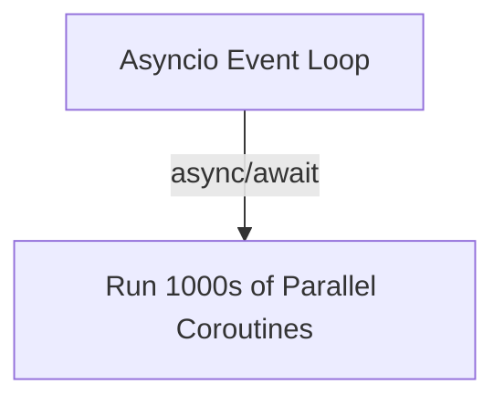
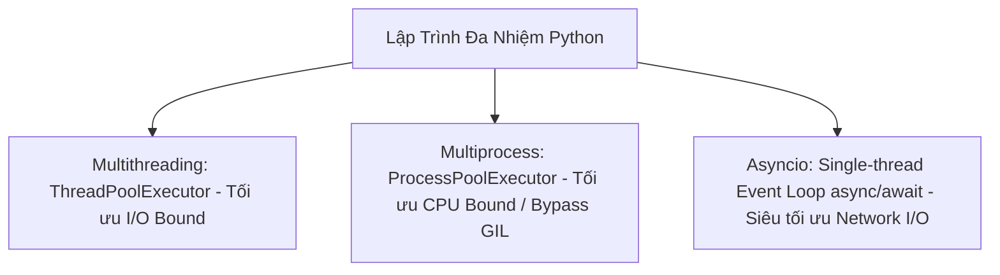

# 🐍 24.Async_Programming_Asyncio_Aiohttp: Lập Trình Bất Đồng Bộ Asyncio, Multithreading & Concurrency - Giáo Trình Python DevOps Chuyên Sâu Cực Chi Tiết

> 💡 **Bản chất 1 câu**: Lập trình đa nhiệm và bất đồng bộ trong Python: Multithreading (`threading`, `ThreadPoolExecutor`), Multiprocessing (Bypass GIL với `ProcessPoolExecutor`), và Async I/O (`asyncio`, `aiohttp`).  
> 🎯 **Trọng tâm thực chiến DevOps**: Nắm vững GIL (Global Interpreter Lock), CPU-bound vs I/O-bound tasks, `async/await`, `asyncio.gather()`, và chạy song song 1,000 HTTP requests trong 2 giây.

---



---

## 2. 📚 Lý Thuyết Chuyên Sâu & Bản Chất Hệ Thống (Under The Hood Architecture)

### 2.1 So Sánh Multithreading, Multiprocessing & Asyncio (OBJ 24.1)



| Phương pháp | Loại công việc phù hợp | Ảnh hưởng bởi GIL? | Số lượng Concurrency tối đa |
| :--- | :--- | :--- | :--- |
| **Multithreading** | I/O-bound (Đọc đĩa, SSH, Socket) | Có (Chỉ 1 thread chạy Python bytecode) | Hàng trăm Threads |
| **Multiprocessing**| **CPU-bound** (Mã hóa, Nén file) | **Không** (Mỗi process có PVM riêng) | Bằng số nhân CPU (`nproc`) |
| **Asyncio** | **Network I/O** (HTTP APIs, Sockets) | Không bị nghẽn I/O (Single-thread Event Loop) | **Hàng chục ngàn Coroutines** |

---

### 2.2 Cơ Chế Single-Thread Event Loop Trong Asyncio
`asyncio` chạy trên một **Event Loop** đơn luồng duy nhất. Khi một hàm `await aiohttp_get()` chờ phản hồi mạng, Event Loop lập tức nhường quyền điều khiển cho Coroutine khác chạy tiếp mà không tốn chi phí Context Switch như Threads!


---

## 3. ⚡ Bảng Tra Cứu Khái Niệm & Hàm / Thư Viện Thực Hành (Reference Table)

| Công cụ / Hàm / Thư viện | Tham số / Module | Ý nghĩa chi tiết bản chất | Ứng dụng thực tế DevOps |
| :--- | :--- | :--- | :--- |
| **`async / await`** | `Asyncio Syntax` | Khai báo hàm bất đồng bộ Coroutine và điểm chờ I/O | `async def fetch_data():` |
| **`asyncio.gather`** | `Asyncio Method` | Chạy song song hàng ngàn Coroutines cùng lúc | `results = await asyncio.gather(*tasks)` |
| **`ThreadPoolExecutor`** | `Concurrent` | Quản lý hồ bơi luồng cho công việc I/O-bound | `with ThreadPoolExecutor(max_workers=20) as executor:` |
| **`aiohttp`** | `Async Library` | Thư viện HTTP Client bất đồng bộ siêu tốc cho Asyncio | `async with aiohttp.ClientSession() as session:` |


---

## 4. 🛠 Thao Tác Thực Chiến & Kịch Bản DevOps Automation (Real-World Production Scripts)

### 🛠 Các đoạn Script Python thực hành chuyên sâu gõ là ăn ngay:
```python
import asyncio
import aiohttp

urls = [f"https://httpbin.org/delay/1" for _ in range(10)]

async def fetch(session, url):
    async with session.get(url) as response:
        return response.status

async def main():
    async with aiohttp.ClientSession() as session:
        tasks = [fetch(session, url) for url in urls]
        # Chạy song song tất cả 10 HTTP requests trong 1 giây:
        results = await asyncio.gather(*tasks)
        print(f"[OK] Fetched {len(results)} URLs concurrently!")

if __name__ == '__main__':
    asyncio.run(main())

```

### 🚀 Kịch bản tự động hóa thực tế khi đi làm (Production DevOps Incident Playbook):
Viết script Python Asyncio gửi 5,000 HTTP requests kiểm tra Health Check cho tất cả các Microservices trong hạ tầng Cloud chỉ mất 3 giây.

---

## 5. 🚀 Bộ Câu Hỏi Phỏng Vấn DevOps Python Thực Tế (Middle-Senior Interview Q&A)

> **Q: Sự khác biệt cốt lõi giữa Multithreading và Asyncio trong Python là gì?**  
> **A**: Multithreading dùng nhiều Threads do OS quản lý (tốn bộ đệm stack RAM và bị vướng GIL). Asyncio dùng 1 Thread duy nhất chạy Event Loop điều phối các Coroutines, cực nhẹ và mở rộng tới hàng ngàn task I/O.

> **Q: Tại sao công việc tính toán nặng CPU (CPU-bound) bắt buộc phải dùng Multiprocessing thay vì Multithreading?**  
> **A**: Vì Python bị vướng khóa **GIL (Global Interpreter Lock)** chỉ cho phép 1 Thread thi hành Python Bytecode tại một thời điểm. Multiprocessing tạo ra các tiến trình độc lập với PVM riêng để tận dụng full 100% tất cả các nhân CPU.


---

## 6. 📝 Cheat Sheet Ghi Nhớ Nhanh (Summary)

- [x] I/O Bound: Dùng Asyncio hoặc Multithreading
- [x] CPU Bound: Dùng Multiprocessing (Bypass GIL)
- [x] async/await: Cú pháp bất đồng bộ Coroutine
- [x] asyncio.gather: Chạy song song hàng ngàn async tasks

