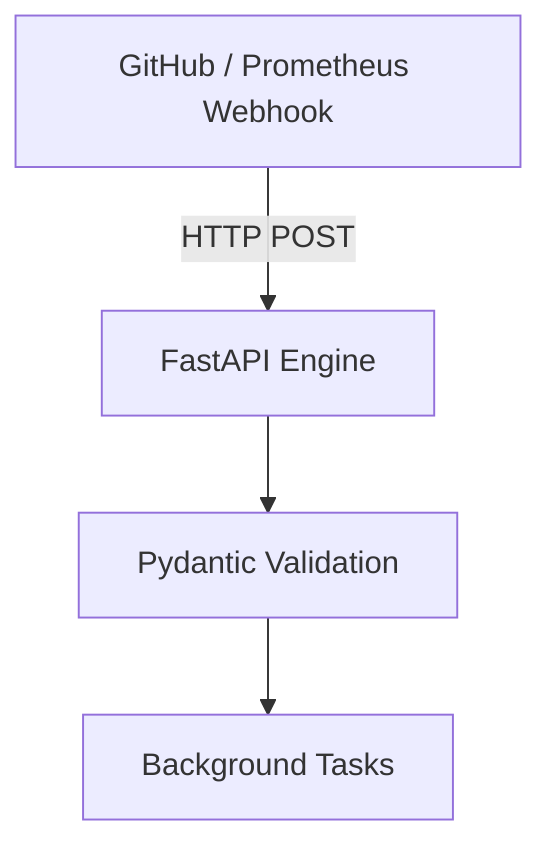
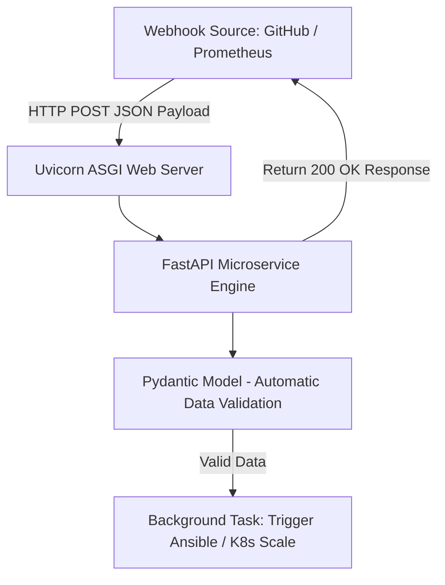

# 🐍 25.Web_Microservices_FastAPI_Pydantic: Xây Dựng Web Microservices Cho DevOps Với FastAPI & Pydantic - Giáo Trình Python DevOps Chuyên Sâu Cực Chi Tiết

> 💡 **Bản chất 1 câu**: Xây dựng Web Microservices mỏng nhẹ cho DevOps: FastAPI & Flask framework (xây dựng Webhook Receivers, Health Check APIs, DevOps Internal Portals, Pydantic data validation, BackgroundTasks, Uvicorn ASGI Server, và Dockerizing Python Microservice).  
> 🎯 **Trọng tâm thực chiến DevOps**: Nắm vững FastAPI `@app.post()`, Pydantic `BaseModel` data validation, Swagger UI (`/docs`), Gunicorn / Uvicorn ASGI Server, Docker multi-stage build cho Python App.

---



---

## 2. 📚 Lý Thuyết Chuyên Sâu & Bản Chất Hệ Thống (Under The Hood Architecture)

### 2.1 Kiến Trúc Web Microservice Với FastAPI & Uvicorn ASGI (OBJ 25.1)



1. **FastAPI Framework**: Web Framework hiện đại dựa trên chuẩn **ASGI**, hỗ trợ `async/await` gốc, tự động tạo OpenAPI / Swagger UI documentation tại `/docs`.
2. **Pydantic**: Thư viện ép kiểu và validate dữ liệu JSON đầu vào cực kỳ mạnh mẽ.
3. **Uvicorn / Gunicorn**: Trình chủ WSGI/ASGI Production Server cho ứng dụng Python.


---

## 3. ⚡ Bảng Tra Cứu Khái Niệm & Hàm / Thư Viện Thực Hành (Reference Table)

| Công cụ / Hàm / Thư viện | Tham số / Module | Ý nghĩa chi tiết bản chất | Ứng dụng thực tế DevOps |
| :--- | :--- | :--- | :--- |
| **`FastAPI`** | `Web Framework` | Framework xây dựng REST API bất đồng bộ siêu tốc | `app = FastAPI()` |
| **`Pydantic.BaseModel`** | `Validation` | Định nghĩa Schema validate kiểu dữ liệu JSON đầu vào | `class WebhookPayload(BaseModel):` |
| **`Uvicorn`** | `ASGI Server` | Web server Production chạy ứng dụng FastAPI bất đồng bộ | `uvicorn main:app --host 0.0.0.0 --port 8000` |
| **`BackgroundTasks`** | `FastAPI Feature` | Chạy task ngầm xử lý sau khi đã trả về HTTP response | `background_tasks.add_task(run_script)` |


---

## 4. 🛠 Thao Tác Thực Chiến & Kịch Bản DevOps Automation (Real-World Production Scripts)

### 🛠 Các đoạn Script Python thực hành chuyên sâu gõ là ăn ngay:
```python
from fastapi import FastAPI, BackgroundTasks
from pydantic import BaseModel

app = FastAPI(title="DevOps Webhook Receiver")

class AlertPayload(BaseModel):
    alert_name: str
    severity: str
    instance: str

def trigger_auto_healing(instance: str):
    print(f"[AUTO-HEAL] Restarting service on instance: {instance}")

@app.post("/webhook/alert")
async def receive_alert(payload: AlertPayload, bg_tasks: BackgroundTasks):
    print(f"[RECEIVED ALERT] {payload.alert_name} on {payload.instance}")
    if payload.severity == "critical":
        bg_tasks.add_task(trigger_auto_healing, payload.instance)
    return {"status": "accepted", "instance": payload.instance}

```

### 🚀 Kịch bản tự động hóa thực tế khi đi làm (Production DevOps Incident Playbook):
Xây dựng Web Microservice bằng FastAPI đóng gói thành Docker Container chạy trong Kubernetes để tiếp nhận Webhook từ Alertmanager và tự động scale up số lượng Pods.

---

## 5. 🚀 Bộ Câu Hỏi Phỏng Vấn DevOps Python Thực Tế (Middle-Senior Interview Q&A)

> **Q: Tại sao FastAPI lại được ưu tiên lựa chọn hơn Flask khi xây dựng Microservices thế hệ mới?**  
> **A**: Vì FastAPI hỗ trợ sẵn lập trình bất đồng bộ (`async/await`), tự động validate dữ liệu với Pydantic, tốc độ thực thi nhanh ngang NGINX/NodeJS và tự tạo tài liệu Swagger UI tự động.

> **Q: Vai trò của `BackgroundTasks` trong FastAPI là gì?**  
> **A**: Cho phép trả về phản hồi HTTP 200 OK ngay lập tức cho bên gửi (như GitHub/Prometheus) và đẩy công việc nặng (như chạy script Ansible) xuống hàng chờ xử lý ngầm, tránh gây timeout request.


---

## 6. 📝 Cheat Sheet Ghi Nhớ Nhanh (Summary)

- [x] FastAPI: Web Framework ASGI siêu tốc cho Microservices
- [x] Pydantic: Validate dữ liệu JSON tự động
- [x] Uvicorn: Production ASGI Server
- [x] BackgroundTasks: Chạy task tự động hóa ngầm
- [x] Docker Multi-stage Build cho Python App

