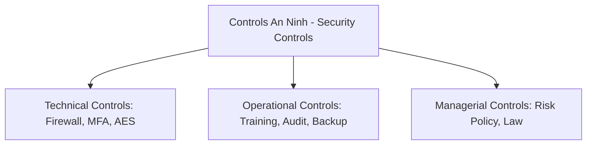
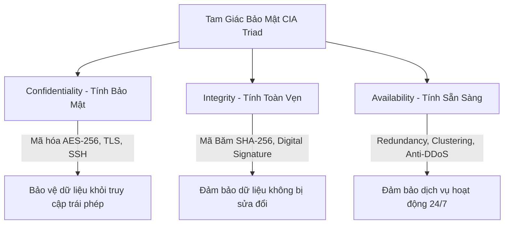
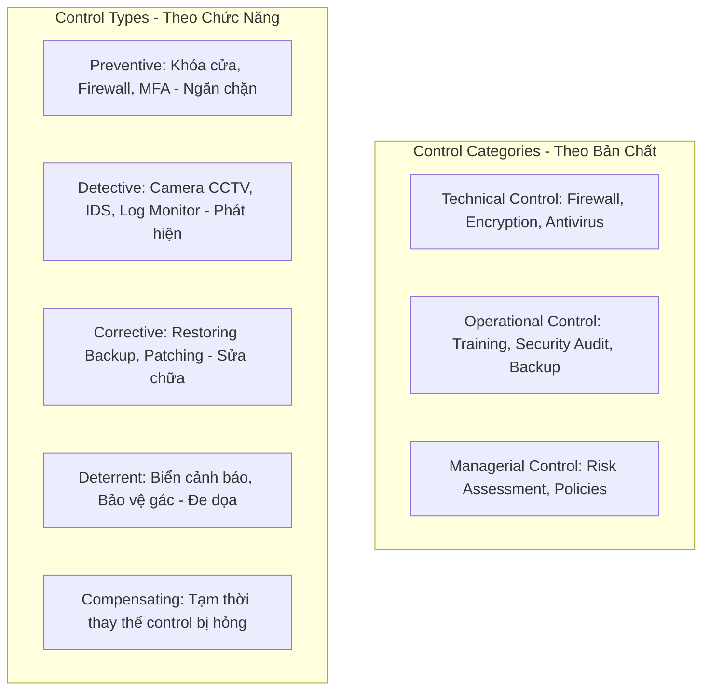

# 🛡 01.Security_Fundamentals: Khái Niệm Bảo Mật Cốt Lõi, Tam Giác CIA, AAA & Zero Trust - Chuyên Sâu CompTIA Security+ Cho DevSecOps

> 💡 **Bản chất 1 câu**: Bảo mật thông tin dựa trên 3 trụ cột CIA (Confidentiality, Integrity, Availability), Không chối bỏ (Non-repudiation), Mô hình AAA và Nguyên tắc Zero Trust.  
> 🎯 **Trọng tâm thực chiến DevSecOps**: Thành thạo CIA Triad, Security Control Categories (Technical, Operational, Managerial), Control Types (Preventive, Detective, Corrective) và Zero Trust Architecture.

---




---

## 2. 📚 Lý Thuyết Chuyên Sâu & Bản Chất Hệ Thống (Under The Hood Architecture)

### 2.1 Tam Giác Bảo Mật Cốt Lõi CIA Triad & Non-Repudiation (OBJ 1.2)



1. **Confidentiality (Tính Bảo Mật)**: Đảm bảo dữ liệu không bị lộ cho người không có thẩm quyền (Mã hóa SSL/TLS, AES-256, Phân quyền RBAC).
2. **Integrity (Tính Toàn Vẹn)**: Đảm bảo dữ liệu chính xác và không bị thay đổi lén lút (Hashing SHA-256, Chữ ký số Digital Signature).
3. **Availability (Tính Sẵn Sàng)**: Đảm bảo hệ thống luôn truy cập được khi cần (Load Balancers, Cluster HA, Backup).
4. **Non-Repudiation (Tính Không Chối Bỏ)**: Đảm bảo người gửi không thể phủ nhận đã gửi thông điệp nhờ chữ ký số PKI và Audit Logging.

---

### 2.2 Phân Loại Kiểm Soát An Ninh (Security Controls - OBJ 1.1)



---

### 2.3 Kiến Trúc Zero Trust (Zero Trust Architecture - OBJ 1.2)
- Triết lý cốt lõi: **"Never Trust, Always Verify"** (Không bao giờ tin tưởng, luôn luôn xác thực).
- Nguyên tắc: Cấp quyền tối thiểu (Least Privilege), Giả định hệ thống đã bị xâm nhập (Assume Breach), Xác thực liên tục dựa theo ngữ cảnh (Context-aware authentication).


---


### 2.4 Cơ Chế Hoạt Động Bên Dưới Kernel & Kiến Trúc Hệ Thống Chi Tiết (Deep Under The Hood Architecture)
- **Tầng Giao Tiếp Mạng & Bắt Gói Tin**: Mọi gói tin đi qua Network Interface Card (NIC) đều trải qua quá trình xử lý Ring Buffer, ngắt phần cứng (Hardware Interrupts), Ring Buffer DMA và chồng giao thức Socket Buffers (`sk_buff`) trong Linux Kernel.
- **Tối Ưu Hóa & Cấu Trúc Dữ Liệu**: Hệ thống duy trì các bảng băm dữ liệu (Routing Table, ARP Cache Table, Connection Tracking Table `conntrack`, Socket Inode Tables) giúp chuyển tiếp gói tin ở tốc độ dây (Line-rate processing).
- **Phân Lập An Ninh & Phân Vùng**: Sử dụng cơ chế Linux Network Namespaces (`ip netns`), iptables/nftables hooks và mã hóa phần cứng để cách ly lưu lượng mạng tuyệt đối.

---

## 3. ⚡ Bảng Tra Cứu Khái Niệm & Câu Lệnh Thực Hành (Reference Table)

| Công cụ / Khái niệm / Lệnh | Phân loại / Standard | Ý nghĩa chi tiết bản chất | Ứng dụng thực tế DevSecOps |
| :--- | :--- | :--- | :--- |
| **`CIA Triad`** | `Core Principle` | Confidentiality - Integrity - Availability | `Trụ cột thiết kế an ninh mạng` |
| **`Non-Repudiation`** | `PKI Concept` | Tính không thể chối bỏ hành vi nhờ chữ ký số và log | `Xác thực giao dịch ngân hàng` |
| **`Technical Control`** | `Category` | Biện pháp bảo mật bằng công nghệ phần cứng/mềm | `Firewall, MFA, Mã hóa AES` |
| **`Preventive Control`** | `Type` | Biện pháp chủ động ngăn chặn đe dọa xảy ra | `Khóa cửa, Firewall, MFA` |
| **`Zero Trust`** | `Framework` | Nguyên tắc Không tin tưởng bất kỳ ai, luôn luôn xác thực | `Kiến trúc an ninh Cloud/K8s` |


---

## 4. 🛠 Thao Tác Thực Chiến & Kịch Bản SecOps (Real-World Scenarios)

### 🛠 Các lệnh & công cụ thực hành gõ là ăn ngay:
```bash
# Kiểm tra hash SHA-256 xác minh tính toàn vẹn (Integrity) của file binary:
sha256sum kubectl

# Audit bảng điều khiển UFW Firewall (Preventive Technical Control):
sudo ufw status verbose
```

### 🚀 Kịch bản xử lý sự cố thực tế khi đi làm (Incident Response Playbook):
Sự cố hệ thống bị mất tính Availability do tấn công làm kiệt quệ tài nguyên -> Kích hoạt Load Balancer và Anti-DDoS Mitigation.

---


### 4.2 Chi Tiết Các Lỗi Thường Gặp & Kịch Bản Khắc Phục Lỗi (Troubleshooting Deep-Dive)
1. **Sự cố 1: Lỗi Mất Gói Tin & Mất Kết Nối Cổng Mạng (Packet Loss & Port Unreachable)**:
   - **Triệu chứng**: Gửi HTTP Request bị Timeout, SSH không kết nối được hoặc gói tin bị nảy rải rác.
   - **Các bước xử lý khẩn cấp**:
     ```bash
     # 1. Kiểm tra trạng thái cổng mạng TCP/UDP đang lắng nghe:
     sudo ss -tulpn | grep :80
     
     # 2. Bắt gói tin trực tiếp trên Interface để kiểm tra bắt tay 3 bước TCP:
     sudo tcpdump -i eth0 port 80 -nn -vv
     
     # 3. Phân tích đường đi của gói tin tìm điểm đứt gãy bằng MTR:
     mtr -n --report --report-cycles=10 8.8.8.8
     
     # 4. Kiểm tra xem gói tin có bị Firewall Drop không:
     sudo iptables -L -n -v | grep DROP
     ```

2. **Sự cố 2: Lỗi Sai Cấu Hình DNS & Chuyển Tiếp IP (DNS Resolution & IP Routing Error)**:
   - **Triệu chứng**: Ping IP thành công nhưng ping Domain Name báo `Could not resolve host`.
   - **Các bước xử lý khẩn cấp**:
     ```bash
     # 1. Tra cứu thử nghiệm phân giải DNS qua server cụ thể:
     dig @8.8.8.8 company.com +trace
     
     # 2. Kiểm tra file cấu hình DNS resolver địa phương:
     cat /etc/resolv.conf
     
     # 3. Kiểm tra bảng định tuyến Kernel IP Routing Table:
     ip route show default
     ```

---

## 5. 🚀 Bộ Câu Hỏi Phỏng Vấn DevSecOps & Security Thực Tế (Interview Q&A)

> **Q: Sự khác biệt giữa Technical Control và Operational Control là gì?**  
> **A**: Technical Control sử dụng công nghệ phần cứng/mềm (Firewall, Encryption). Operational Control sử dụng quy trình quản lý con người (Training, Audit, Backup).

> **Q: Triết lý cốt lõi của Zero Trust Architecture là gì?**  
> **A**: Triết lý 'Never Trust, Always Verify' (Không bao giờ tin tưởng bất kỳ kết nối nào kể cả từ mạng nội bộ, luôn luôn xác thực và cấp quyền tối thiểu).


> **Q: Làm thế nào để điều tra và dập tắt sự cố một Server bị tấn công làm tràn bộ đệm kết nối TCP SYN Flood DoS?**  
> **A**:  
> 1. **Nhận biết**: Lệnh `ss -ant | grep SYN_RECV | wc -l` trả về hàng ngàn kết nối ở trạng thái `SYN_RECV`.  
> 2. **Xử lý khẩn cấp**: Bật ngay cơ chế **SYN Cookies** của Linux Kernel bằng lệnh `sudo sysctl -w net.ipv4.tcp_syncookies=1`. Kích hoạt bộ lọc Firewall drop các gói tin SYN có tần suất bất thường: `sudo iptables -A INPUT -p tcp --syn -m limit --limit 1/s --limit-burst 3 -j ACCEPT`.

> **Q: Sự khác biệt về mặt bản chất giữa Stateful Firewall và Stateless Firewall là gì?**  
> **A**: Stateless Firewall chỉ kiểm tra từng gói tin riêng rẻ dựa trên IP nguồn/đích và Port mà KHÔNG nhớ ngữ cảnh. Stateful Firewall duy trì một bảng theo dõi trạng thái kết nối (**Connection Tracking Table `conntrack`**), tự động nhận diện gói tin thuộc về một kết nối hợp lệ đã được chấp nhận trước đó (như trạng thái `ESTABLISHED,RELATED`), giúp bảo mật và tối ưu hiệu năng vượt trội.

---

## 6. 📝 Cheat Sheet Ghi Nhớ Nhanh (Summary)

- [x] CIA: Confidentiality - Integrity - Availability
- [x] Non-repudiation: Không thể chối bỏ (Digital Signature)
- [x] Control Categories: Technical, Operational, Managerial
- [x] Control Types: Preventive, Detective, Corrective
- [x] Zero Trust: Never Trust, Always Verify

