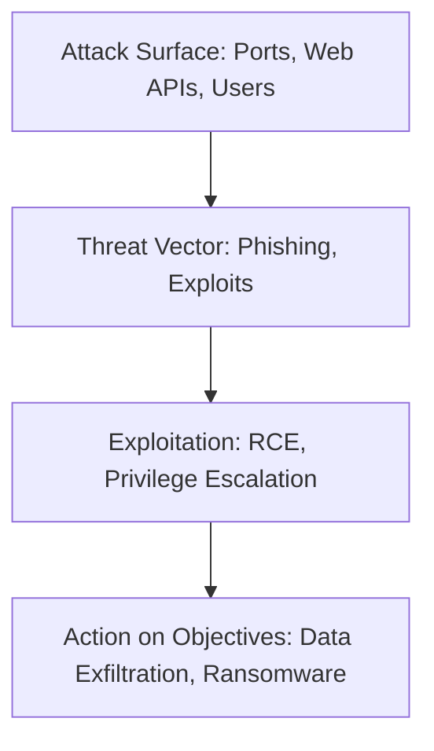
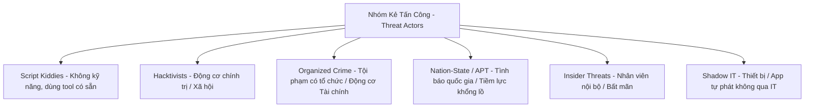

# 🛡 02.Threat_Actors_and_Attack_Surfaces: Kẻ Tấn Công (Threat Actors), Động Cơ & Bề Mặt Tấn Công - Chuyên Sâu CompTIA Security+ Cho DevSecOps

> 💡 **Bản chất 1 câu**: Phân loại các nhóm tấn công (Script Kiddies, Hacktivists, APT, Insiders, Shadow IT), Động cơ, Vector tấn công và Bề mặt tấn công (Attack Surface).  
> 🎯 **Trọng tâm thực chiến DevSecOps**: Phân biệt Script Kiddies vs Hacktivists vs Advanced Persistent Threats (APTs) vs Insider Threats, Supply Chain Attacks và Attack Surface Reduction.

---




---

## 2. 📚 Lý Thuyết Chuyên Sâu & Bản Chất Hệ Thống (Under The Hood Architecture)

### 2.1 Các Nhóm Kẻ Tấn Công (Threat Actor Types - OBJ 2.1)



| Threat Actor | Trình độ (Skill Level) | Động cơ (Motivation) | Tài nguyên (Resources) | Đặc điểm tiêu biểu |
| :--- | :--- | :--- | :--- | :--- |
| **Script Kiddies** | Thấp (Unskilled) | Tìm sự nổi tiếng / Tò mò | Thấp | Chạy các script có sẵn trên Github |
| **Hacktivists** | Trung bình | Chính trị / Ideology | Trung bình | Biến đổi giao diện Web (Defacement), DDoS |
| **Organized Crime** | Cao | **Tài chính / Tiền tệ** | Cao | Tấn công Ransomware, tống tiền, trộm credit card |
| **Nation-State (APT)**| Cực cao | Tình báo / Phá hoại quân sự| **Khổng lồ (Chính phủ)** | Nằm vùng bí mật nhiều năm, Zero-day exploits |
| **Insider Threat** | Thay đổi | Trả thù / Tiền / Sơ suất | Trung bình | Có sẵn quyền truy cập hợp lệ vào nội bộ |

---

### 2.2 Vector Tấn Công & Thu Hẹp Bề Mặt Tấn Công (Attack Surface Reduction)
- **Threat Vector**: Đường dẫn/Phương tiện kẻ tấn công dùng để xâm nhập (Email Phishing, Unpatched Open Ports, USB, Supply Chain).
- **Attack Surface**: Tổng số tất cả các điểm yếu/cổng mở có thể bị tấn công.
- **Attack Surface Reduction (ASR)**: Tắt các service không dùng, đóng port dư thừa, gỡ bỏ phần mềm rác.


---


### 2.4 Cơ Chế Hoạt Động Bên Dưới Kernel & Kiến Trúc Hệ Thống Chi Tiết (Deep Under The Hood Architecture)
- **Tầng Giao Tiếp Mạng & Bắt Gói Tin**: Mọi gói tin đi qua Network Interface Card (NIC) đều trải qua quá trình xử lý Ring Buffer, ngắt phần cứng (Hardware Interrupts), Ring Buffer DMA và chồng giao thức Socket Buffers (`sk_buff`) trong Linux Kernel.
- **Tối Ưu Hóa & Cấu Trúc Dữ Liệu**: Hệ thống duy trì các bảng băm dữ liệu (Routing Table, ARP Cache Table, Connection Tracking Table `conntrack`, Socket Inode Tables) giúp chuyển tiếp gói tin ở tốc độ dây (Line-rate processing).
- **Phân Lập An Ninh & Phân Vùng**: Sử dụng cơ chế Linux Network Namespaces (`ip netns`), iptables/nftables hooks và mã hóa phần cứng để cách ly lưu lượng mạng tuyệt đối.

---

## 3. ⚡ Bảng Tra Cứu Khái Niệm & Câu Lệnh Thực Hành (Reference Table)

| Công cụ / Khái niệm / Lệnh | Phân loại / Standard | Ý nghĩa chi tiết bản chất | Ứng dụng thực tế DevSecOps |
| :--- | :--- | :--- | :--- |
| **`APT`** | `Nation-State` | Kẻ tấn công có sự tài trợ của quốc gia nằm vùng lâu dài | `Tấn công mạng lưới điện / Tình báo quốc phòng` |
| **`Insider Threat`** | `Internal Threat` | Mối đe dọa từ chính nhân viên nội bộ bất mãn | `Rò rỉ dữ liệu qua USB / Email cá nhân` |
| **`Shadow IT`** | `Unauthorized IT` | Thiết bị hoặc phần mềm tự phát không qua IT phê duyệt | `Dùng Dropbox cá nhân lưu code công ty` |
| **`Attack Surface`** | `Security Concept` | Tổng số điểm có thể bị khai thác trong hệ thống | `Thu hẹp bề mặt tấn công bằng cách đóng Port` |


---

## 4. 🛠 Thao Tác Thực Chiến & Kịch Bản SecOps (Real-World Scenarios)

### 🛠 Các lệnh & công cụ thực hành gõ là ăn ngay:
```bash
# Thu hẹp bề mặt tấn công (ASR): Kiểm tra các Port mở không cần thiết để đóng bớt:
sudo nmap -sT -O localhost

# Tìm phần mềm không được duyệt (Shadow IT / Unapproved SUID binaries):
sudo find / -perm -4000 -type f
```

### 🚀 Kịch bản xử lý sự cố thực tế khi đi làm (Incident Response Playbook):
Sự cố hệ thống bị nhiễm Ransomware do nhà cung cấp phần mềm bên thứ 3 bị hack (Supply Chain Attack) -> Cô lập ngay các kênh kết nối bên thứ 3 và thu hồi API Key.

---


### 4.2 Chi Tiết Các Lỗi Thường Gặp & Kịch Bản Khắc Phục Lỗi (Troubleshooting Deep-Dive)
1. **Sự cố 1: Lỗi Mất Gói Tin & Mất Kết Nối Cổng Mạng (Packet Loss & Port Unreachable)**:
   - **Triệu chứng**: Gửi HTTP Request bị Timeout, SSH không kết nối được hoặc gói tin bị nảy rải rác.
   - **Các bước xử lý khẩn cấp**:
     ```bash
     # 1. Kiểm tra trạng thái cổng mạng TCP/UDP đang lắng nghe:
     sudo ss -tulpn | grep :80
     
     # 2. Bắt gói tin trực tiếp trên Interface để kiểm tra bắt tay 3 bước TCP:
     sudo tcpdump -i eth0 port 80 -nn -vv
     
     # 3. Phân tích đường đi của gói tin tìm điểm đứt gãy bằng MTR:
     mtr -n --report --report-cycles=10 8.8.8.8
     
     # 4. Kiểm tra xem gói tin có bị Firewall Drop không:
     sudo iptables -L -n -v | grep DROP
     ```

2. **Sự cố 2: Lỗi Sai Cấu Hình DNS & Chuyển Tiếp IP (DNS Resolution & IP Routing Error)**:
   - **Triệu chứng**: Ping IP thành công nhưng ping Domain Name báo `Could not resolve host`.
   - **Các bước xử lý khẩn cấp**:
     ```bash
     # 1. Tra cứu thử nghiệm phân giải DNS qua server cụ thể:
     dig @8.8.8.8 company.com +trace
     
     # 2. Kiểm tra file cấu hình DNS resolver địa phương:
     cat /etc/resolv.conf
     
     # 3. Kiểm tra bảng định tuyến Kernel IP Routing Table:
     ip route show default
     ```

---

## 5. 🚀 Bộ Câu Hỏi Phỏng Vấn DevSecOps & Security Thực Tế (Interview Q&A)

> **Q: Sự khác biệt giữa Script Kiddies và Nation-State APTs là gì?**  
> **A**: Script Kiddies không có kỹ năng, dùng tool có sẵn với động cơ tò mò. APTs là nhóm hacker trình độ cao do quốc gia tài trợ, nằm vùng lâu dài với tài nguyên vô hạn.

> **Q: Shadow IT gây ra rủi ro an ninh mạng nào cho doanh nghiệp?**  
> **A**: Shadow IT tạo ra các điểm đứt gãy an toàn thông tin nằm ngoài tầm kiểm soát của đội IT/Security, dễ bị khai thác mà không có log audit.


> **Q: Làm thế nào để điều tra và dập tắt sự cố một Server bị tấn công làm tràn bộ đệm kết nối TCP SYN Flood DoS?**  
> **A**:  
> 1. **Nhận biết**: Lệnh `ss -ant | grep SYN_RECV | wc -l` trả về hàng ngàn kết nối ở trạng thái `SYN_RECV`.  
> 2. **Xử lý khẩn cấp**: Bật ngay cơ chế **SYN Cookies** của Linux Kernel bằng lệnh `sudo sysctl -w net.ipv4.tcp_syncookies=1`. Kích hoạt bộ lọc Firewall drop các gói tin SYN có tần suất bất thường: `sudo iptables -A INPUT -p tcp --syn -m limit --limit 1/s --limit-burst 3 -j ACCEPT`.

> **Q: Sự khác biệt về mặt bản chất giữa Stateful Firewall và Stateless Firewall là gì?**  
> **A**: Stateless Firewall chỉ kiểm tra từng gói tin riêng rẻ dựa trên IP nguồn/đích và Port mà KHÔNG nhớ ngữ cảnh. Stateful Firewall duy trì một bảng theo dõi trạng thái kết nối (**Connection Tracking Table `conntrack`**), tự động nhận diện gói tin thuộc về một kết nối hợp lệ đã được chấp nhận trước đó (như trạng thái `ESTABLISHED,RELATED`), giúp bảo mật và tối ưu hiệu năng vượt trội.

---

## 6. 📝 Cheat Sheet Ghi Nhớ Nhanh (Summary)

- [x] Script Kiddies: Dùng tool có sẵn
- [x] Hacktivists: Động cơ chính trị/ideology
- [x] Organized Crime: Động cơ tiền bạc (Ransomware)
- [x] APT: Do quốc gia tài trợ, nằm vùng lâu dài
- [x] Insider Threat: Nhân viên nội bộ
- [x] ASR: Thu hẹp bề mặt tấn công

