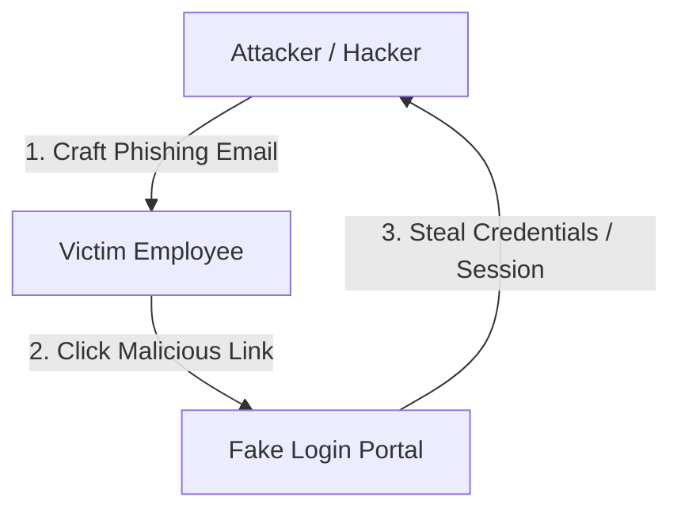
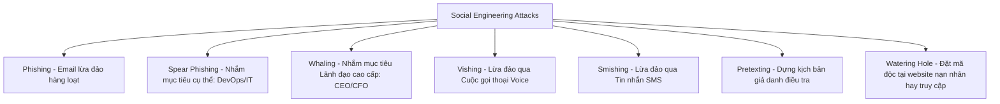

# 🛡 03.Physical_Security_and_Social_Engineering: An Ninh Vật Lý & Các Cuộc Tấn Công Kỹ Thuật Xã Hội - Chuyên Sâu CompTIA Security+ Cho DevSecOps

> 💡 **Bản chất 1 câu**: Kiểm soát an ninh vật lý (Mantraps, CCTV, Faraday Cages) và các kỹ thuật tấn công Social Engineering (Phishing, Spear Phishing, Whaling, Pretexting, Impersonation).  
> 🎯 **Trọng tâm thực chiến DevSecOps**: Hiểu rõ Phishing vs Spear Phishing vs Whaling vs Vishing vs Smishing, Pretexting, Water Hole, Baiting, Dumpster Diving, Shoulder Surfing và giải pháp phòng chống.

---




---

## 2. 📚 Lý Thuyết Chuyên Sâu & Bản Chất Hệ Thống (Under The Hood Architecture)

### 2.1 Các Hình Thức Tấn Công Kỹ Thuật Xã Hội (Social Engineering - OBJ 2.2)



1. **Phishing**: Gửi email lừa đảo hàng loạt giả danh ngân hàng/dịch vụ để trộm Credential.
2. **Spear Phishing**: Tấn công nhắm vào cá nhân/nhóm cụ thể (Ví dụ: Gửi email giả chứa file đính kèm độc hại cho riêng đội DevOps).
3. **Whaling**: Tấn công nhắm vào các "Cá voi" - Lãnh đạo cấp cao (CEO, CFO) để chuyển tiền chuyển khoản lừa đảo.
4. **Watering Hole Attack**: Kẻ tấn công cài cắm mã độc vào một Website mà nhóm mục tiêu thường xuyên truy cập (như diễn đàn kỹ thuật).
5. **Tailgating / Piggybacking**: Đi ké ngay sau lưng nhân viên hợp lệ để chui qua cửa an ninh.

---

### 2.2 An Ninh Vật Lý (Physical Security Controls - OBJ 1.2)
- **Access Control Vestibule / Mantrap**: Cổng bảo vệ 2 lớp cửa (Cửa A mở thì Cửa B tự khóa) để ngăn Tailgating.
- **Faraday Cage**: Lồng kim loại ngăn chặn sóng vô tuyến/điện từ rò rỉ ra ngoài.
- **Bollards**: Cọc bê tông/thép chặn xe tải đâm vào tòa nhà.


---


### 2.4 Cơ Chế Hoạt Động Bên Dưới Kernel & Kiến Trúc Hệ Thống Chi Tiết (Deep Under The Hood Architecture)
- **Tầng Giao Tiếp Mạng & Bắt Gói Tin**: Mọi gói tin đi qua Network Interface Card (NIC) đều trải qua quá trình xử lý Ring Buffer, ngắt phần cứng (Hardware Interrupts), Ring Buffer DMA và chồng giao thức Socket Buffers (`sk_buff`) trong Linux Kernel.
- **Tối Ưu Hóa & Cấu Trúc Dữ Liệu**: Hệ thống duy trì các bảng băm dữ liệu (Routing Table, ARP Cache Table, Connection Tracking Table `conntrack`, Socket Inode Tables) giúp chuyển tiếp gói tin ở tốc độ dây (Line-rate processing).
- **Phân Lập An Ninh & Phân Vùng**: Sử dụng cơ chế Linux Network Namespaces (`ip netns`), iptables/nftables hooks và mã hóa phần cứng để cách ly lưu lượng mạng tuyệt đối.

---

## 3. ⚡ Bảng Tra Cứu Khái Niệm & Câu Lệnh Thực Hành (Reference Table)

| Công cụ / Khái niệm / Lệnh | Phân loại / Standard | Ý nghĩa chi tiết bản chất | Ứng dụng thực tế DevSecOps |
| :--- | :--- | :--- | :--- |
| **`Spear Phishing`** | `Social Attack` | Email lừa đảo nhắm mục tiêu cá nhân/kỹ sư cụ thể | `Giả email Admin gửi file đính kèm cho DevOps` |
| **`Whaling`** | `Social Attack` | Email lừa đảo nhắm vào Giám đốc/CEO tống tiền | `Giả CEO yêu cầu kế toán chuyển khoản khẩn` |
| **`Watering Hole`** | `Social Attack` | Cài mã độc lên website mà mục tiêu hay truy cập | `Hack diễn đàn kỹ thuật nội bộ` |
| **`Mantrap`** | `Physical Control` | Cổng an ninh 2 lớp cửa chống đi ké Tailgating | `Cửa vào Datacenter phòng Server` |
| **`Faraday Cage`** | `Physical Control` | Lồng chống rò rỉ sóng điện từ và nghe lén Wi-Fi | `Phòng họp bảo mật quốc phòng` |


---

## 4. 🛠 Thao Tác Thực Chiến & Kịch Bản SecOps (Real-World Scenarios)

### 🛠 Các lệnh & công cụ thực hành gõ là ăn ngay:
```bash
# Triển khai giải pháp xác thực Email SPF/DKIM/DMARC chống giả mạo Domain:
dig company.com TXT +short
```

### 🚀 Kịch bản xử lý sự cố thực tế khi đi làm (Incident Response Playbook):
Sự cố nhân viên bị lừa đảo Phishing nhấp vào link giả mạo lộ password -> Đội SecOps kích hoạt Revoke Session, Reset Password và bắt buộc bật FIDO2 MFA.

---


### 4.2 Chi Tiết Các Lỗi Thường Gặp & Kịch Bản Khắc Phục Lỗi (Troubleshooting Deep-Dive)
1. **Sự cố 1: Lỗi Mất Gói Tin & Mất Kết Nối Cổng Mạng (Packet Loss & Port Unreachable)**:
   - **Triệu chứng**: Gửi HTTP Request bị Timeout, SSH không kết nối được hoặc gói tin bị nảy rải rác.
   - **Các bước xử lý khẩn cấp**:
     ```bash
     # 1. Kiểm tra trạng thái cổng mạng TCP/UDP đang lắng nghe:
     sudo ss -tulpn | grep :80
     
     # 2. Bắt gói tin trực tiếp trên Interface để kiểm tra bắt tay 3 bước TCP:
     sudo tcpdump -i eth0 port 80 -nn -vv
     
     # 3. Phân tích đường đi của gói tin tìm điểm đứt gãy bằng MTR:
     mtr -n --report --report-cycles=10 8.8.8.8
     
     # 4. Kiểm tra xem gói tin có bị Firewall Drop không:
     sudo iptables -L -n -v | grep DROP
     ```

2. **Sự cố 2: Lỗi Sai Cấu Hình DNS & Chuyển Tiếp IP (DNS Resolution & IP Routing Error)**:
   - **Triệu chứng**: Ping IP thành công nhưng ping Domain Name báo `Could not resolve host`.
   - **Các bước xử lý khẩn cấp**:
     ```bash
     # 1. Tra cứu thử nghiệm phân giải DNS qua server cụ thể:
     dig @8.8.8.8 company.com +trace
     
     # 2. Kiểm tra file cấu hình DNS resolver địa phương:
     cat /etc/resolv.conf
     
     # 3. Kiểm tra bảng định tuyến Kernel IP Routing Table:
     ip route show default
     ```

---

## 5. 🚀 Bộ Câu Hỏi Phỏng Vấn DevSecOps & Security Thực Tế (Interview Q&A)

> **Q: Sự khác biệt giữa Phishing, Spear Phishing và Whaling là gì?**  
> **A**: Phishing gửi email lừa đảo diện rộng. Spear Phishing nhắm mục tiêu cá nhân/đội nhóm cụ thể. Whaling nhắm riêng vào các lãnh đạo cao cấp (CEO, CFO).

> **Q: Cổng Mantrap (Access Control Vestibule) ngăn chặn hình thức tấn công an ninh vật lý nào?**  
> **A**: Ngăn chặn hình thức **Tailgating / Piggybacking** (đi ké sau lưng người khác để chui vào vùng cấm).


> **Q: Làm thế nào để điều tra và dập tắt sự cố một Server bị tấn công làm tràn bộ đệm kết nối TCP SYN Flood DoS?**  
> **A**:  
> 1. **Nhận biết**: Lệnh `ss -ant | grep SYN_RECV | wc -l` trả về hàng ngàn kết nối ở trạng thái `SYN_RECV`.  
> 2. **Xử lý khẩn cấp**: Bật ngay cơ chế **SYN Cookies** của Linux Kernel bằng lệnh `sudo sysctl -w net.ipv4.tcp_syncookies=1`. Kích hoạt bộ lọc Firewall drop các gói tin SYN có tần suất bất thường: `sudo iptables -A INPUT -p tcp --syn -m limit --limit 1/s --limit-burst 3 -j ACCEPT`.

> **Q: Sự khác biệt về mặt bản chất giữa Stateful Firewall và Stateless Firewall là gì?**  
> **A**: Stateless Firewall chỉ kiểm tra từng gói tin riêng rẻ dựa trên IP nguồn/đích và Port mà KHÔNG nhớ ngữ cảnh. Stateful Firewall duy trì một bảng theo dõi trạng thái kết nối (**Connection Tracking Table `conntrack`**), tự động nhận diện gói tin thuộc về một kết nối hợp lệ đã được chấp nhận trước đó (như trạng thái `ESTABLISHED,RELATED`), giúp bảo mật và tối ưu hiệu năng vượt trội.

---

## 6. 📝 Cheat Sheet Ghi Nhớ Nhanh (Summary)

- [x] Phishing: Email diện rộng
- [x] Spear Phishing: Nhắm mục tiêu cụ thể
- [x] Whaling: Nhắm CEO/CFO
- [x] Watering Hole: Hack website mục tiêu hay vào
- [x] Mantrap: Cửa 2 lớp chống Tailgating
- [x] Faraday Cage: Chống rò sóng vô tuyến

