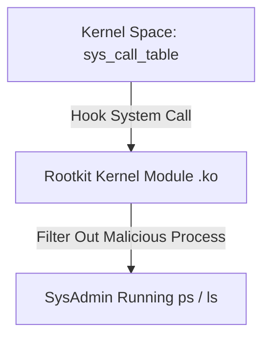
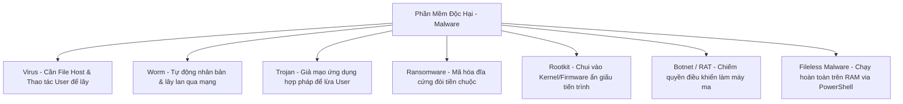

# 🛡 04.Malware_Threats: Phần Mềm Độc Hạ (Malware Types & Behavioral Mechanics) - Chuyên Sâu CompTIA Security+ Cho DevSecOps

> 💡 **Bản chất 1 câu**: Phân tích chuyên sâu các loại Malware: Viruses, Worms, Trojans, Ransomware, Spyware, Keyloggers, Rootkits, Logic Bombs, Botnets và Fileless Malware.  
> 🎯 **Trọng tâm thực chiến DevSecOps**: Nắm vững sự khác nhau giữa Virus (Cần host file + tác động người dùng) vs Worm (Tự lây lan qua mạng) vs Trojan (Núp bóng phần mềm sạch) vs Rootkit (Nằm ở Kernel/Firmware để ẩn giấu).

---




---

## 2. 📚 Lý Thuyết Chuyên Sâu & Bản Chất Hệ Thống (Under The Hood Architecture)

### 2.1 Phân Loại Phần Mềm Độc hại (Malware Categories - OBJ 2.2)



| Loại Malware | Cơ chế lây lan (Propagation) | Mục đích / Tác hại | Cách phát hiện & Phòng thủ |
| :--- | :--- | :--- | :--- |
| **Virus** | Cần chèn vào File Host + User chạy file | Sửa đổi/Xóa dữ liệu, làm chậm máy | Antivirus, File Integrity Monitoring (FIM) |
| **Worm** | **Tự động quét và lây qua lỗ hổng mạng** | Bão hòa băng thông, lây nhiễm toàn LAN | Patch Management, Network Segmentation |
| **Trojan** | Núp bóng phần mềm crack/utility hợp pháp | Mở cổng hậu Backdoor, tải thêm mã độc | Đăng ký phần mềm bản quyền, EDR |
| **Ransomware** | Mã hóa toàn bộ dữ liệu bằng AES/RSA | Tống tiền bằng Crypto mới giải mã | **Offline Backup**, Endpoint Protection |
| **Rootkit** | Thay thế System Calls tại Kernel Space | **Ẩn giấu hoàn toàn tiến trình/file độc hại**| Boot Guard, Volatility Memory Forensics |
| **Fileless** | Chạy trong bộ nhớ RAM via PowerShell/WMI | Không ghi file ra đĩa cứng để tránh Antivirus| Memory Scanning, Constrained Language Mode |

---

### 2.2 Cơ Chế Hoạt Động Của Rootkit Tại Kernel Level
Rootkit chèn các **Loadable Kernel Modules (LKM)** hoặc hooks vào bảng `sys_call_table`, thay thế các hàm hệ thống như `ps`, `ls`, `netstat`. Khi SysAdmin gõ `ps aux`, Rootkit chặn kết quả và lọc bỏ tên tiến trình độc hại!


---


### 2.4 Cơ Chế Hoạt Động Bên Dưới Kernel & Kiến Trúc Hệ Thống Chi Tiết (Deep Under The Hood Architecture)
- **Tầng Giao Tiếp Mạng & Bắt Gói Tin**: Mọi gói tin đi qua Network Interface Card (NIC) đều trải qua quá trình xử lý Ring Buffer, ngắt phần cứng (Hardware Interrupts), Ring Buffer DMA và chồng giao thức Socket Buffers (`sk_buff`) trong Linux Kernel.
- **Tối Ưu Hóa & Cấu Trúc Dữ Liệu**: Hệ thống duy trì các bảng băm dữ liệu (Routing Table, ARP Cache Table, Connection Tracking Table `conntrack`, Socket Inode Tables) giúp chuyển tiếp gói tin ở tốc độ dây (Line-rate processing).
- **Phân Lập An Ninh & Phân Vùng**: Sử dụng cơ chế Linux Network Namespaces (`ip netns`), iptables/nftables hooks và mã hóa phần cứng để cách ly lưu lượng mạng tuyệt đối.

---

## 3. ⚡ Bảng Tra Cứu Khái Niệm & Câu Lệnh Thực Hành (Reference Table)

| Công cụ / Khái niệm / Lệnh | Phân loại / Standard | Ý nghĩa chi tiết bản chất | Ứng dụng thực tế DevSecOps |
| :--- | :--- | :--- | :--- |
| **`Ransomware`** | `Malware` | Mã hóa dữ liệu đòi tiền chuộc bằng tiền điện tử | `Phòng thủ bằng Offline 3-2-1 Backup` |
| **`Rootkit`** | `Kernel Malware` | Mã độc nằm ở Kernel Hook che giấu tiến trình | `Quét bằng RKHunter / Memory Forensics` |
| **`Fileless Malware`** | `RAM-Only` | Mã độc chạy trên RAM không ghi đĩa tránh Antivirus | `Bật PowerShell Constrained Language Mode` |
| **`Botnet / C2`** | `Command & Control` | Mạng lưới máy ma bị điều khiển từ xa để DDoS | `Chặn IP C2 Server trên Firewall` |


---

## 4. 🛠 Thao Tác Thực Chiến & Kịch Bản SecOps (Real-World Scenarios)

### 🛠 Các lệnh & công cụ thực hành gõ là ăn ngay:
```bash
# Quét phát hiện Rootkit ẩn giấu trên Linux Server bằng rkhunter:
sudo rkhunter --check --sk

# Tìm các tiến trình chạy từ bộ nhớ RAM tạm /tmp hay /dev/shm:
sudo ls -la /proc/*/exe | grep -E '/tmp|/dev/shm'
```

### 🚀 Kịch bản xử lý sự cố thực tế khi đi làm (Incident Response Playbook):
Sự cố Server bị dính Ransomware mã hóa dữ liệu đĩa cứng -> Cô lập Server khỏi mạng lập tức, dựng lại VM từ bản Backup sạch và vá lỗ hổng RCE.

---


### 4.2 Chi Tiết Các Lỗi Thường Gặp & Kịch Bản Khắc Phục Lỗi (Troubleshooting Deep-Dive)
1. **Sự cố 1: Lỗi Mất Gói Tin & Mất Kết Nối Cổng Mạng (Packet Loss & Port Unreachable)**:
   - **Triệu chứng**: Gửi HTTP Request bị Timeout, SSH không kết nối được hoặc gói tin bị nảy rải rác.
   - **Các bước xử lý khẩn cấp**:
     ```bash
     # 1. Kiểm tra trạng thái cổng mạng TCP/UDP đang lắng nghe:
     sudo ss -tulpn | grep :80
     
     # 2. Bắt gói tin trực tiếp trên Interface để kiểm tra bắt tay 3 bước TCP:
     sudo tcpdump -i eth0 port 80 -nn -vv
     
     # 3. Phân tích đường đi của gói tin tìm điểm đứt gãy bằng MTR:
     mtr -n --report --report-cycles=10 8.8.8.8
     
     # 4. Kiểm tra xem gói tin có bị Firewall Drop không:
     sudo iptables -L -n -v | grep DROP
     ```

2. **Sự cố 2: Lỗi Sai Cấu Hình DNS & Chuyển Tiếp IP (DNS Resolution & IP Routing Error)**:
   - **Triệu chứng**: Ping IP thành công nhưng ping Domain Name báo `Could not resolve host`.
   - **Các bước xử lý khẩn cấp**:
     ```bash
     # 1. Tra cứu thử nghiệm phân giải DNS qua server cụ thể:
     dig @8.8.8.8 company.com +trace
     
     # 2. Kiểm tra file cấu hình DNS resolver địa phương:
     cat /etc/resolv.conf
     
     # 3. Kiểm tra bảng định tuyến Kernel IP Routing Table:
     ip route show default
     ```

---

## 5. 🚀 Bộ Câu Hỏi Phỏng Vấn DevSecOps & Security Thực Tế (Interview Q&A)

> **Q: Sự khác biệt cốt lõi giữa Virus và Worm là gì?**  
> **A**: Virus cần bám vào một File Host hợp lệ và cần người dùng chạy file đó mới lây lan. Worm là mã độc độc lập tự động nhân bản và lây qua lỗ hổng mạng mà không cần người dùng thao tác.

> **Q: Tại sao Fileless Malware lại khó bị phát hiện bởi các phần mềm Antivirus truyền thống?**  
> **A**: Vì Fileless Malware không ghi bất kỳ file mã độc nào xuống đĩa cứng (Disk) mà chạy hoàn toàn trên bộ nhớ RAM thông qua các công cụ hệ thống hợp pháp như PowerShell/WMI.


> **Q: Làm thế nào để điều tra và dập tắt sự cố một Server bị tấn công làm tràn bộ đệm kết nối TCP SYN Flood DoS?**  
> **A**:  
> 1. **Nhận biết**: Lệnh `ss -ant | grep SYN_RECV | wc -l` trả về hàng ngàn kết nối ở trạng thái `SYN_RECV`.  
> 2. **Xử lý khẩn cấp**: Bật ngay cơ chế **SYN Cookies** của Linux Kernel bằng lệnh `sudo sysctl -w net.ipv4.tcp_syncookies=1`. Kích hoạt bộ lọc Firewall drop các gói tin SYN có tần suất bất thường: `sudo iptables -A INPUT -p tcp --syn -m limit --limit 1/s --limit-burst 3 -j ACCEPT`.

> **Q: Sự khác biệt về mặt bản chất giữa Stateful Firewall và Stateless Firewall là gì?**  
> **A**: Stateless Firewall chỉ kiểm tra từng gói tin riêng rẻ dựa trên IP nguồn/đích và Port mà KHÔNG nhớ ngữ cảnh. Stateful Firewall duy trì một bảng theo dõi trạng thái kết nối (**Connection Tracking Table `conntrack`**), tự động nhận diện gói tin thuộc về một kết nối hợp lệ đã được chấp nhận trước đó (như trạng thái `ESTABLISHED,RELATED`), giúp bảo mật và tối ưu hiệu năng vượt trội.

---

## 6. 📝 Cheat Sheet Ghi Nhớ Nhanh (Summary)

- [x] Virus: Cần file host + user chạy
- [x] Worm: Tự lây lan qua mạng
- [x] Trojan: Giả ứng dụng hợp pháp
- [x] Ransomware: Mã hóa đòi tiền chuộc (Cần Backup Offline)
- [x] Rootkit: Nằm ở Kernel che giấu tiến trình
- [x] Fileless: Chạy thuần trên RAM

