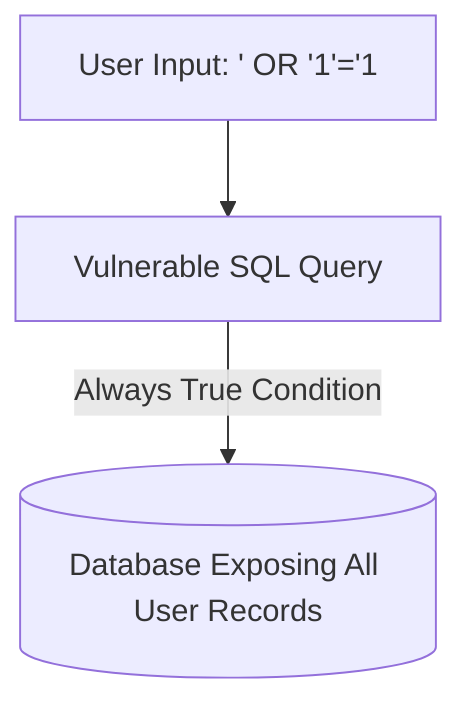
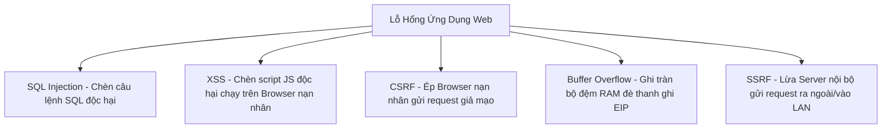

# 🛡 05.Application_and_Software_Security: Bảo Mật Ứng Dụng, Lỗ Hổng Web OWASP & DevSecOps - Chuyên Sâu CompTIA Security+ Cho DevSecOps

> 💡 **Bản chất 1 câu**: Top lỗ hổng Web OWASP: SQL Injection (SQLi), Cross-Site Scripting (XSS), CSRF, Buffer Overflow, Command Injection, SSRF, Memory Leaks và DevSecOps CI/CD Integration.  
> 🎯 **Trọng tâm thực chiến DevSecOps**: Nắm vững SQLi (dùng Parameterized Queries), XSS (Stored vs Reflected vs DOM - Output Encoding), CSRF (Anti-CSRF Tokens), Buffer Overflow (ASLR, DEP/NX) và SAST/DAST.

---




---

## 2. 📚 Lý Thuyết Chuyên Sâu & Bản Chất Hệ Thống (Under The Hood Architecture)

### 2.1 Phân Tích Các Lỗ Hổng Web Top OWASP (OBJ 2.2)



1. **SQL Injection (SQLi)**:
   - **Bản chất**: Kẻ tấn công chèn cú pháp SQL vào tham số đầu vào chưa được lọc (Input Validation).
   - Ví dụ: `SELECT * FROM users WHERE user = '' OR '1'='1' AND pass = '' OR '1'='1'`.
   - **Fix**: Sử dụng **Prepared Statements / Parameterized Queries** (KHÔNG BAO GIỜ cộng chuỗi SQL!).
2. **Cross-Site Scripting (XSS)**:
   - **Bản chất**: Chèn mã JavaScript độc hại vào trang web để chạy trên trình duyệt của người dùng khác (trộm Cookie Session).
   - **Stored XSS** (Mã độc lưu vào DB) vs **Reflected XSS** (Mã độc nằm trong URL link).
   - **Fix**: **Input Sanitization & Output Encoding** + Bật cờ `HttpOnly` cho Cookie.
3. **Buffer Overflow**:
   - **Bản chất**: Ghi dữ liệu vượt quá dung lượng bộ nhớ đệm (Buffer) allocated trên Stack/Heap, đè lên thanh ghi con trỏ lệnh `EIP/RIP` để thực thi mã độc.
   - **Fix**: Dùng ngôn ngữ an toàn bộ nhớ (Rust, Go), bật **ASLR** (Address Space Layout Randomization) và **DEP/NX bit**.

---

### 2.2 Tích Hợp Bảo Mật Vào CI/CD (DevSecOps Pipeline)
- **SAST (Static Application Security Testing)**: Quét mã nguồn tĩnh tìm lỗi bảo mật trước khi build (SonarQube, Semgrep).
- **DAST (Dynamic Application Security Testing)**: Quét ứng dụng đang chạy từ bên ngoài (OWASP ZAP, Burp Suite).
- **SCA (Software Composition Analysis)**: Quét lỗ hổng trong các thư viện bên thứ 3 (Trivy, Snyk, Dependency-Check).


---


### 2.4 Cơ Chế Hoạt Động Bên Dưới Kernel & Kiến Trúc Hệ Thống Chi Tiết (Deep Under The Hood Architecture)
- **Tầng Giao Tiếp Mạng & Bắt Gói Tin**: Mọi gói tin đi qua Network Interface Card (NIC) đều trải qua quá trình xử lý Ring Buffer, ngắt phần cứng (Hardware Interrupts), Ring Buffer DMA và chồng giao thức Socket Buffers (`sk_buff`) trong Linux Kernel.
- **Tối Ưu Hóa & Cấu Trúc Dữ Liệu**: Hệ thống duy trì các bảng băm dữ liệu (Routing Table, ARP Cache Table, Connection Tracking Table `conntrack`, Socket Inode Tables) giúp chuyển tiếp gói tin ở tốc độ dây (Line-rate processing).
- **Phân Lập An Ninh & Phân Vùng**: Sử dụng cơ chế Linux Network Namespaces (`ip netns`), iptables/nftables hooks và mã hóa phần cứng để cách ly lưu lượng mạng tuyệt đối.

---

## 3. ⚡ Bảng Tra Cứu Khái Niệm & Câu Lệnh Thực Hành (Reference Table)

| Công cụ / Khái niệm / Lệnh | Phân loại / Standard | Ý nghĩa chi tiết bản chất | Ứng dụng thực tế DevSecOps |
| :--- | :--- | :--- | :--- |
| **`SQL Injection`** | `Web Vuln` | Chèn câu lệnh SQL độc hại qua ô Input | `Sử dụng Parameterized Queries để fix` |
| **`XSS`** | `Web Vuln` | Chèn mã JavaScript độc hại trộm Session Cookie | `Output Encoding + Cookie HttpOnly` |
| **`Buffer Overflow`** | `Memory Vuln` | Ghi tràn bộ nhớ RAM đè thanh ghi chỉ định lệnh EIP | `Bật ASLR + DEP/NX Bit` |
| **`SAST / DAST`** | `DevSecOps` | Quét lỗ hổng mã nguồn tĩnh (SAST) và dynamic (DAST) | `Tích hợp SonarQube / Trivy vào CI/CD` |


---

## 4. 🛠 Thao Tác Thực Chiến & Kịch Bản SecOps (Real-World Scenarios)

### 🛠 Các lệnh & công cụ thực hành gõ là ăn ngay:
```bash
# Quét lỗ hổng Container Image bằng Trivy trong CI/CD:
trivy image nginx:latest

# Quét lỗ hổng mã nguồn bằng Semgrep (SAST):
semgrep --config=auto .
```

### 🚀 Kịch bản xử lý sự cố thực tế khi đi làm (Incident Response Playbook):
Sự cố ứng dụng bị dính SQL Injection lộ dữ liệu tài khoản -> Sửa code backend dùng Prepared Statements / ORM và bật WAF (Web Application Firewall).

---


### 4.2 Chi Tiết Các Lỗi Thường Gặp & Kịch Bản Khắc Phục Lỗi (Troubleshooting Deep-Dive)
1. **Sự cố 1: Lỗi Mất Gói Tin & Mất Kết Nối Cổng Mạng (Packet Loss & Port Unreachable)**:
   - **Triệu chứng**: Gửi HTTP Request bị Timeout, SSH không kết nối được hoặc gói tin bị nảy rải rác.
   - **Các bước xử lý khẩn cấp**:
     ```bash
     # 1. Kiểm tra trạng thái cổng mạng TCP/UDP đang lắng nghe:
     sudo ss -tulpn | grep :80
     
     # 2. Bắt gói tin trực tiếp trên Interface để kiểm tra bắt tay 3 bước TCP:
     sudo tcpdump -i eth0 port 80 -nn -vv
     
     # 3. Phân tích đường đi của gói tin tìm điểm đứt gãy bằng MTR:
     mtr -n --report --report-cycles=10 8.8.8.8
     
     # 4. Kiểm tra xem gói tin có bị Firewall Drop không:
     sudo iptables -L -n -v | grep DROP
     ```

2. **Sự cố 2: Lỗi Sai Cấu Hình DNS & Chuyển Tiếp IP (DNS Resolution & IP Routing Error)**:
   - **Triệu chứng**: Ping IP thành công nhưng ping Domain Name báo `Could not resolve host`.
   - **Các bước xử lý khẩn cấp**:
     ```bash
     # 1. Tra cứu thử nghiệm phân giải DNS qua server cụ thể:
     dig @8.8.8.8 company.com +trace
     
     # 2. Kiểm tra file cấu hình DNS resolver địa phương:
     cat /etc/resolv.conf
     
     # 3. Kiểm tra bảng định tuyến Kernel IP Routing Table:
     ip route show default
     ```

---

## 5. 🚀 Bộ Câu Hỏi Phỏng Vấn DevSecOps & Security Thực Tế (Interview Q&A)

> **Q: Giải pháp triệt để nhất để phòng chống lỗ hổng SQL Injection là gì?**  
> **A**: Sử dụng **Prepared Statements / Parameterized Queries** (hoặc ORM) để tách biệt tuyệt đối giữa Dữ liệu đầu vào và Câu lệnh SQL.

> **Q: Sự khác biệt giữa SAST và DAST trong DevSecOps Pipeline là gì?**  
> **A**: SAST (Static) phân tích trực tiếp mã nguồn trắng (Source code) khi chưa chạy. DAST (Dynamic) kiểm thử tấn công ứng dụng đen (Running Application) từ bên ngoài.


> **Q: Làm thế nào để điều tra và dập tắt sự cố một Server bị tấn công làm tràn bộ đệm kết nối TCP SYN Flood DoS?**  
> **A**:  
> 1. **Nhận biết**: Lệnh `ss -ant | grep SYN_RECV | wc -l` trả về hàng ngàn kết nối ở trạng thái `SYN_RECV`.  
> 2. **Xử lý khẩn cấp**: Bật ngay cơ chế **SYN Cookies** của Linux Kernel bằng lệnh `sudo sysctl -w net.ipv4.tcp_syncookies=1`. Kích hoạt bộ lọc Firewall drop các gói tin SYN có tần suất bất thường: `sudo iptables -A INPUT -p tcp --syn -m limit --limit 1/s --limit-burst 3 -j ACCEPT`.

> **Q: Sự khác biệt về mặt bản chất giữa Stateful Firewall và Stateless Firewall là gì?**  
> **A**: Stateless Firewall chỉ kiểm tra từng gói tin riêng rẻ dựa trên IP nguồn/đích và Port mà KHÔNG nhớ ngữ cảnh. Stateful Firewall duy trì một bảng theo dõi trạng thái kết nối (**Connection Tracking Table `conntrack`**), tự động nhận diện gói tin thuộc về một kết nối hợp lệ đã được chấp nhận trước đó (như trạng thái `ESTABLISHED,RELATED`), giúp bảo mật và tối ưu hiệu năng vượt trội.

---

## 6. 📝 Cheat Sheet Ghi Nhớ Nhanh (Summary)

- [x] SQLi Fix: Prepared Statements / Parameterized Queries
- [x] XSS Fix: Output Encoding + HttpOnly Cookie
- [x] Buffer Overflow Fix: ASLR + DEP/NX + Memory-safe language
- [x] DevSecOps: SAST (Code) + DAST (App) + SCA (Libs)

