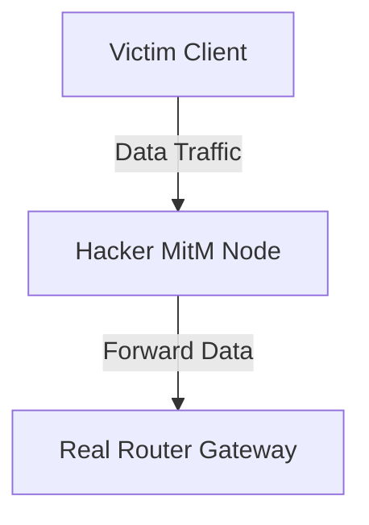
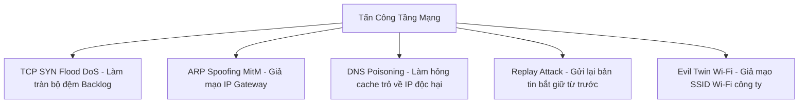

# 🛡 06.Network_Attacks: Các Cuộc Tấn Công Mạng & Kỹ Thuật Nghe Lén (Network Attacks) - Chuyên Sâu CompTIA Security+ Cho DevSecOps

> 💡 **Bản chất 1 câu**: Phân tích chuyên sâu các cuộc tấn công mạng: DoS/DDoS, ARP Spoofing, DNS Poisoning, MAC Flooding, IP Spoofing, Session Hijacking, Replay Attacks, Rogue AP, Evil Twin và VLAN Hopping.  
> 🎯 **Trọng tâm thực chiến DevSecOps**: Nắm vững DoS (SYN Flood, UDP Amplification) vs MitM (ARP Poisoning, SSL Stripping) vs Replay Attack (Dùng Token dùng 1 lần Nonce/Timestamp) vs VLAN Hopping (Double Tagging).

---




---

## 2. 📚 Lý Thuyết Chuyên Sâu & Bản Chất Hệ Thống (Under The Hood Architecture)

### 2.1 Phân Tích Các Cuộc Tấn Công Tầng Mạng (Network Attacks - OBJ 4.2)



1. **TCP SYN Flood DoS**: Hacker gửi hàng triệu gói `SYN` giả mạo IP nguồn, khiến Server mở hàng triệu kết nối bán mở (Half-open) làm tràn bộ đệm Backlog queue.
   - **Fix**: Bật **SYN Cookies** trong Linux Kernel (`net.ipv4.tcp_syncookies = 1`).
2. **Replay Attack**: Kẻ tấn công bắt giữ bản tin xác thực hợp lệ trên mạng rồi gửi lại (Replay) bản tin đó để vượt qua khâu đăng nhập.
   - **Fix**: Thêm **Timestamp** và số ngẫu nhiên **Nonce** vào chuỗi mã hóa xác thực.
3. **Evil Twin Wi-Fi Attack**: Hacker đặt một Access Point không dây giả mạo cùng tên SSID với Wi-Fi công ty để dụ người dùng kết nối vào nghe lén.


---


### 2.4 Cơ Chế Hoạt Động Bên Dưới Kernel & Kiến Trúc Hệ Thống Chi Tiết (Deep Under The Hood Architecture)
- **Tầng Giao Tiếp Mạng & Bắt Gói Tin**: Mọi gói tin đi qua Network Interface Card (NIC) đều trải qua quá trình xử lý Ring Buffer, ngắt phần cứng (Hardware Interrupts), Ring Buffer DMA và chồng giao thức Socket Buffers (`sk_buff`) trong Linux Kernel.
- **Tối Ưu Hóa & Cấu Trúc Dữ Liệu**: Hệ thống duy trì các bảng băm dữ liệu (Routing Table, ARP Cache Table, Connection Tracking Table `conntrack`, Socket Inode Tables) giúp chuyển tiếp gói tin ở tốc độ dây (Line-rate processing).
- **Phân Lập An Ninh & Phân Vùng**: Sử dụng cơ chế Linux Network Namespaces (`ip netns`), iptables/nftables hooks và mã hóa phần cứng để cách ly lưu lượng mạng tuyệt đối.

---

## 3. ⚡ Bảng Tra Cứu Khái Niệm & Câu Lệnh Thực Hành (Reference Table)

| Công cụ / Khái niệm / Lệnh | Phân loại / Standard | Ý nghĩa chi tiết bản chất | Ứng dụng thực tế DevSecOps |
| :--- | :--- | :--- | :--- |
| **`SYN Flood`** | `DoS Attack` | Tấn công làm tràn bộ đệm kết nối bán mở TCP | `Bật Kernel SYN Cookies phòng thủ` |
| **`Replay Attack`** | `Network Attack` | Bắt giữ bản tin cũ gửi lại để giả mạo xác thực | `Thêm Timestamp / Nonce vào token` |
| **`DNS Poisoning`** | `DNS Attack` | Làm sai lệch cache DNS trỏ về Server độc hại | `Triển khai DNSSEC` |
| **`Evil Twin`** | `Wireless Attack` | AP giả mạo trùng tên SSID Wi-Fi công ty | `Dùng WIPS / 802.1X Enterprise` |


---

## 4. 🛠 Thao Tác Thực Chiến & Kịch Bản SecOps (Real-World Scenarios)

### 🛠 Các lệnh & công cụ thực hành gõ là ăn ngay:
```bash
# Phòng chống SYN Flood DoS bằng cách bật SYN Cookies trên Linux:
sudo sysctl -w net.ipv4.tcp_syncookies=1

# Bắt gói tin xem có bị tấn công ARP Spoofing không:
sudo tcpdump -i eth0 arp
```

### 🚀 Kịch bản xử lý sự cố thực tế khi đi làm (Incident Response Playbook):
Sự cố hệ thống bị Replay Attack lặp lại lệnh chuyển tiền -> Sửa ứng dụng bắt buộc kiểm tra mã Nonce duy nhất dùng 1 lần cho từng giao dịch.

---


### 4.2 Chi Tiết Các Lỗi Thường Gặp & Kịch Bản Khắc Phục Lỗi (Troubleshooting Deep-Dive)
1. **Sự cố 1: Lỗi Mất Gói Tin & Mất Kết Nối Cổng Mạng (Packet Loss & Port Unreachable)**:
   - **Triệu chứng**: Gửi HTTP Request bị Timeout, SSH không kết nối được hoặc gói tin bị nảy rải rác.
   - **Các bước xử lý khẩn cấp**:
     ```bash
     # 1. Kiểm tra trạng thái cổng mạng TCP/UDP đang lắng nghe:
     sudo ss -tulpn | grep :80
     
     # 2. Bắt gói tin trực tiếp trên Interface để kiểm tra bắt tay 3 bước TCP:
     sudo tcpdump -i eth0 port 80 -nn -vv
     
     # 3. Phân tích đường đi của gói tin tìm điểm đứt gãy bằng MTR:
     mtr -n --report --report-cycles=10 8.8.8.8
     
     # 4. Kiểm tra xem gói tin có bị Firewall Drop không:
     sudo iptables -L -n -v | grep DROP
     ```

2. **Sự cố 2: Lỗi Sai Cấu Hình DNS & Chuyển Tiếp IP (DNS Resolution & IP Routing Error)**:
   - **Triệu chứng**: Ping IP thành công nhưng ping Domain Name báo `Could not resolve host`.
   - **Các bước xử lý khẩn cấp**:
     ```bash
     # 1. Tra cứu thử nghiệm phân giải DNS qua server cụ thể:
     dig @8.8.8.8 company.com +trace
     
     # 2. Kiểm tra file cấu hình DNS resolver địa phương:
     cat /etc/resolv.conf
     
     # 3. Kiểm tra bảng định tuyến Kernel IP Routing Table:
     ip route show default
     ```

---

## 5. 🚀 Bộ Câu Hỏi Phỏng Vấn DevSecOps & Security Thực Tế (Interview Q&A)

> **Q: Cơ chế SYN Cookies giúp Linux Server chống lại tấn công SYN Flood DoS như thế nào?**  
> **A**: SYN Cookies cho phép Server mã hóa thông tin kết nối vào Sequence Number trả về cho Client mà không cần tiêu tốn bộ đệm memory backlog cho đến khi Client gửi lại ACK hợp lệ.

> **Q: Làm thế nào để chống lại cuộc tấn công Replay Attack?**  
> **A**: Sử dụng mã ngẫu nhiên dùng một lần (Nonce) và gán thời gian thực (Timestamp) vào bản tin xác thực để vô hiệu hóa bản tin nếu bị gửi lại.


> **Q: Làm thế nào để điều tra và dập tắt sự cố một Server bị tấn công làm tràn bộ đệm kết nối TCP SYN Flood DoS?**  
> **A**:  
> 1. **Nhận biết**: Lệnh `ss -ant | grep SYN_RECV | wc -l` trả về hàng ngàn kết nối ở trạng thái `SYN_RECV`.  
> 2. **Xử lý khẩn cấp**: Bật ngay cơ chế **SYN Cookies** của Linux Kernel bằng lệnh `sudo sysctl -w net.ipv4.tcp_syncookies=1`. Kích hoạt bộ lọc Firewall drop các gói tin SYN có tần suất bất thường: `sudo iptables -A INPUT -p tcp --syn -m limit --limit 1/s --limit-burst 3 -j ACCEPT`.

> **Q: Sự khác biệt về mặt bản chất giữa Stateful Firewall và Stateless Firewall là gì?**  
> **A**: Stateless Firewall chỉ kiểm tra từng gói tin riêng rẻ dựa trên IP nguồn/đích và Port mà KHÔNG nhớ ngữ cảnh. Stateful Firewall duy trì một bảng theo dõi trạng thái kết nối (**Connection Tracking Table `conntrack`**), tự động nhận diện gói tin thuộc về một kết nối hợp lệ đã được chấp nhận trước đó (như trạng thái `ESTABLISHED,RELATED`), giúp bảo mật và tối ưu hiệu năng vượt trội.

---

## 6. 📝 Cheat Sheet Ghi Nhớ Nhanh (Summary)

- [x] SYN Flood Fix: SYN Cookies
- [x] Replay Attack Fix: Nonce + Timestamp
- [x] DNS Poisoning Fix: DNSSEC
- [x] Evil Twin: Wi-Fi giả mạo SSID
- [x] ARP Spoofing Fix: DAI

