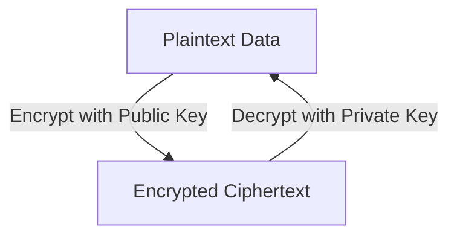
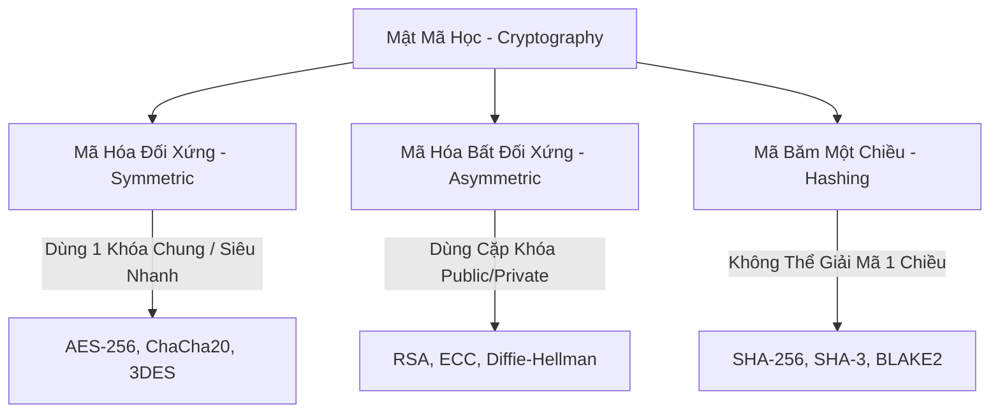

# 🛡 07.Cryptographic_Fundamentals: Nền Tảng Mật Mã Học & Thuật Toán Mã Hóa (Cryptography) - Chuyên Sâu CompTIA Security+ Cho DevSecOps

> 💡 **Bản chất 1 câu**: Mã hóa Đối xứng (AES, 3DES, RC4), Mã hóa Bất đối xứng (RSA, ECC, Diffie-Hellman), Thuật toán Băm Hashing (SHA-256, MD5), Salt & Pepper, Digital Signatures và Steganography.  
> 🎯 **Trọng tâm thực chiến DevSecOps**: Phân biệt Symmetric (1 Khóa, nhanh) vs Asymmetric (Cặp Public/Private Key) vs Hashing (Mã băm 1 chiều không thể giải mã) vs Salt (Muối chống Rainbow Table).

---




---

## 2. 📚 Lý Thuyết Chuyên Sâu & Bản Chất Hệ Thống (Under The Hood Architecture)

### 2.1 So Sánh Các Nhóm Mật Mã Học Cốt Lõi (OBJ 4.1)



| Tiêu chí | Mã hóa Đối xứng (Symmetric) | Mã hóa Bất đối xứng (Asymmetric) | Mã Băm (Hashing) |
| :--- | :--- | :--- | :--- |
| **Số lượng Khóa** | **1 Khóa bí mật duy nhất** | **Cặp 2 Khóa: Public & Private** | **Không dùng khóa** (1 chiều) |
| **Tốc độ xử lý** | **Cực nhanh** (Dùng cho Data Payload) | Chậm hơn (Dùng trao đổi khóa/chữ ký)| Siêu nhanh |
| **Mục đích chính** | Confidentalily (Bảo mật dữ liệu) | Authentication & Key Exchange | Integrity (Kiểm tra toàn vẹn) |
| **Thuật toán tiêu chuẩn**| **AES-256**, ChaCha20 | **RSA (2048/4096)**, **ECC** | **SHA-256**, SHA-3 |

---

### 2.2 Kỹ Thuật Hash Salting Chống Tấn Công Rainbow Table
Khi lưu mật khẩu trong DB, nếu chỉ hash thuần `SHA256("password")`, kẻ tấn công dùng **Rainbow Table** (Bảng tính sẵn hash) để tra ngược ra pass.
- **Salt (Muối)**: Chuỗi ngẫu nhiên duy nhất được nối vào mật khẩu TRƯỚC KHÁM BĂM: `SHA256("password" + Salt_Random)`. Khiến Rainbow Table hoàn toàn vô tác dụng!


---


### 2.4 Cơ Chế Hoạt Động Bên Dưới Kernel & Kiến Trúc Hệ Thống Chi Tiết (Deep Under The Hood Architecture)
- **Tầng Giao Tiếp Mạng & Bắt Gói Tin**: Mọi gói tin đi qua Network Interface Card (NIC) đều trải qua quá trình xử lý Ring Buffer, ngắt phần cứng (Hardware Interrupts), Ring Buffer DMA và chồng giao thức Socket Buffers (`sk_buff`) trong Linux Kernel.
- **Tối Ưu Hóa & Cấu Trúc Dữ Liệu**: Hệ thống duy trì các bảng băm dữ liệu (Routing Table, ARP Cache Table, Connection Tracking Table `conntrack`, Socket Inode Tables) giúp chuyển tiếp gói tin ở tốc độ dây (Line-rate processing).
- **Phân Lập An Ninh & Phân Vùng**: Sử dụng cơ chế Linux Network Namespaces (`ip netns`), iptables/nftables hooks và mã hóa phần cứng để cách ly lưu lượng mạng tuyệt đối.

---

## 3. ⚡ Bảng Tra Cứu Khái Niệm & Câu Lệnh Thực Hành (Reference Table)

| Công cụ / Khái niệm / Lệnh | Phân loại / Standard | Ý nghĩa chi tiết bản chất | Ứng dụng thực tế DevSecOps |
| :--- | :--- | :--- | :--- |
| **`AES-256`** | `Symmetric` | Chuẩn mã hóa đối xứng khối 256-bit an toàn nhất | `Mã hóa đĩa cứng BitLocker / TLS Payload` |
| **`RSA / ECC`** | `Asymmetric` | Mã hóa bất đối xứng cặp Public/Private Key | `SSH Keypair, HTTPS Handshake, Digital Sign` |
| **`SHA-256`** | `Hashing` | Hàm băm 1 chiều tạo chuỗi 256-bit không thể giải mã | `Xác minh tính toàn vẹn file / Blockchain` |
| **`Salt`** | `Hash Defense` | Chuỗi ngẫu nhiên nối vào pass trước khi băm | `Chống tấn công Rainbow Table` |


---

## 4. 🛠 Thao Tác Thực Chiến & Kịch Bản SecOps (Real-World Scenarios)

### 🛠 Các lệnh & công cụ thực hành gõ là ăn ngay:
```bash
# Mã hóa file bằng AES-256 đối xứng với OpenSSL:
openssl enc -aes-256-cbc -salt -in file.txt -out file.enc

# Tạo cặp khóa bất đối xứng RSA 4096-bit:
ssh-keygen -t rsa -b 4096 -f id_rsa_devops
```

### 🚀 Kịch bản xử lý sự cố thực tế khi đi làm (Incident Response Playbook):
Sự cố Cơ sở dữ liệu lộ bảng Hash mật khẩu -> Kiểm tra hệ thống bắt buộc sử dụng thuật toán băm chậm Argon2/Bcrypt kết hợp Salt.

---


### 4.2 Chi Tiết Các Lỗi Thường Gặp & Kịch Bản Khắc Phục Lỗi (Troubleshooting Deep-Dive)
1. **Sự cố 1: Lỗi Mất Gói Tin & Mất Kết Nối Cổng Mạng (Packet Loss & Port Unreachable)**:
   - **Triệu chứng**: Gửi HTTP Request bị Timeout, SSH không kết nối được hoặc gói tin bị nảy rải rác.
   - **Các bước xử lý khẩn cấp**:
     ```bash
     # 1. Kiểm tra trạng thái cổng mạng TCP/UDP đang lắng nghe:
     sudo ss -tulpn | grep :80
     
     # 2. Bắt gói tin trực tiếp trên Interface để kiểm tra bắt tay 3 bước TCP:
     sudo tcpdump -i eth0 port 80 -nn -vv
     
     # 3. Phân tích đường đi của gói tin tìm điểm đứt gãy bằng MTR:
     mtr -n --report --report-cycles=10 8.8.8.8
     
     # 4. Kiểm tra xem gói tin có bị Firewall Drop không:
     sudo iptables -L -n -v | grep DROP
     ```

2. **Sự cố 2: Lỗi Sai Cấu Hình DNS & Chuyển Tiếp IP (DNS Resolution & IP Routing Error)**:
   - **Triệu chứng**: Ping IP thành công nhưng ping Domain Name báo `Could not resolve host`.
   - **Các bước xử lý khẩn cấp**:
     ```bash
     # 1. Tra cứu thử nghiệm phân giải DNS qua server cụ thể:
     dig @8.8.8.8 company.com +trace
     
     # 2. Kiểm tra file cấu hình DNS resolver địa phương:
     cat /etc/resolv.conf
     
     # 3. Kiểm tra bảng định tuyến Kernel IP Routing Table:
     ip route show default
     ```

---

## 5. 🚀 Bộ Câu Hỏi Phỏng Vấn DevSecOps & Security Thực Tế (Interview Q&A)

> **Q: Tại sao mã hóa đối xứng (AES) lại được dùng để mã hóa dữ liệu thực tế thay vì dùng mã hóa bất đối xứng (RSA)?**  
> **A**: Vì mã hóa đối xứng AES có tốc độ xử lý nhanh hơn hàng ngàn lần so với mã hóa bất đối xứng RSA, tiết kiệm tài nguyên CPU tuyệt đối.

> **Q: Kỹ thuật Salt (Muối) bảo vệ mật khẩu lưu trữ chống lại hình thức tấn công nào?**  
> **A**: Chống lại hình thức tấn công tra cứu bảng tính sẵn **Rainbow Table Attack** và tấn công Dictionary Attack hàng loạt.


> **Q: Làm thế nào để điều tra và dập tắt sự cố một Server bị tấn công làm tràn bộ đệm kết nối TCP SYN Flood DoS?**  
> **A**:  
> 1. **Nhận biết**: Lệnh `ss -ant | grep SYN_RECV | wc -l` trả về hàng ngàn kết nối ở trạng thái `SYN_RECV`.  
> 2. **Xử lý khẩn cấp**: Bật ngay cơ chế **SYN Cookies** của Linux Kernel bằng lệnh `sudo sysctl -w net.ipv4.tcp_syncookies=1`. Kích hoạt bộ lọc Firewall drop các gói tin SYN có tần suất bất thường: `sudo iptables -A INPUT -p tcp --syn -m limit --limit 1/s --limit-burst 3 -j ACCEPT`.

> **Q: Sự khác biệt về mặt bản chất giữa Stateful Firewall và Stateless Firewall là gì?**  
> **A**: Stateless Firewall chỉ kiểm tra từng gói tin riêng rẻ dựa trên IP nguồn/đích và Port mà KHÔNG nhớ ngữ cảnh. Stateful Firewall duy trì một bảng theo dõi trạng thái kết nối (**Connection Tracking Table `conntrack`**), tự động nhận diện gói tin thuộc về một kết nối hợp lệ đã được chấp nhận trước đó (như trạng thái `ESTABLISHED,RELATED`), giúp bảo mật và tối ưu hiệu năng vượt trội.

---

## 6. 📝 Cheat Sheet Ghi Nhớ Nhanh (Summary)

- [x] Symmetric (AES): 1 khóa, nhanh, mã hóa data
- [x] Asymmetric (RSA/ECC): Cặp Public/Private Key
- [x] Hashing (SHA-256): 1 chiều, kiểm tra Integrity
- [x] Salt: Nối chuỗi ngẫu nhiên chống Rainbow Table

