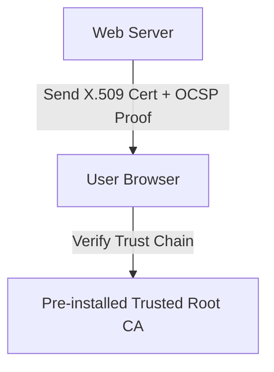
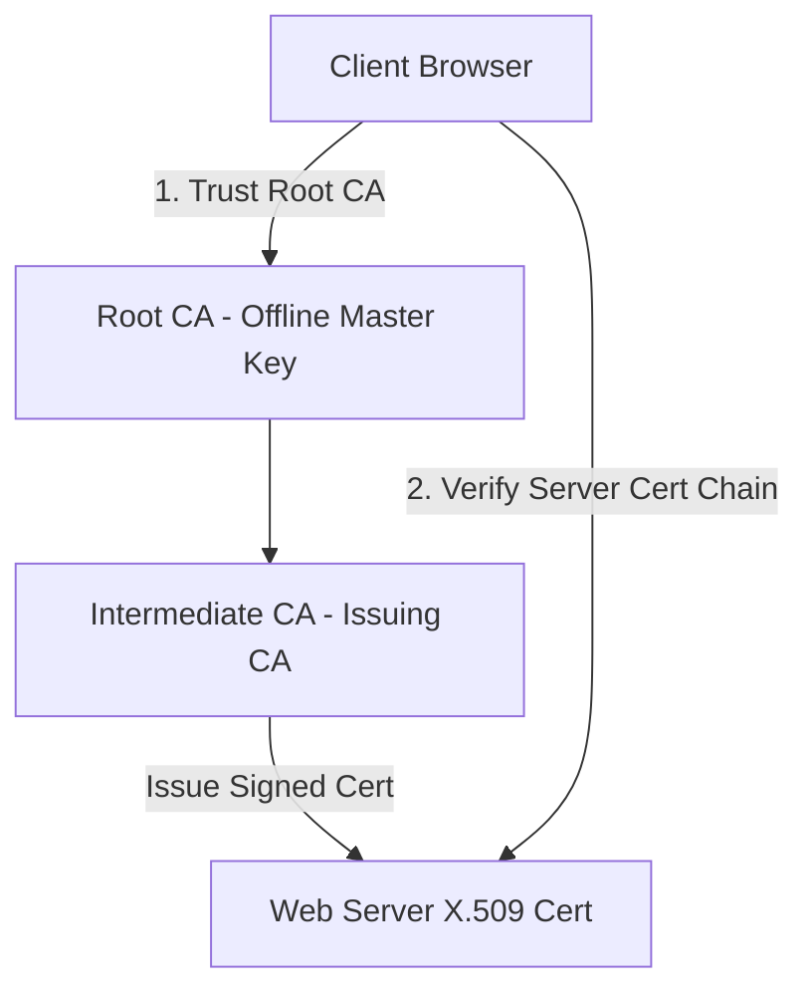

# 🛡 08.Public_Key_Infrastructure_and_Certificates: Hạ Tầng Khóa Công Khai PKI & Chứng Chỉ Số X.509 - Chuyên Sâu CompTIA Security+ Cho DevSecOps

> 💡 **Bản chất 1 câu**: Kiến trúc PKI: Certificate Authority (CA), Registration Authority (RA), CSR, Chứng chỉ X.509, SAN/Wildcard Certs, Vòng đời chứng chỉ, CRL vs OCSP vs OCSP Stapling.  
> 🎯 **Trọng tâm thực chiến DevSecOps**: Nắm vững CA Hierarchy (Root CA -> Intermediate CA), CSR Request, X.509 format, CRL (Danh sách thu hồi) vs OCSP (Check realtime) vs OCSP Stapling (Web Server tự gửi OCSP proof).

---




---

## 2. 📚 Lý Thuyết Chuyên Sâu & Bản Chất Hệ Thống (Under The Hood Architecture)

### 2.1 Kiến Trúc Hạ Tầng Khóa Công Khai PKI (OBJ 4.1)



1. **Root CA & Intermediate CA**: Root CA giữ khóa tối cao (thường để Offline cách ly). Intermediate CA dùng để trực tiếp ký cấp chứng chỉ cho các Domain/Server.
2. **CSR (Certificate Signing Request)**: Tệp chứa Public Key và thông tin Domain do Server tạo ra gửi cho CA xin ký.
3. **CRL vs OCSP vs OCSP Stapling**:
   - **CRL (Certificate Revocation List)**: Tệp danh sách các chứng chỉ bị thu hồi do lộ key. Browser phải tải toàn bộ file về (Chậm!).
   - **OCSP (Online Certificate Status Protocol)**: Browser gửi request hỏi thẳng CA về trạng thái 1 cert (Gây chậm & lộ riêng tư).
   - **OCSP Stapling**: Web Server **TỰ ĐỘNG** đính kèm bằng chứng OCSP được CA ký sẵn vào HTTPS Handshake -> Cực nhanh & Bảo mật!


---


### 2.4 Cơ Chế Hoạt Động Bên Dưới Kernel & Kiến Trúc Hệ Thống Chi Tiết (Deep Under The Hood Architecture)
- **Tầng Giao Tiếp Mạng & Bắt Gói Tin**: Mọi gói tin đi qua Network Interface Card (NIC) đều trải qua quá trình xử lý Ring Buffer, ngắt phần cứng (Hardware Interrupts), Ring Buffer DMA và chồng giao thức Socket Buffers (`sk_buff`) trong Linux Kernel.
- **Tối Ưu Hóa & Cấu Trúc Dữ Liệu**: Hệ thống duy trì các bảng băm dữ liệu (Routing Table, ARP Cache Table, Connection Tracking Table `conntrack`, Socket Inode Tables) giúp chuyển tiếp gói tin ở tốc độ dây (Line-rate processing).
- **Phân Lập An Ninh & Phân Vùng**: Sử dụng cơ chế Linux Network Namespaces (`ip netns`), iptables/nftables hooks và mã hóa phần cứng để cách ly lưu lượng mạng tuyệt đối.

---

## 3. ⚡ Bảng Tra Cứu Khái Niệm & Câu Lệnh Thực Hành (Reference Table)

| Công cụ / Khái niệm / Lệnh | Phân loại / Standard | Ý nghĩa chi tiết bản chất | Ứng dụng thực tế DevSecOps |
| :--- | :--- | :--- | :--- |
| **`X.509`** | `Cert Standard` | Chuẩn định dạng chứng chỉ số PKI quốc tế | `HTTPS SSL/TLS Certificates` |
| **`CSR`** | `Req File` | Tệp yêu cầu cấp chứng chỉ chứa Public Key gửi CA | `Tạo CSR đăng ký SSL` |
| **`OCSP Stapling`** | `Performance/Sec` | Server tự đính kèm bằng chứng OCSP từ CA vào TLS | `Tăng tốc HTTPS Handshake` |
| **`Wildcard Cert`** | `Cert Type` | Chứng chỉ dùng chung cho tất cả subdomain (*.company.com) | `SSL cho nhiều trang con` |


---

## 4. 🛠 Thao Tác Thực Chiến & Kịch Bản SecOps (Real-World Scenarios)

### 🛠 Các lệnh & công cụ thực hành gõ là ăn ngay:
```bash
# Tạo file CSR và Private Key bằng OpenSSL:
openssl req -new -newkey rsa:2048 -nodes -keyout site.key -out site.csr

# Kiểm tra chi tiết thông tin chứng chỉ SSL X.509:
openssl x509 -in site.crt -text -noout
```

### 🚀 Kịch bản xử lý sự cố thực tế khi đi làm (Incident Response Playbook):
Sự cố Web Server bị cảnh báo SSL Certificate Revoked do Private Key bị lộ -> Thu hồi cert trên CA và cập nhật OCSP Stapling.

---


### 4.2 Chi Tiết Các Lỗi Thường Gặp & Kịch Bản Khắc Phục Lỗi (Troubleshooting Deep-Dive)
1. **Sự cố 1: Lỗi Mất Gói Tin & Mất Kết Nối Cổng Mạng (Packet Loss & Port Unreachable)**:
   - **Triệu chứng**: Gửi HTTP Request bị Timeout, SSH không kết nối được hoặc gói tin bị nảy rải rác.
   - **Các bước xử lý khẩn cấp**:
     ```bash
     # 1. Kiểm tra trạng thái cổng mạng TCP/UDP đang lắng nghe:
     sudo ss -tulpn | grep :80
     
     # 2. Bắt gói tin trực tiếp trên Interface để kiểm tra bắt tay 3 bước TCP:
     sudo tcpdump -i eth0 port 80 -nn -vv
     
     # 3. Phân tích đường đi của gói tin tìm điểm đứt gãy bằng MTR:
     mtr -n --report --report-cycles=10 8.8.8.8
     
     # 4. Kiểm tra xem gói tin có bị Firewall Drop không:
     sudo iptables -L -n -v | grep DROP
     ```

2. **Sự cố 2: Lỗi Sai Cấu Hình DNS & Chuyển Tiếp IP (DNS Resolution & IP Routing Error)**:
   - **Triệu chứng**: Ping IP thành công nhưng ping Domain Name báo `Could not resolve host`.
   - **Các bước xử lý khẩn cấp**:
     ```bash
     # 1. Tra cứu thử nghiệm phân giải DNS qua server cụ thể:
     dig @8.8.8.8 company.com +trace
     
     # 2. Kiểm tra file cấu hình DNS resolver địa phương:
     cat /etc/resolv.conf
     
     # 3. Kiểm tra bảng định tuyến Kernel IP Routing Table:
     ip route show default
     ```

---

## 5. 🚀 Bộ Câu Hỏi Phỏng Vấn DevSecOps & Security Thực Tế (Interview Q&A)

> **Q: Ưu điểm vượt trội của OCSP Stapling so với kiểm tra OCSP truyền thống là gì?**  
> **A**: OCSP Stapling cho phép Web Server tự đính kèm bằng chứng kiểm tra chứng chỉ từ CA vào gói TLS Handshake, giúp trình duyệt không phải tự gọi về CA, tăng tốc kết nối và bảo vệ quyền riêng tư người dùng.

> **Q: Chứng chỉ Wildcard Certificate (`*.domain.com`) có công dụng gì?**  
> **A**: Cho phép bảo vệ không giới hạn tất cả các subdomains cấp 1 thuộc tên miền đó (như `app.domain.com`, `api.domain.com`) chỉ bằng một chứng chỉ duy nhất.


> **Q: Làm thế nào để điều tra và dập tắt sự cố một Server bị tấn công làm tràn bộ đệm kết nối TCP SYN Flood DoS?**  
> **A**:  
> 1. **Nhận biết**: Lệnh `ss -ant | grep SYN_RECV | wc -l` trả về hàng ngàn kết nối ở trạng thái `SYN_RECV`.  
> 2. **Xử lý khẩn cấp**: Bật ngay cơ chế **SYN Cookies** của Linux Kernel bằng lệnh `sudo sysctl -w net.ipv4.tcp_syncookies=1`. Kích hoạt bộ lọc Firewall drop các gói tin SYN có tần suất bất thường: `sudo iptables -A INPUT -p tcp --syn -m limit --limit 1/s --limit-burst 3 -j ACCEPT`.

> **Q: Sự khác biệt về mặt bản chất giữa Stateful Firewall và Stateless Firewall là gì?**  
> **A**: Stateless Firewall chỉ kiểm tra từng gói tin riêng rẻ dựa trên IP nguồn/đích và Port mà KHÔNG nhớ ngữ cảnh. Stateful Firewall duy trì một bảng theo dõi trạng thái kết nối (**Connection Tracking Table `conntrack`**), tự động nhận diện gói tin thuộc về một kết nối hợp lệ đã được chấp nhận trước đó (như trạng thái `ESTABLISHED,RELATED`), giúp bảo mật và tối ưu hiệu năng vượt trội.

---

## 6. 📝 Cheat Sheet Ghi Nhớ Nhanh (Summary)

- [x] Root CA -> Intermediate CA -> End Cert
- [x] CSR: Tệp chứa Public Key xin cấp cert
- [x] CRL: Tệp danh sách cert bị thu hồi
- [x] OCSP Stapling: Server tự gửi bằng chứng OCSP
- [x] Wildcard Cert: Dùng cho *.domain.com

