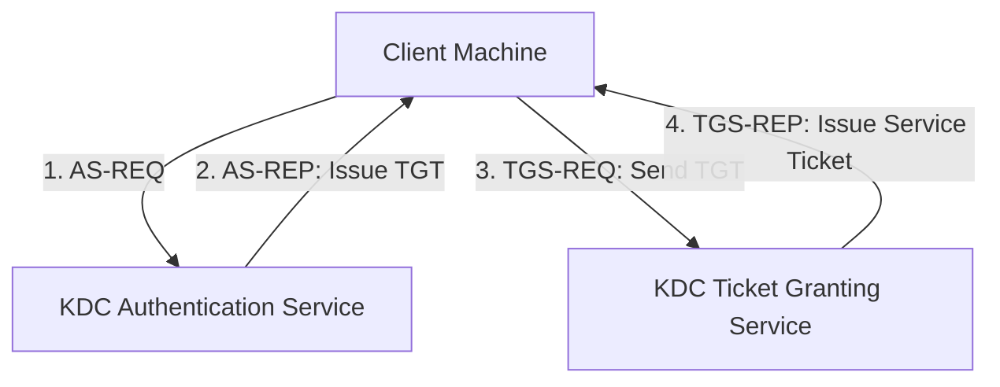
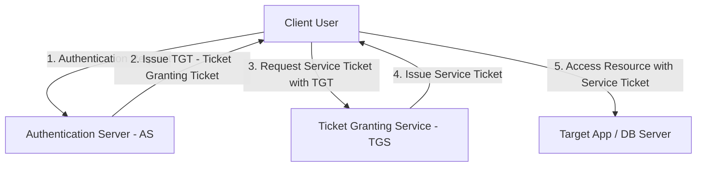

# 🛡 09.Identity_and_Access_Management_IAM: Quản Lý Danh Tính IAM, MFA, SSO & Directory Services - Chuyên Sâu CompTIA Security+ Cho DevSecOps

> 💡 **Bản chất 1 câu**: IAM Lifecycle, MFA (TOTP, HOTP, FIDO2 WebAuthn), Single Sign-On (SAML 2.0, OAuth 2.0, OpenID Connect), Active Directory, LDAP, Kerberos Ticket Granting Ticket (TGT) và PAM.  
> 🎯 **Trọng tâm thực chiến DevSecOps**: Phân biệt SAML 2.0 (Enterprise Auth XML) vs OAuth 2.0 (Authorization Token JSON) vs OIDC (Authentication Layer on OAuth2) vs Kerberos (Ticket-based Port 88).

---




---

## 2. 📚 Lý Thuyết Chuyên Sâu & Bản Chất Hệ Thống (Under The Hood Architecture)

### 2.1 Kiến Trúc Xác Thực Tập Trung Kerberos & SSO Protocols (OBJ 4.1)



1. **Mô Hình Kerberos (Port 88)**:
   - Cơ chế xác thực dựa trên thẻ vé (Ticket-based) chống nghe lén password trên mạng.
   - **TGT (Ticket Granting Ticket)**: Vé tổng cấp sau khi đăng nhập thành công.
2. **So Sánh Các Chuẩn SSO Đăng Nhập Một Lần**:
   - **SAML 2.0**: Chuẩn SSO doanh nghiệp dựa trên định dạng **XML**.
   - **OAuth 2.0**: Chuẩn **Ủy quyền (Authorization)** cấp Access Token (JSON/JWT).
   - **OpenID Connect (OIDC)**: Lớp **Xác thực (Authentication)** chạy trên nền OAuth 2.0.
3. **MFA (Multifactor Authentication)**:
   - Kết hợp >= 2 yếu tố: Something you know (Pass), Something you have (OTP/Security Key), Something you are (Vân tay/Khuôn mặt).
   - **FIDO2 / WebAuthn**: Chuẩn MFA chống Phishing bằng khóa phần cứng (YubiKey).


---


### 2.4 Cơ Chế Hoạt Động Bên Dưới Kernel & Kiến Trúc Hệ Thống Chi Tiết (Deep Under The Hood Architecture)
- **Tầng Giao Tiếp Mạng & Bắt Gói Tin**: Mọi gói tin đi qua Network Interface Card (NIC) đều trải qua quá trình xử lý Ring Buffer, ngắt phần cứng (Hardware Interrupts), Ring Buffer DMA và chồng giao thức Socket Buffers (`sk_buff`) trong Linux Kernel.
- **Tối Ưu Hóa & Cấu Trúc Dữ Liệu**: Hệ thống duy trì các bảng băm dữ liệu (Routing Table, ARP Cache Table, Connection Tracking Table `conntrack`, Socket Inode Tables) giúp chuyển tiếp gói tin ở tốc độ dây (Line-rate processing).
- **Phân Lập An Ninh & Phân Vùng**: Sử dụng cơ chế Linux Network Namespaces (`ip netns`), iptables/nftables hooks và mã hóa phần cứng để cách ly lưu lượng mạng tuyệt đối.

---

## 3. ⚡ Bảng Tra Cứu Khái Niệm & Câu Lệnh Thực Hành (Reference Table)

| Công cụ / Khái niệm / Lệnh | Phân loại / Standard | Ý nghĩa chi tiết bản chất | Ứng dụng thực tế DevSecOps |
| :--- | :--- | :--- | :--- |
| **`Kerberos TGT`** | `Protocol Port 88` | Vé tổng cấp bởi KDC dùng để xin vé truy cập Server | `Xác thực Active Directory Domain` |
| **`SAML 2.0`** | `SSO Protocol` | Chuẩn SSO doanh nghiệp trao đổi assertion dạng XML | `SSO Okta / Azure AD sang Web App` |
| **`OAuth 2.0 / OIDC`** | `Auth Standards` | OAuth 2.0 cấp Access Token, OIDC cấp Identity Token | `Đăng nhập bằng Google / GitHub` |
| **`FIDO2 / WebAuthn`** | `MFA Standard` | Chuẩn MFA dựa trên khóa mã hóa phần cứng chống Phishing | `MFA bằng YubiKey / TouchID` |


---

## 4. 🛠 Thao Tác Thực Chiến & Kịch Bản SecOps (Real-World Scenarios)

### 🛠 Các lệnh & công cụ thực hành gõ là ăn ngay:
```bash
# Query thông tin User từ máy chủ Active Directory / OpenLDAP qua CLI:
ldapsearch -x -H ldap://dc.company.com -b 'dc=company,dc=com' '(sAMAccountName=devops)'
```

### 🚀 Kịch bản xử lý sự cố thực tế khi đi làm (Incident Response Playbook):
Sự cố nhân viên bị tấn công SIM Swapping qua MFA SMS -> Chuyển đổi toàn bộ MFA công ty sang chuẩn FIDO2 YubiKey / App TOTP.

---


### 4.2 Chi Tiết Các Lỗi Thường Gặp & Kịch Bản Khắc Phục Lỗi (Troubleshooting Deep-Dive)
1. **Sự cố 1: Lỗi Mất Gói Tin & Mất Kết Nối Cổng Mạng (Packet Loss & Port Unreachable)**:
   - **Triệu chứng**: Gửi HTTP Request bị Timeout, SSH không kết nối được hoặc gói tin bị nảy rải rác.
   - **Các bước xử lý khẩn cấp**:
     ```bash
     # 1. Kiểm tra trạng thái cổng mạng TCP/UDP đang lắng nghe:
     sudo ss -tulpn | grep :80
     
     # 2. Bắt gói tin trực tiếp trên Interface để kiểm tra bắt tay 3 bước TCP:
     sudo tcpdump -i eth0 port 80 -nn -vv
     
     # 3. Phân tích đường đi của gói tin tìm điểm đứt gãy bằng MTR:
     mtr -n --report --report-cycles=10 8.8.8.8
     
     # 4. Kiểm tra xem gói tin có bị Firewall Drop không:
     sudo iptables -L -n -v | grep DROP
     ```

2. **Sự cố 2: Lỗi Sai Cấu Hình DNS & Chuyển Tiếp IP (DNS Resolution & IP Routing Error)**:
   - **Triệu chứng**: Ping IP thành công nhưng ping Domain Name báo `Could not resolve host`.
   - **Các bước xử lý khẩn cấp**:
     ```bash
     # 1. Tra cứu thử nghiệm phân giải DNS qua server cụ thể:
     dig @8.8.8.8 company.com +trace
     
     # 2. Kiểm tra file cấu hình DNS resolver địa phương:
     cat /etc/resolv.conf
     
     # 3. Kiểm tra bảng định tuyến Kernel IP Routing Table:
     ip route show default
     ```

---

## 5. 🚀 Bộ Câu Hỏi Phỏng Vấn DevSecOps & Security Thực Tế (Interview Q&A)

> **Q: Sự khác biệt về mục đích sử dụng giữa OAuth 2.0 và OpenID Connect (OIDC) là gì?**  
> **A**: OAuth 2.0 là giao thức dùng cho **Ủy quyền (Authorization)** cấp Access Token. OpenID Connect (OIDC) là lớp mở rộng bổ sung tính năng **Xác thực danh tính (Authentication)** chạy trên nền OAuth 2.0.

> **Q: Ba yếu tố xác thực chính trong MFA bao gồm những gì?**  
> **A**: Something you KNOW (Mật khẩu, PIN), Something you HAVE (Điện thoại, YubiKey), và Something you ARE (Vân tay, Khuôn mặt).


> **Q: Làm thế nào để điều tra và dập tắt sự cố một Server bị tấn công làm tràn bộ đệm kết nối TCP SYN Flood DoS?**  
> **A**:  
> 1. **Nhận biết**: Lệnh `ss -ant | grep SYN_RECV | wc -l` trả về hàng ngàn kết nối ở trạng thái `SYN_RECV`.  
> 2. **Xử lý khẩn cấp**: Bật ngay cơ chế **SYN Cookies** của Linux Kernel bằng lệnh `sudo sysctl -w net.ipv4.tcp_syncookies=1`. Kích hoạt bộ lọc Firewall drop các gói tin SYN có tần suất bất thường: `sudo iptables -A INPUT -p tcp --syn -m limit --limit 1/s --limit-burst 3 -j ACCEPT`.

> **Q: Sự khác biệt về mặt bản chất giữa Stateful Firewall và Stateless Firewall là gì?**  
> **A**: Stateless Firewall chỉ kiểm tra từng gói tin riêng rẻ dựa trên IP nguồn/đích và Port mà KHÔNG nhớ ngữ cảnh. Stateful Firewall duy trì một bảng theo dõi trạng thái kết nối (**Connection Tracking Table `conntrack`**), tự động nhận diện gói tin thuộc về một kết nối hợp lệ đã được chấp nhận trước đó (như trạng thái `ESTABLISHED,RELATED`), giúp bảo mật và tối ưu hiệu năng vượt trội.

---

## 6. 📝 Cheat Sheet Ghi Nhớ Nhanh (Summary)

- [x] Kerberos: Port 88, Ticket TGT
- [x] SAML 2.0: SSO XML doanh nghiệp
- [x] OAuth 2.0: Authorization Access Token
- [x] OIDC: Authentication trên OAuth 2.0
- [x] FIDO2: MFA an toàn nhất chống Phishing

