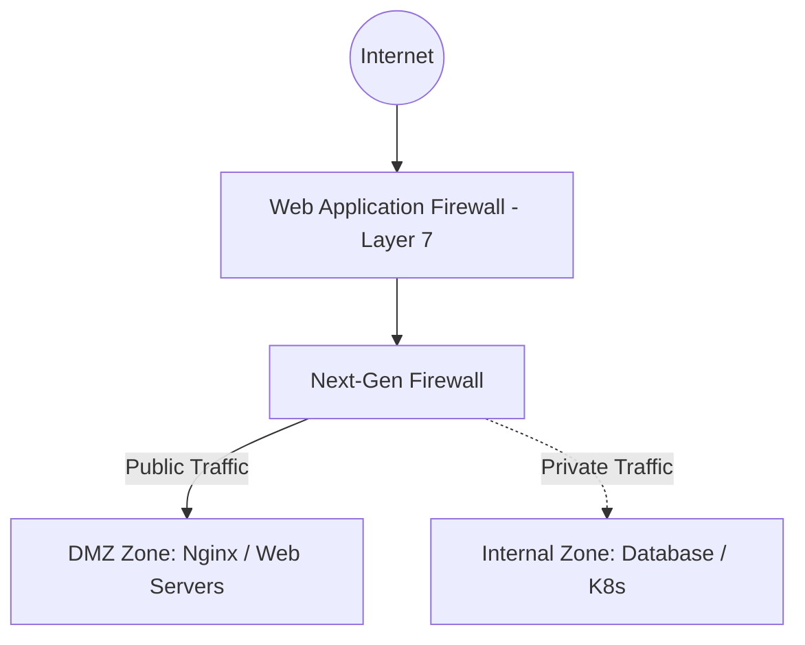
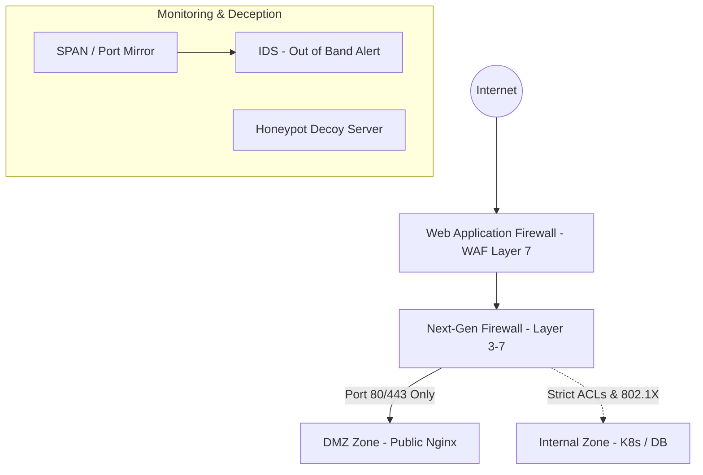

# 🛡 10.Network_Security_Architecture: Kiến Trúc Bảo Mật Mạng, IDS/IPS, WAF & Zero-Trust Segmentation - Chuyên Sâu CompTIA Security+ Cho DevSecOps

> 💡 **Bản chất 1 câu**: Thiết kế vùng mạng an toàn (DMZ, Internal, Management, Cloud), Firewalls (Stateless/Stateful/NGFW/WAF), IDS vs IPS, Network Access Control (802.1X NAC), Jumpbox và Honeypots.  
> 🎯 **Trọng tâm thực chiến DevSecOps**: Phân biệt WAF (Lọc Layer 7 HTTP/Web) vs NGFW (Lọc Layer 3-7 Network) vs IDS/IPS (Phát hiện/Ngăn chặn xâm nhập signature).

---




---

## 2. 📚 Lý Thuyết Chuyên Sâu & Bản Chất Hệ Thống (Under The Hood Architecture)

### 2.1 Chi Tiết Các Thiết Bị Phân Vùng Bảo Mật Mạng (OBJ 1.2 & 4.3)



1. **Web Application Firewall (WAF)**: Lọc sâu Layer 7 inspect luồng HTTP/HTTPS, chặn các cuộc tấn công Web cụ thể như SQLi, XSS, CSRF, Malicious User-Agent.
2. **Next-Generation Firewall (NGFW)**: Lọc gói tin Layer 3-7 kết hợp Deep Packet Inspection (DPI), IPS và nhận diện ứng dụng (App-ID).
3. **802.1X NAC (Network Access Control)**: Bắt buộc cạc mạng PC/Server phải xác thực tài khoản hợp lệ trước khi Switch mở cổng cho vào mạng LAN.
4. **DMZ (Demilitarized Zone)**: Vùng mạng đệm chứa các Server công cộng (Web, Mail, DNS) nhằm cách ly hoàn toàn khỏi mạng nội bộ Database.


---


### 2.4 Cơ Chế Hoạt Động Bên Dưới Kernel & Kiến Trúc Hệ Thống Chi Tiết (Deep Under The Hood Architecture)
- **Tầng Giao Tiếp Mạng & Bắt Gói Tin**: Mọi gói tin đi qua Network Interface Card (NIC) đều trải qua quá trình xử lý Ring Buffer, ngắt phần cứng (Hardware Interrupts), Ring Buffer DMA và chồng giao thức Socket Buffers (`sk_buff`) trong Linux Kernel.
- **Tối Ưu Hóa & Cấu Trúc Dữ Liệu**: Hệ thống duy trì các bảng băm dữ liệu (Routing Table, ARP Cache Table, Connection Tracking Table `conntrack`, Socket Inode Tables) giúp chuyển tiếp gói tin ở tốc độ dây (Line-rate processing).
- **Phân Lập An Ninh & Phân Vùng**: Sử dụng cơ chế Linux Network Namespaces (`ip netns`), iptables/nftables hooks và mã hóa phần cứng để cách ly lưu lượng mạng tuyệt đối.

---

## 3. ⚡ Bảng Tra Cứu Khái Niệm & Câu Lệnh Thực Hành (Reference Table)

| Công cụ / Khái niệm / Lệnh | Phân loại / Standard | Ý nghĩa chi tiết bản chất | Ứng dụng thực tế DevSecOps |
| :--- | :--- | :--- | :--- |
| **`WAF`** | `L7 Firewall` | Tường lửa chuyên sâu lọc traffic Web HTTP chặn SQLi/XSS | `ModSecurity, AWS WAF, Cloudflare WAF` |
| **`NGFW`** | `L3-L7 Firewall` | Tường lửa thế hệ mới tích hợp DPI, IPS, App-ID | `Palo Alto, Fortinet` |
| **`802.1X NAC`** | `Port Security` | Xác thực thiết bị tại cổng Switch trước khi mở port | `Cisco ISE, Forescout` |
| **`Honeypot`** | `Deception` | Máy chủ bẫy dụ Hacker để nghiên cứu hành vi | `Grasp / Cowrie Honeypot` |


---

## 4. 🛠 Thao Tác Thực Chiến & Kịch Bản SecOps (Real-World Scenarios)

### 🛠 Các lệnh & công cụ thực hành gõ là ăn ngay:
```bash
# Cài đặt WAF ModSecurity cho Nginx Web Server:
sudo apt install -y libapache2-mod-security2

# Bắt gói tin SPAN Port bằng Wireshark/tshark để audit IDS:
tshark -i eth0 -n
```

### 🚀 Kịch bản xử lý sự cố thực tế khi đi làm (Incident Response Playbook):
Sự cố Hacker chiếm quyền điều khiển Web Server trong vùng DMZ -> Nhờ có phân vùng DMZ cách ly, Firewall chặn đứng kết nối từ DMZ vào Internal Database.

---


### 4.2 Chi Tiết Các Lỗi Thường Gặp & Kịch Bản Khắc Phục Lỗi (Troubleshooting Deep-Dive)
1. **Sự cố 1: Lỗi Mất Gói Tin & Mất Kết Nối Cổng Mạng (Packet Loss & Port Unreachable)**:
   - **Triệu chứng**: Gửi HTTP Request bị Timeout, SSH không kết nối được hoặc gói tin bị nảy rải rác.
   - **Các bước xử lý khẩn cấp**:
     ```bash
     # 1. Kiểm tra trạng thái cổng mạng TCP/UDP đang lắng nghe:
     sudo ss -tulpn | grep :80
     
     # 2. Bắt gói tin trực tiếp trên Interface để kiểm tra bắt tay 3 bước TCP:
     sudo tcpdump -i eth0 port 80 -nn -vv
     
     # 3. Phân tích đường đi của gói tin tìm điểm đứt gãy bằng MTR:
     mtr -n --report --report-cycles=10 8.8.8.8
     
     # 4. Kiểm tra xem gói tin có bị Firewall Drop không:
     sudo iptables -L -n -v | grep DROP
     ```

2. **Sự cố 2: Lỗi Sai Cấu Hình DNS & Chuyển Tiếp IP (DNS Resolution & IP Routing Error)**:
   - **Triệu chứng**: Ping IP thành công nhưng ping Domain Name báo `Could not resolve host`.
   - **Các bước xử lý khẩn cấp**:
     ```bash
     # 1. Tra cứu thử nghiệm phân giải DNS qua server cụ thể:
     dig @8.8.8.8 company.com +trace
     
     # 2. Kiểm tra file cấu hình DNS resolver địa phương:
     cat /etc/resolv.conf
     
     # 3. Kiểm tra bảng định tuyến Kernel IP Routing Table:
     ip route show default
     ```

---

## 5. 🚀 Bộ Câu Hỏi Phỏng Vấn DevSecOps & Security Thực Tế (Interview Q&A)

> **Q: Sự khác biệt về phạm vi bảo mật giữa WAF và NGFW là gì?**  
> **A**: WAF chuyên sâu bảo vệ ứng dụng Web ở Layer 7 (chặn SQLi, XSS, CSRF). NGFW kiểm soát toàn bộ lưu lượng mạng từ Layer 3 đến Layer 7 (IP, Port, Protocol, App-ID, IPS).

> **Q: Vai trò của 802.1X Network Access Control (NAC) là gì?**  
> **A**: Đảm bảo chỉ các thiết bị hợp lệ được xác thực qua máy chủ RADIUS/LDAP mới được phép kết nối vào hạ tầng mạng LAN/Switch.


> **Q: Làm thế nào để điều tra và dập tắt sự cố một Server bị tấn công làm tràn bộ đệm kết nối TCP SYN Flood DoS?**  
> **A**:  
> 1. **Nhận biết**: Lệnh `ss -ant | grep SYN_RECV | wc -l` trả về hàng ngàn kết nối ở trạng thái `SYN_RECV`.  
> 2. **Xử lý khẩn cấp**: Bật ngay cơ chế **SYN Cookies** của Linux Kernel bằng lệnh `sudo sysctl -w net.ipv4.tcp_syncookies=1`. Kích hoạt bộ lọc Firewall drop các gói tin SYN có tần suất bất thường: `sudo iptables -A INPUT -p tcp --syn -m limit --limit 1/s --limit-burst 3 -j ACCEPT`.

> **Q: Sự khác biệt về mặt bản chất giữa Stateful Firewall và Stateless Firewall là gì?**  
> **A**: Stateless Firewall chỉ kiểm tra từng gói tin riêng rẻ dựa trên IP nguồn/đích và Port mà KHÔNG nhớ ngữ cảnh. Stateful Firewall duy trì một bảng theo dõi trạng thái kết nối (**Connection Tracking Table `conntrack`**), tự động nhận diện gói tin thuộc về một kết nối hợp lệ đã được chấp nhận trước đó (như trạng thái `ESTABLISHED,RELATED`), giúp bảo mật và tối ưu hiệu năng vượt trội.

---

## 6. 📝 Cheat Sheet Ghi Nhớ Nhanh (Summary)

- [x] WAF: Lọc Layer 7 Web (SQLi, XSS)
- [x] NGFW: Lọc Layer 3-7 Network + IPS
- [x] 802.1X NAC: Bắt buộc xác thực trước khi cắm mạng LAN
- [x] DMZ: Cách ly Server công cộng khỏi LAN

