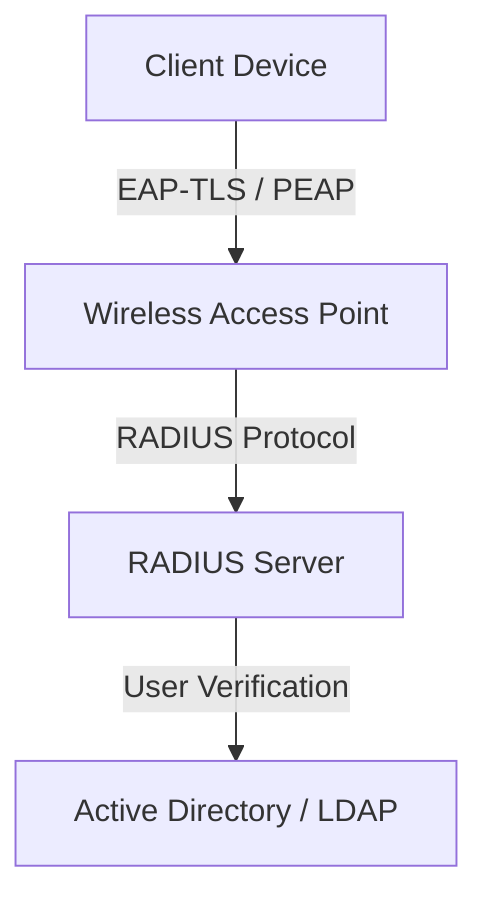
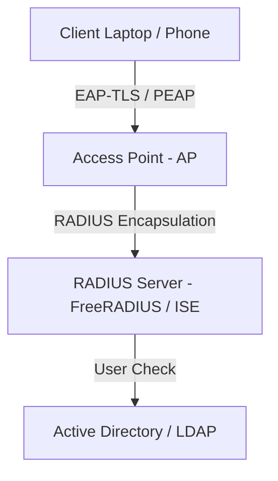

# 🛡 11.Wireless_and_Mobile_Security: Bảo Mật Mạng Không Dây Wi-Fi & Quản Lý Thiết Bị Di Động MDM - Chuyên Sâu CompTIA Security+ Cho DevSecOps

> 💡 **Bản chất 1 câu**: Bảo mật Wi-Fi: WPA2-CCMP, WPA3-SAE, 802.1X Enterprise (PEAP, EAP-TLS), MDM (Mobile Device Management), BYOD vs COPE, Geofencing và Containerization.  
> 🎯 **Trọng tâm thực chiến DevSecOps**: Phân biệt EAP-TLS (Cần Certificate cả Client & Server - An toàn nhất) vs PEAP/EAP-TTLS (Cần Certificate Server + Pass Client), WPA3 SAE chống hack từ điển.

---



---

## 2. 📚 Lý Thuyết Chuyên Sâu & Bản Chất Hệ Thống (Under The Hood Architecture)

### 2.1 Các Chuẩn Xác Thực Wi-Fi Enterprise EAP (OBJ 2.3)



1. **EAP-TLS (EAP Transport Layer Security - An Toàn Nhất)**:
   - Bắt buộc phải có **Digital Certificate (X.509)** cài trên CẢ Máy Chủ RADIUS lẫn Máy Cửa Client.
   - Không dùng Mật khẩu -> Chống 100% tấn công trộm mật khẩu!
2. **PEAP (Protected EAP) / EAP-TTLS**:
   - Chỉ cần **Certificate trên RADIUS Server** (tạo đường hầm TLS mã hóa). Client đăng nhập bằng **Username/Password** thông thường chui qua hầm.
3. **MDM (Mobile Device Management)**:
   - Hệ thống quản lý tập trung từ xa cho điện thoại/laptop công ty (Remote Wipe khi mất máy, ép mã hóa đĩa, cấm cài app ngoài).


---


### 2.4 Cơ Chế Hoạt Động Bên Dưới Kernel & Kiến Trúc Hệ Thống Chi Tiết (Deep Under The Hood Architecture)
- **Tầng Giao Tiếp Mạng & Bắt Gói Tin**: Mọi gói tin đi qua Network Interface Card (NIC) đều trải qua quá trình xử lý Ring Buffer, ngắt phần cứng (Hardware Interrupts), Ring Buffer DMA và chồng giao thức Socket Buffers (`sk_buff`) trong Linux Kernel.
- **Tối Ưu Hóa & Cấu Trúc Dữ Liệu**: Hệ thống duy trì các bảng băm dữ liệu (Routing Table, ARP Cache Table, Connection Tracking Table `conntrack`, Socket Inode Tables) giúp chuyển tiếp gói tin ở tốc độ dây (Line-rate processing).
- **Phân Lập An Ninh & Phân Vùng**: Sử dụng cơ chế Linux Network Namespaces (`ip netns`), iptables/nftables hooks và mã hóa phần cứng để cách ly lưu lượng mạng tuyệt đối.

---

## 3. ⚡ Bảng Tra Cứu Khái Niệm & Câu Lệnh Thực Hành (Reference Table)

| Công cụ / Khái niệm / Lệnh | Phân loại / Standard | Ý nghĩa chi tiết bản chất | Ứng dụng thực tế DevSecOps |
| :--- | :--- | :--- | :--- |
| **`EAP-TLS`** | `Wi-Fi Auth` | Chuẩn xác thực Wi-Fi an toàn nhất yêu cầu Cert cả Client & Server | `Wi-Fi Enterprise bảo mật cao` |
| **`PEAP`** | `Wi-Fi Auth` | Xác thực Wi-Fi qua đường hầm TLS bằng Username/Password | `Wi-Fi văn phòng công ty` |
| **`MDM`** | `Mobile Sec` | Hệ thống quản lý thiết bị di động từ xa (Remote Wipe) | `Quản lý Laptop/Smartphone công ty` |
| **`BYOD`** | `Mobile Policy` | Bring Your Own Device - Cho phép dùng máy cá nhân làm việc | `Chính sách thiết bị di động` |


---

## 4. 🛠 Thao Tác Thực Chiến & Kịch Bản SecOps (Real-World Scenarios)

### 🛠 Các lệnh & công cụ thực hành gõ là ăn ngay:
```bash
# Thấu thị gói tin xác thực EAPOL Wi-Fi bằng tshark:
tshark -i wlan0 -Y 'eapol'
```

### 🚀 Kịch bản xử lý sự cố thực tế khi đi làm (Incident Response Playbook):
Sự cố nhân viên bị mất Laptop công ty chứa dữ liệu nhạy cảm -> Đội SecOps kích hoạt lệnh **Remote Wipe** xóa sạch đĩa từ xa qua MDM.

---


### 4.2 Chi Tiết Các Lỗi Thường Gặp & Kịch Bản Khắc Phục Lỗi (Troubleshooting Deep-Dive)
1. **Sự cố 1: Lỗi Mất Gói Tin & Mất Kết Nối Cổng Mạng (Packet Loss & Port Unreachable)**:
   - **Triệu chứng**: Gửi HTTP Request bị Timeout, SSH không kết nối được hoặc gói tin bị nảy rải rác.
   - **Các bước xử lý khẩn cấp**:
     ```bash
     # 1. Kiểm tra trạng thái cổng mạng TCP/UDP đang lắng nghe:
     sudo ss -tulpn | grep :80
     
     # 2. Bắt gói tin trực tiếp trên Interface để kiểm tra bắt tay 3 bước TCP:
     sudo tcpdump -i eth0 port 80 -nn -vv
     
     # 3. Phân tích đường đi của gói tin tìm điểm đứt gãy bằng MTR:
     mtr -n --report --report-cycles=10 8.8.8.8
     
     # 4. Kiểm tra xem gói tin có bị Firewall Drop không:
     sudo iptables -L -n -v | grep DROP
     ```

2. **Sự cố 2: Lỗi Sai Cấu Hình DNS & Chuyển Tiếp IP (DNS Resolution & IP Routing Error)**:
   - **Triệu chứng**: Ping IP thành công nhưng ping Domain Name báo `Could not resolve host`.
   - **Các bước xử lý khẩn cấp**:
     ```bash
     # 1. Tra cứu thử nghiệm phân giải DNS qua server cụ thể:
     dig @8.8.8.8 company.com +trace
     
     # 2. Kiểm tra file cấu hình DNS resolver địa phương:
     cat /etc/resolv.conf
     
     # 3. Kiểm tra bảng định tuyến Kernel IP Routing Table:
     ip route show default
     ```

---

## 5. 🚀 Bộ Câu Hỏi Phỏng Vấn DevSecOps & Security Thực Tế (Interview Q&A)

> **Q: Tại sao EAP-TLS lại được đánh giá là chuẩn xác thực Wi-Fi an toàn nhất hiện nay?**  
> **A**: Vì EAP-TLS bắt buộc phải có chứng chỉ số X.509 trên cả Server lẫn thiết bị Client, không sử dụng mật khẩu gõ tay nên chống 100% tấn công từ điển và nghe lén.

> **Q: Tính năng Remote Wipe trong hệ thống MDM có tác dụng gì?**  
> **A**: Cho phép quản trị viên kích hoạt lệnh xóa sạch toàn bộ dữ liệu trên thiết bị di động từ xa khi máy bị mất cắp hoặc nhân viên nghỉ việc.


> **Q: Làm thế nào để điều tra và dập tắt sự cố một Server bị tấn công làm tràn bộ đệm kết nối TCP SYN Flood DoS?**  
> **A**:  
> 1. **Nhận biết**: Lệnh `ss -ant | grep SYN_RECV | wc -l` trả về hàng ngàn kết nối ở trạng thái `SYN_RECV`.  
> 2. **Xử lý khẩn cấp**: Bật ngay cơ chế **SYN Cookies** của Linux Kernel bằng lệnh `sudo sysctl -w net.ipv4.tcp_syncookies=1`. Kích hoạt bộ lọc Firewall drop các gói tin SYN có tần suất bất thường: `sudo iptables -A INPUT -p tcp --syn -m limit --limit 1/s --limit-burst 3 -j ACCEPT`.

> **Q: Sự khác biệt về mặt bản chất giữa Stateful Firewall và Stateless Firewall là gì?**  
> **A**: Stateless Firewall chỉ kiểm tra từng gói tin riêng rẻ dựa trên IP nguồn/đích và Port mà KHÔNG nhớ ngữ cảnh. Stateful Firewall duy trì một bảng theo dõi trạng thái kết nối (**Connection Tracking Table `conntrack`**), tự động nhận diện gói tin thuộc về một kết nối hợp lệ đã được chấp nhận trước đó (như trạng thái `ESTABLISHED,RELATED`), giúp bảo mật và tối ưu hiệu năng vượt trội.

---

## 6. 📝 Cheat Sheet Ghi Nhớ Nhanh (Summary)

- [x] EAP-TLS: Cert trên cả Client & Server (An toàn nhất)
- [x] PEAP: Cert trên Server + Pass trên Client
- [x] WPA3-SAE: Chống hack từ điển
- [x] MDM: Quản lý thiết bị di động & Remote Wipe

