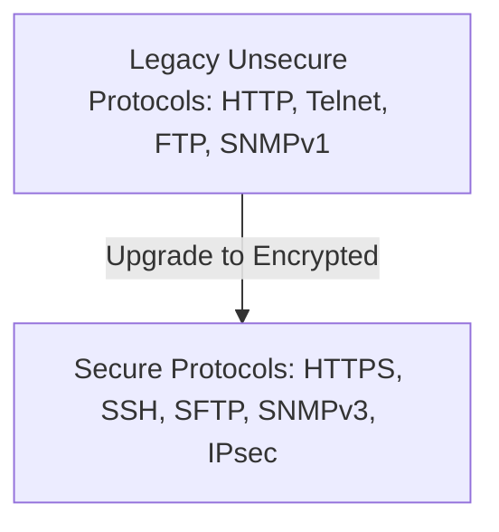

# 🛡 12.Secure_Network_Design_and_Protocols: Thiết Kế Mạng An Toàn & Các Giao Thức Bảo Mật Chuẩn - Chuyên Sâu CompTIA Security+ Cho DevSecOps

> 💡 **Bản chất 1 câu**: Các giao thức bảo mật chuẩn: HTTPS (TLS 1.3), SSH, SFTP, IPsec (AH/ESP, IKEv2), DNSSEC, SNMPv3, S/MIME, SRTP, NTPsec và thiết kế mạng an toàn (VLANs, Load Balancers).  
> 🎯 **Trọng tâm thực chiến DevSecOps**: Thay thế các giao thức plain-text nguy hiểm (HTTP, Telnet, FTP, DNS, SNMPv1/v2, POP3/IMAP) bằng giao thức mã hóa tương ứng (HTTPS, SSH, SFTP, DNSSEC, SNMPv3, IMAPS).

---



---

## 2. 📚 Lý Thuyết Chuyên Sâu & Bản Chất Hệ Thống (Under The Hood Architecture)

### 2.1 Bảng Phép Đổi Các Giao Thức Nguy Hiểm Sang Giao Thức An Toàn (OBJ 1.4)

| Giao Thức Nguy Hiểm (Plain-text) | Port | Giao Thức Bảo Mật Thay Thế (Encrypted) | Port | Chuẩn Mã Hóa / Cơ Chế |
| :--- | :--- | :--- | :--- | :--- |
| **HTTP** | 80 | **HTTPS** | 443 | TLS 1.3 / SSL |
| **Telnet** | 23 | **SSH** | 22 | RSA / ECC Asymmetric |
| **FTP** | 20/21 | **SFTP / FTPS** | 22 / 990 | SSH / TLS |
| **DNS** | 53 | **DNSSEC / DoH / DoT** | 53 / 443 / 853 | Chữ ký số Digital Signature / TLS |
| **SNMP v1/v2c** | 161 | **SNMP v3** | 161 | AES Encryption + SHA Auth |
| **HTTP Mail** | 110/143 | **IMAPS / POP3S / S/MIME** | 993 / 995 | TLS / PKI Encryption |

---

### 2.2 Bộ Giao Thức Mã Hóa Tầng Mạng IPsec (OBJ 1.4)
- **AH (Authentication Header)**: Xác thực nguồn gốc và toàn vẹn (KHÔNG MÃ HÓA).
- **ESP (Encapsulating Security Payload)**: **MÃ HÓA DỮ LIỆU** + Xác thực nguồn gốc.
- **IKEv2 (Internet Key Exchange v2 - UDP 500/4500)**: Thương lượng thiết lập đường hầm VPN IPsec cực nhanh và ổn định.


---


### 2.4 Cơ Chế Hoạt Động Bên Dưới Kernel & Kiến Trúc Hệ Thống Chi Tiết (Deep Under The Hood Architecture)
- **Tầng Giao Tiếp Mạng & Bắt Gói Tin**: Mọi gói tin đi qua Network Interface Card (NIC) đều trải qua quá trình xử lý Ring Buffer, ngắt phần cứng (Hardware Interrupts), Ring Buffer DMA và chồng giao thức Socket Buffers (`sk_buff`) trong Linux Kernel.
- **Tối Ưu Hóa & Cấu Trúc Dữ Liệu**: Hệ thống duy trì các bảng băm dữ liệu (Routing Table, ARP Cache Table, Connection Tracking Table `conntrack`, Socket Inode Tables) giúp chuyển tiếp gói tin ở tốc độ dây (Line-rate processing).
- **Phân Lập An Ninh & Phân Vùng**: Sử dụng cơ chế Linux Network Namespaces (`ip netns`), iptables/nftables hooks và mã hóa phần cứng để cách ly lưu lượng mạng tuyệt đối.

---

## 3. ⚡ Bảng Tra Cứu Khái Niệm & Câu Lệnh Thực Hành (Reference Table)

| Công cụ / Khái niệm / Lệnh | Phân loại / Standard | Ý nghĩa chi tiết bản chất | Ứng dụng thực tế DevSecOps |
| :--- | :--- | :--- | :--- |
| **`TLS 1.3`** | `Web Security` | Phiên bản mã hóa Web tối tân nhất bỏ hoàn toàn cipher yếu | `Bảo mật HTTPS Web App` |
| **`SFTP`** | `File Transfer` | Truyền file mã hóa chạy trên nền SSH Port 22 | `Thay thế FTP không an toàn` |
| **`IPsec ESP`** | `Network Sec` | Giao thức mã hóa dữ liệu IP Packet ở Layer 3 | `Site-to-Site VPN giữa 2 chi nhánh` |
| **`SNMPv3`** | `Monitoring` | Giám sát thiết bị mạng hỗ trợ mã hóa AES và SHA | `Zabbix/Nagios monitoring` |


---

## 4. 🛠 Thao Tác Thực Chiến & Kịch Bản SecOps (Real-World Scenarios)

### 🛠 Các lệnh & công cụ thực hành gõ là ăn ngay:
```bash
# Cấu hình Nginx chỉ cho phép giao thức mã hóa an toàn TLS 1.2 và TLS 1.3:
ssl_protocols TLSv1.2 TLSv1.3;
ssl_ciphers HIGH:!aNULL:!MD5;
```

### 🚀 Kịch bản xử lý sự cố thực tế khi đi làm (Incident Response Playbook):
Audit an ninh phát hiện hệ thống còn chạy Telnet Port 23 và HTTP Port 80 -> Tắt ngay dịch vụ legacy và ép HTTP tự động chuyển hướng (Redirect 301) sang HTTPS Port 443.

---


### 4.2 Chi Tiết Các Lỗi Thường Gặp & Kịch Bản Khắc Phục Lỗi (Troubleshooting Deep-Dive)
1. **Sự cố 1: Lỗi Mất Gói Tin & Mất Kết Nối Cổng Mạng (Packet Loss & Port Unreachable)**:
   - **Triệu chứng**: Gửi HTTP Request bị Timeout, SSH không kết nối được hoặc gói tin bị nảy rải rác.
   - **Các bước xử lý khẩn cấp**:
     ```bash
     # 1. Kiểm tra trạng thái cổng mạng TCP/UDP đang lắng nghe:
     sudo ss -tulpn | grep :80
     
     # 2. Bắt gói tin trực tiếp trên Interface để kiểm tra bắt tay 3 bước TCP:
     sudo tcpdump -i eth0 port 80 -nn -vv
     
     # 3. Phân tích đường đi của gói tin tìm điểm đứt gãy bằng MTR:
     mtr -n --report --report-cycles=10 8.8.8.8
     
     # 4. Kiểm tra xem gói tin có bị Firewall Drop không:
     sudo iptables -L -n -v | grep DROP
     ```

2. **Sự cố 2: Lỗi Sai Cấu Hình DNS & Chuyển Tiếp IP (DNS Resolution & IP Routing Error)**:
   - **Triệu chứng**: Ping IP thành công nhưng ping Domain Name báo `Could not resolve host`.
   - **Các bước xử lý khẩn cấp**:
     ```bash
     # 1. Tra cứu thử nghiệm phân giải DNS qua server cụ thể:
     dig @8.8.8.8 company.com +trace
     
     # 2. Kiểm tra file cấu hình DNS resolver địa phương:
     cat /etc/resolv.conf
     
     # 3. Kiểm tra bảng định tuyến Kernel IP Routing Table:
     ip route show default
     ```

---

## 5. 🚀 Bộ Câu Hỏi Phỏng Vấn DevSecOps & Security Thực Tế (Interview Q&A)

> **Q: Tại sao bắt buộc phải thay thế SNMP v1/v2c bằng SNMP v3?**  
> **A**: SNMP v1/v2c truyền chuỗi xác thực Community String dưới dạng văn bản rõ (Plaintext) dễ bị nghe lén. SNMP v3 bổ sung mã hóa AES và xác thực SHA bảo mật tuyệt đối.

> **Q: Sự khác biệt cốt lõi giữa SFTP và FTPS là gì?**  
> **A**: SFTP chạy trên nền giao thức SSH (Port 22). FTPS là FTP truyền thống được mở rộng bổ sung lớp mã hóa SSL/TLS (Port 990/989).


> **Q: Làm thế nào để điều tra và dập tắt sự cố một Server bị tấn công làm tràn bộ đệm kết nối TCP SYN Flood DoS?**  
> **A**:  
> 1. **Nhận biết**: Lệnh `ss -ant | grep SYN_RECV | wc -l` trả về hàng ngàn kết nối ở trạng thái `SYN_RECV`.  
> 2. **Xử lý khẩn cấp**: Bật ngay cơ chế **SYN Cookies** của Linux Kernel bằng lệnh `sudo sysctl -w net.ipv4.tcp_syncookies=1`. Kích hoạt bộ lọc Firewall drop các gói tin SYN có tần suất bất thường: `sudo iptables -A INPUT -p tcp --syn -m limit --limit 1/s --limit-burst 3 -j ACCEPT`.

> **Q: Sự khác biệt về mặt bản chất giữa Stateful Firewall và Stateless Firewall là gì?**  
> **A**: Stateless Firewall chỉ kiểm tra từng gói tin riêng rẻ dựa trên IP nguồn/đích và Port mà KHÔNG nhớ ngữ cảnh. Stateful Firewall duy trì một bảng theo dõi trạng thái kết nối (**Connection Tracking Table `conntrack`**), tự động nhận diện gói tin thuộc về một kết nối hợp lệ đã được chấp nhận trước đó (như trạng thái `ESTABLISHED,RELATED`), giúp bảo mật và tối ưu hiệu năng vượt trội.

---

## 6. 📝 Cheat Sheet Ghi Nhớ Nhanh (Summary)

- [x] HTTP -> HTTPS (443)
- [x] Telnet -> SSH (22)
- [x] FTP -> SFTP (22)
- [x] SNMPv1 -> SNMPv3 (161)
- [x] IPsec ESP: Mã hóa dữ liệu Layer 3

