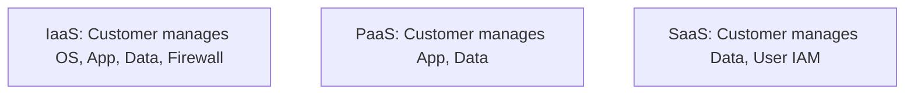
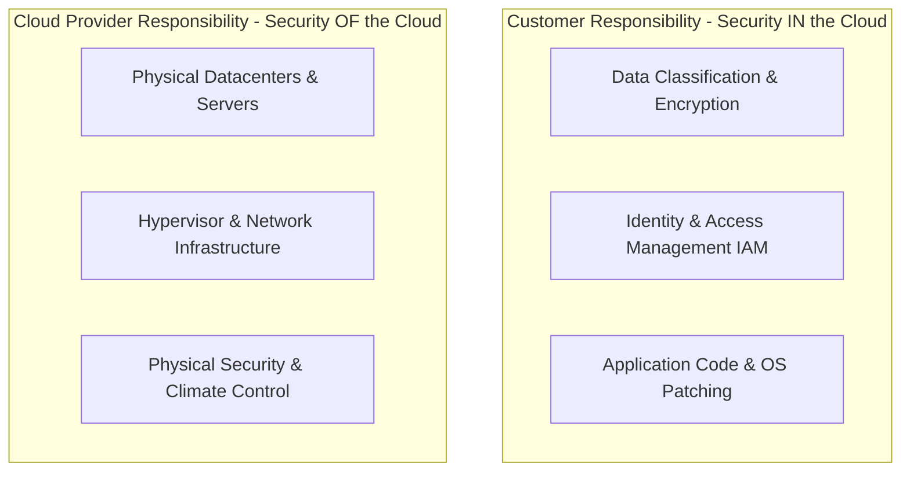

# 🛡 13.Cloud_Security_and_Virtualization: Bảo Mật Điện Toán Đám Mây Cloud, Containers & CASB - Chuyên Sâu CompTIA Security+ Cho DevSecOps

> 💡 **Bản chất 1 câu**: Mô hình Trách nhiệm sẻ chia (Shared Responsibility Model), Cloud Security (Public/Private/Hybrid), CASB, SWG, Serverless Security, Container Security (Docker, Kubernetes) và IaC Security.  
> 🎯 **Trọng tâm thực chiến DevSecOps**: Nắm vững Trách nhiệm Cloud (AWS chịu trách nhiệm Security OF the Cloud, Khách hàng chịu trách nhiệm Security IN the Cloud), CASB (Cloud Access Security Broker) và Container Hardening.

---




---

## 2. 📚 Lý Thuyết Chuyên Sâu & Bản Chất Hệ Thống (Under The Hood Architecture)

### 2.1 Mô Hình Trách Nhiệm Sẻ Chia An Ninh Đám Mây (Shared Responsibility Model - OBJ 1.3)



1. **IaaS (AWS EC2)**: Khách hàng quản lý từ OS, App, Data, IAM, Firewall Rules. AWS quản lý phần cứng vật lý, Hypervisor.
2. **PaaS (AWS Elastic Beanstalk)**: Khách hàng chỉ quản lý Code và Data. AWS quản lý cả OS và Runtime.
3. **SaaS (Gmail, Office365)**: Khách hàng chỉ quản lý Data và User Access. Provider quản lý toàn bộ hệ thống.

---

### 2.2 Môi Trường Container Security (Docker & Kubernetes)
- **Container Hardening**: Không bao giờ chạy Container bằng quyền `root` (dùng `USER nonroot`).
- **Image Scanning**: Quét lỗ hổng trong Docker Image trước khi đẩy lên Registry bằng **Trivy / Clair**.
- **CASB (Cloud Access Security Broker)**: Thiết bị/Dịch vụ đứng giữa User và Cloud Provider để thực thi chính sách bảo mật (DLP, Encryption, Threat Detection).


---


### 2.4 Cơ Chế Hoạt Động Bên Dưới Kernel & Kiến Trúc Hệ Thống Chi Tiết (Deep Under The Hood Architecture)
- **Tầng Giao Tiếp Mạng & Bắt Gói Tin**: Mọi gói tin đi qua Network Interface Card (NIC) đều trải qua quá trình xử lý Ring Buffer, ngắt phần cứng (Hardware Interrupts), Ring Buffer DMA và chồng giao thức Socket Buffers (`sk_buff`) trong Linux Kernel.
- **Tối Ưu Hóa & Cấu Trúc Dữ Liệu**: Hệ thống duy trì các bảng băm dữ liệu (Routing Table, ARP Cache Table, Connection Tracking Table `conntrack`, Socket Inode Tables) giúp chuyển tiếp gói tin ở tốc độ dây (Line-rate processing).
- **Phân Lập An Ninh & Phân Vùng**: Sử dụng cơ chế Linux Network Namespaces (`ip netns`), iptables/nftables hooks và mã hóa phần cứng để cách ly lưu lượng mạng tuyệt đối.

---

## 3. ⚡ Bảng Tra Cứu Khái Niệm & Câu Lệnh Thực Hành (Reference Table)

| Công cụ / Khái niệm / Lệnh | Phân loại / Standard | Ý nghĩa chi tiết bản chất | Ứng dụng thực tế DevSecOps |
| :--- | :--- | :--- | :--- |
| **`Shared Responsibility`** | `Cloud Concept` | Phân định trách nhiệm bảo mật giữa Cloud Provider và Customer | `Phân định trách nhiệm an ninh Cloud` |
| **`CASB`** | `Cloud Sec` | Cloud Access Security Broker giám sát & thực thi chính sách an ninh Cloud | `Ngăn rò rỉ dữ liệu lên Google Drive` |
| **`Container Hardening`** | `DevSecOps` | Bảo mật Docker/K8s không dùng root, read-only rootfs | `Bảo mật Kubernetes Pods` |
| **`Trivy / Snyk`** | `Scanner` | Công cụ quét lỗ hổng mã nguồn & Docker Image | `Tích hợp CI/CD Pipeline` |


---

## 4. 🛠 Thao Tác Thực Chiến & Kịch Bản SecOps (Real-World Scenarios)

### 🛠 Các lệnh & công cụ thực hành gõ là ăn ngay:
```bash
# Quét lỗ hổng Docker Image bằng Trivy trước khi deploy lên Production:
trivy image --severity HIGH,CRITICAL myapp:v1.0

# Đảm bảo Docker Container không chạy bằng root user trong Dockerfile:
# USER 10001
```

### 🚀 Kịch bản xử lý sự cố thực tế khi đi làm (Incident Response Playbook):
Sự cố nhân viên đẩy nhầm AWS Access Key lên GitHub public -> Kích hoạt Revoke Key trên AWS IAM, xoay vòng Secret và dùng GitGuardian quét commit.

---


### 4.2 Chi Tiết Các Lỗi Thường Gặp & Kịch Bản Khắc Phục Lỗi (Troubleshooting Deep-Dive)
1. **Sự cố 1: Lỗi Mất Gói Tin & Mất Kết Nối Cổng Mạng (Packet Loss & Port Unreachable)**:
   - **Triệu chứng**: Gửi HTTP Request bị Timeout, SSH không kết nối được hoặc gói tin bị nảy rải rác.
   - **Các bước xử lý khẩn cấp**:
     ```bash
     # 1. Kiểm tra trạng thái cổng mạng TCP/UDP đang lắng nghe:
     sudo ss -tulpn | grep :80
     
     # 2. Bắt gói tin trực tiếp trên Interface để kiểm tra bắt tay 3 bước TCP:
     sudo tcpdump -i eth0 port 80 -nn -vv
     
     # 3. Phân tích đường đi của gói tin tìm điểm đứt gãy bằng MTR:
     mtr -n --report --report-cycles=10 8.8.8.8
     
     # 4. Kiểm tra xem gói tin có bị Firewall Drop không:
     sudo iptables -L -n -v | grep DROP
     ```

2. **Sự cố 2: Lỗi Sai Cấu Hình DNS & Chuyển Tiếp IP (DNS Resolution & IP Routing Error)**:
   - **Triệu chứng**: Ping IP thành công nhưng ping Domain Name báo `Could not resolve host`.
   - **Các bước xử lý khẩn cấp**:
     ```bash
     # 1. Tra cứu thử nghiệm phân giải DNS qua server cụ thể:
     dig @8.8.8.8 company.com +trace
     
     # 2. Kiểm tra file cấu hình DNS resolver địa phương:
     cat /etc/resolv.conf
     
     # 3. Kiểm tra bảng định tuyến Kernel IP Routing Table:
     ip route show default
     ```

---

## 5. 🚀 Bộ Câu Hỏi Phỏng Vấn DevSecOps & Security Thực Tế (Interview Q&A)

> **Q: Trong mô hình IaaS (như AWS EC2), khách hàng chịu trách nhiệm bảo mật cho những phần nào?**  
> **A**: Khách hàng chịu trách nhiệm bảo mật dữ liệu (Data), quản lý truy cập (IAM), bảo mật ứng dụng (App), hệ điều hành (OS patching) và cấu hình tường lửa (Security Groups).

> **Q: Thiết bị CASB (Cloud Access Security Broker) đóng vai trò gì trong an toàn thông tin Cloud?**  
> **A**: CASB nằm giữa người dùng và dịch vụ Cloud để theo dõi hoạt động, thực thi chính sách bảo mật (như ngăn rò rỉ dữ liệu DLP, mã hóa và phát hiện đe dọa).


> **Q: Làm thế nào để điều tra và dập tắt sự cố một Server bị tấn công làm tràn bộ đệm kết nối TCP SYN Flood DoS?**  
> **A**:  
> 1. **Nhận biết**: Lệnh `ss -ant | grep SYN_RECV | wc -l` trả về hàng ngàn kết nối ở trạng thái `SYN_RECV`.  
> 2. **Xử lý khẩn cấp**: Bật ngay cơ chế **SYN Cookies** của Linux Kernel bằng lệnh `sudo sysctl -w net.ipv4.tcp_syncookies=1`. Kích hoạt bộ lọc Firewall drop các gói tin SYN có tần suất bất thường: `sudo iptables -A INPUT -p tcp --syn -m limit --limit 1/s --limit-burst 3 -j ACCEPT`.

> **Q: Sự khác biệt về mặt bản chất giữa Stateful Firewall và Stateless Firewall là gì?**  
> **A**: Stateless Firewall chỉ kiểm tra từng gói tin riêng rẻ dựa trên IP nguồn/đích và Port mà KHÔNG nhớ ngữ cảnh. Stateful Firewall duy trì một bảng theo dõi trạng thái kết nối (**Connection Tracking Table `conntrack`**), tự động nhận diện gói tin thuộc về một kết nối hợp lệ đã được chấp nhận trước đó (như trạng thái `ESTABLISHED,RELATED`), giúp bảo mật và tối ưu hiệu năng vượt trội.

---

## 6. 📝 Cheat Sheet Ghi Nhớ Nhanh (Summary)

- [x] IaaS: Customer quản lý OS + App + Data
- [x] PaaS: Customer quản lý App + Data
- [x] SaaS: Customer quản lý Data + IAM
- [x] CASB: Giám sát an ninh truy cập Cloud
- [x] Container Sec: Không dùng root + Quét image Trivy

