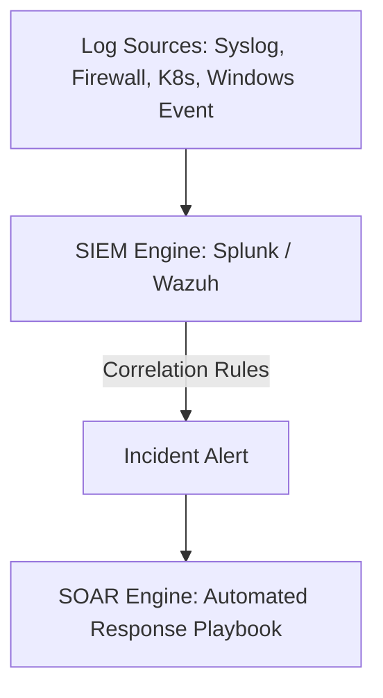
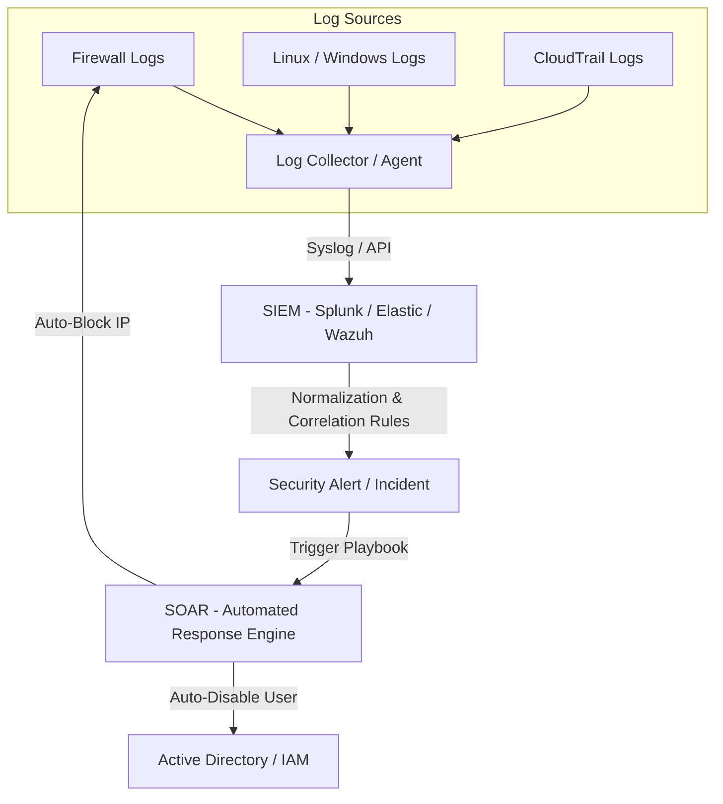

# 🛡 14.Security_Operations_and_Monitoring: Vận Hành An Ninh SecOps, SIEM, SOAR & EDR - Chuyên Sâu CompTIA Security+ Cho DevSecOps

> 💡 **Bản chất 1 câu**: Kiến trúc SecOps: SIEM (Log Collection, Normalization, Correlation), SOAR (Automated Incident Playbooks), Syslog, Packet Captures, NetFlow, EDR/XDR và File Integrity Monitoring (FIM).  
> 🎯 **Trọng tâm thực chiến DevSecOps**: Nắm vững SIEM (Splunk, Wazuh) thu thập log tập trung vs SOAR (Phản ứng tự động qua Playbook) vs EDR (Giám sát và phản ứng mã độc tại Endpoint) vs FIM (Kiểm tra thay đổi file hệ thống `tripwire`/`ossec`).

---



---

## 2. 📚 Lý Thuyết Chuyên Sâu & Bản Chất Hệ Thống (Under The Hood Architecture)

### 2.1 Kiến Trúc Giám Sát An Ninh SIEM & SOAR (OBJ 3.2)



1. **SIEM (Security Information and Event Management)**:
   - Thu thập, chuẩn hóa (Normalization) và tương quan (Correlation) hàng tỷ dòng log từ nhiều nguồn để phát hiện hành vi tấn công bất thường.
2. **SOAR (Security Orchestration, Automation, and Response)**:
   - Tự động hóa quy trình xử lý sự cố theo kịch bản Playbook (Ví dụ: Khi SIEM phát hiện IP brute-force -> SOAR tự động gọi API gõ lệnh chặn IP đó trên Firewall trong 1 giây mà không cần con người thao tác).
3. **EDR (Endpoint Detection and Response)**: Giám sát hành vi tiến trình thực thời gian trên từng máy trạm/server để phát hiện và cô lập mã độc phức tạp.
4. **FIM (File Integrity Monitoring)**: Giám sát hash của các file hệ thống quan trọng (`/etc/passwd`, `/bin/bash`) để phát hiện file bị thay đổi trái phép (Tripwire, Wazuh FIM).


---


### 2.4 Cơ Chế Hoạt Động Bên Dưới Kernel & Kiến Trúc Hệ Thống Chi Tiết (Deep Under The Hood Architecture)
- **Tầng Giao Tiếp Mạng & Bắt Gói Tin**: Mọi gói tin đi qua Network Interface Card (NIC) đều trải qua quá trình xử lý Ring Buffer, ngắt phần cứng (Hardware Interrupts), Ring Buffer DMA và chồng giao thức Socket Buffers (`sk_buff`) trong Linux Kernel.
- **Tối Ưu Hóa & Cấu Trúc Dữ Liệu**: Hệ thống duy trì các bảng băm dữ liệu (Routing Table, ARP Cache Table, Connection Tracking Table `conntrack`, Socket Inode Tables) giúp chuyển tiếp gói tin ở tốc độ dây (Line-rate processing).
- **Phân Lập An Ninh & Phân Vùng**: Sử dụng cơ chế Linux Network Namespaces (`ip netns`), iptables/nftables hooks và mã hóa phần cứng để cách ly lưu lượng mạng tuyệt đối.

---

## 3. ⚡ Bảng Tra Cứu Khái Niệm & Câu Lệnh Thực Hành (Reference Table)

| Công cụ / Khái niệm / Lệnh | Phân loại / Standard | Ý nghĩa chi tiết bản chất | Ứng dụng thực tế DevSecOps |
| :--- | :--- | :--- | :--- |
| **`SIEM`** | `SecOps Tool` | Hệ thống tập trung thu thập & tương quan log phát hiện tấn công | `Wazuh, Elastic SIEM, Splunk` |
| **`SOAR`** | `SecOps Auto` | Hệ thống tự động hóa phản ứng sự cố theo kịch bản Playbook | `Tự động chặn IP độc hại trên Firewall` |
| **`EDR / XDR`** | `Endpoint Sec` | Giám sát & cô lập mã độc thời gian thực trên máy trạm/Server | `CrowdStrike, SentinelOne` |
| **`FIM`** | `Integrity` | Giám sát sự thay đổi file hệ thống quan trọng | `Phát hiện file bị chèn backdoor` |


---

## 4. 🛠 Thao Tác Thực Chiến & Kịch Bản SecOps (Real-World Scenarios)

### 🛠 Các lệnh & công cụ thực hành gõ là ăn ngay:
```bash
# Cấu hình Rsyslog đẩy log tập trung sang máy chủ SIEM:
*.* @10.0.0.100:514

# Kiểm tra sự thay đổi file hệ thống bằng Wazuh FIM agent status:
sudo /var/ossec/bin/wazuh-control status
```

### 🚀 Kịch bản xử lý sự cố thực tế khi đi làm (Incident Response Playbook):
Sự cố SIEM phát hiện hàng ngàn lần đăng nhập thất bại SSH từ 1 IP lạ -> Kích hoạt kịch bản SOAR tự động thêm IP đó vào danh sách đen IPTables drop ngay lập tức.

---


### 4.2 Chi Tiết Các Lỗi Thường Gặp & Kịch Bản Khắc Phục Lỗi (Troubleshooting Deep-Dive)
1. **Sự cố 1: Lỗi Mất Gói Tin & Mất Kết Nối Cổng Mạng (Packet Loss & Port Unreachable)**:
   - **Triệu chứng**: Gửi HTTP Request bị Timeout, SSH không kết nối được hoặc gói tin bị nảy rải rác.
   - **Các bước xử lý khẩn cấp**:
     ```bash
     # 1. Kiểm tra trạng thái cổng mạng TCP/UDP đang lắng nghe:
     sudo ss -tulpn | grep :80
     
     # 2. Bắt gói tin trực tiếp trên Interface để kiểm tra bắt tay 3 bước TCP:
     sudo tcpdump -i eth0 port 80 -nn -vv
     
     # 3. Phân tích đường đi của gói tin tìm điểm đứt gãy bằng MTR:
     mtr -n --report --report-cycles=10 8.8.8.8
     
     # 4. Kiểm tra xem gói tin có bị Firewall Drop không:
     sudo iptables -L -n -v | grep DROP
     ```

2. **Sự cố 2: Lỗi Sai Cấu Hình DNS & Chuyển Tiếp IP (DNS Resolution & IP Routing Error)**:
   - **Triệu chứng**: Ping IP thành công nhưng ping Domain Name báo `Could not resolve host`.
   - **Các bước xử lý khẩn cấp**:
     ```bash
     # 1. Tra cứu thử nghiệm phân giải DNS qua server cụ thể:
     dig @8.8.8.8 company.com +trace
     
     # 2. Kiểm tra file cấu hình DNS resolver địa phương:
     cat /etc/resolv.conf
     
     # 3. Kiểm tra bảng định tuyến Kernel IP Routing Table:
     ip route show default
     ```

---

## 5. 🚀 Bộ Câu Hỏi Phỏng Vấn DevSecOps & Security Thực Tế (Interview Q&A)

> **Q: Sự khác biệt cốt lõi giữa SIEM và SOAR là gì?**  
> **A**: SIEM tập trung vào việc **Thu thập, Chuẩn hóa và Tương quan Log** để phát hiện và cảnh báo sự cố. SOAR tập trung vào **Tự động hóa phản ứng** sự cố theo kịch bản Playbook mà không cần con người thao tác.

> **Q: Công cụ File Integrity Monitoring (FIM) hoạt động theo nguyên lý nào?**  
> **A**: FIM tính toán mã băm (Hash SHA-256) của các file hệ thống quan trọng và liên tục so sánh với bản mốc ban đầu để phát hiện sự thay đổi hoặc chèn mã độc trái phép.


> **Q: Làm thế nào để điều tra và dập tắt sự cố một Server bị tấn công làm tràn bộ đệm kết nối TCP SYN Flood DoS?**  
> **A**:  
> 1. **Nhận biết**: Lệnh `ss -ant | grep SYN_RECV | wc -l` trả về hàng ngàn kết nối ở trạng thái `SYN_RECV`.  
> 2. **Xử lý khẩn cấp**: Bật ngay cơ chế **SYN Cookies** của Linux Kernel bằng lệnh `sudo sysctl -w net.ipv4.tcp_syncookies=1`. Kích hoạt bộ lọc Firewall drop các gói tin SYN có tần suất bất thường: `sudo iptables -A INPUT -p tcp --syn -m limit --limit 1/s --limit-burst 3 -j ACCEPT`.

> **Q: Sự khác biệt về mặt bản chất giữa Stateful Firewall và Stateless Firewall là gì?**  
> **A**: Stateless Firewall chỉ kiểm tra từng gói tin riêng rẻ dựa trên IP nguồn/đích và Port mà KHÔNG nhớ ngữ cảnh. Stateful Firewall duy trì một bảng theo dõi trạng thái kết nối (**Connection Tracking Table `conntrack`**), tự động nhận diện gói tin thuộc về một kết nối hợp lệ đã được chấp nhận trước đó (như trạng thái `ESTABLISHED,RELATED`), giúp bảo mật và tối ưu hiệu năng vượt trội.

---

## 6. 📝 Cheat Sheet Ghi Nhớ Nhanh (Summary)

- [x] SIEM: Thu thập & tương quan log tập trung
- [x] SOAR: Tự động hóa phản ứng theo Playbook
- [x] EDR: Giám sát & cô lập mã độc trên Endpoint
- [x] FIM: Giám sát thay đổi file bằng Hashing

