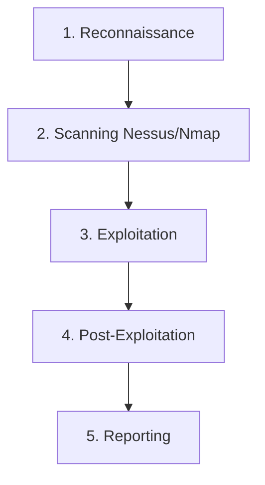
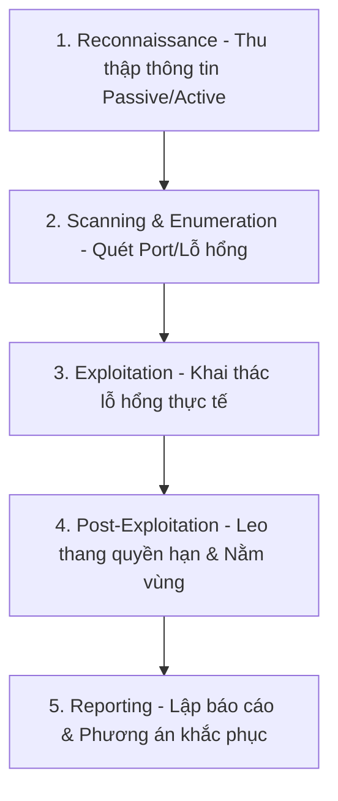

# 🛡 15.Vulnerability_Management_and_Pentesting: Quản Lý Lỗ Hổng & Thử Nghiệm Xâm Nhập (Penetration Testing) - Chuyên Sâu CompTIA Security+ Cho DevSecOps

> 💡 **Bản chất 1 câu**: Vulnerability Scanning (Nessus, OpenVAS), CVSS v3/v4 Scoring, Penetration Testing Phases (Reconnaissance, Scanning, Exploitation, Post-Exploitation, Reporting), Red vs Blue vs Purple Team và Bug Bounty.  
> 🎯 **Trọng tâm thực chiến DevSecOps**: Phân biệt Passive vs Active Reconnaissance, Black Box vs White Box vs Gray Box Testing, Vulnerability Assessment (Chỉ tìm lỗ hổng) vs Pentest (Khai thác lỗ hổng thực sự).

---



---

## 2. 📚 Lý Thuyết Chuyên Sâu & Bản Chất Hệ Thống (Under The Hood Architecture)

### 2.1 Quy Trình Thử Nghiệm Xâm Nhập (Pentest Phases - OBJ 2.5)



1. **Các Phân Loại Pentesting (Box Types)**:
   - **Black Box**: Tester không có bất kỳ thông tin nào về hệ thống (Giống Hacker bên ngoài).
   - **White Box**: Tester được cung cấp đầy đủ sơ đồ mạng, mã nguồn và tài khoản.
   - **Gray Box**: Tester được cung cấp thông tin giới hạn (User account tiêu chuẩn).
2. **Thang Điểm Lỗ Hổng CVSS (Common Vulnerability Scoring System)**:
   - Thang điểm từ **0.0 đến 10.0** (Low, Medium, High, Critical >= 9.0).
3. **Diễn Tập Red Team vs Blue Team**:
   - **Red Team**: Đội tấn công đóng giả Hacker.
   - **Blue Team**: Đội phòng thủ giám sát và ngăn chặn tấn công.
   - **Purple Team**: Đội hợp tác tối ưu hóa luật phòng thủ dựa trên kết quả Red Team.


---


### 2.4 Cơ Chế Hoạt Động Bên Dưới Kernel & Kiến Trúc Hệ Thống Chi Tiết (Deep Under The Hood Architecture)
- **Tầng Giao Tiếp Mạng & Bắt Gói Tin**: Mọi gói tin đi qua Network Interface Card (NIC) đều trải qua quá trình xử lý Ring Buffer, ngắt phần cứng (Hardware Interrupts), Ring Buffer DMA và chồng giao thức Socket Buffers (`sk_buff`) trong Linux Kernel.
- **Tối Ưu Hóa & Cấu Trúc Dữ Liệu**: Hệ thống duy trì các bảng băm dữ liệu (Routing Table, ARP Cache Table, Connection Tracking Table `conntrack`, Socket Inode Tables) giúp chuyển tiếp gói tin ở tốc độ dây (Line-rate processing).
- **Phân Lập An Ninh & Phân Vùng**: Sử dụng cơ chế Linux Network Namespaces (`ip netns`), iptables/nftables hooks và mã hóa phần cứng để cách ly lưu lượng mạng tuyệt đối.

---

## 3. ⚡ Bảng Tra Cứu Khái Niệm & Câu Lệnh Thực Hành (Reference Table)

| Công cụ / Khái niệm / Lệnh | Phân loại / Standard | Ý nghĩa chi tiết bản chất | Ứng dụng thực tế DevSecOps |
| :--- | :--- | :--- | :--- |
| **`Nessus / OpenVAS`** | `Vuln Scanner` | Công cụ quét tự động phát hiện các lỗ hổng hệ thống | `Quét lỗ hổng định kỳ hàng tháng` |
| **`CVSS v3/v4`** | `Scoring Metric` | Thang điểm đánh giá mức độ nghiêm trọng lỗ hổng (0-10) | `Đánh giá ưu tiên vá lỗ hổng Critical` |
| **`Black Box`** | `Pentest Type` | Thử nghiệm xâm nhập không có thông tin nội bộ | `Đánh giá an ninh từ góc nhìn Hacker ngoài` |
| **`Red/Blue Team`** | `Exercise` | Red Team tấn công giả lập, Blue Team phòng thủ giám sát | `Diễn tập an ninh mạng doanh nghiệp` |


---

## 4. 🛠 Thao Tác Thực Chiến & Kịch Bản SecOps (Real-World Scenarios)

### 🛠 Các lệnh & công cụ thực hành gõ là ăn ngay:
```bash
# Quét lỗ hổng an ninh Web bằng Nikto:
nikto -h https://target.company.com

# Tìm kiếm thông tin công khai (Passive Reconnaissance) bằng theHarvester:
theharvester -d company.com -b google
```

### 🚀 Kịch bản xử lý sự cố thực tế khi đi làm (Incident Response Playbook):
Sự cố Pentester khai thác thành công lỗ hổng Remote Code Execution (RCE) gõ lệnh chiếm quyền Root -> Lập tức thông báo đội DevSecOps vá lỗi khẩn cấp trong 24h.

---


### 4.2 Chi Tiết Các Lỗi Thường Gặp & Kịch Bản Khắc Phục Lỗi (Troubleshooting Deep-Dive)
1. **Sự cố 1: Lỗi Mất Gói Tin & Mất Kết Nối Cổng Mạng (Packet Loss & Port Unreachable)**:
   - **Triệu chứng**: Gửi HTTP Request bị Timeout, SSH không kết nối được hoặc gói tin bị nảy rải rác.
   - **Các bước xử lý khẩn cấp**:
     ```bash
     # 1. Kiểm tra trạng thái cổng mạng TCP/UDP đang lắng nghe:
     sudo ss -tulpn | grep :80
     
     # 2. Bắt gói tin trực tiếp trên Interface để kiểm tra bắt tay 3 bước TCP:
     sudo tcpdump -i eth0 port 80 -nn -vv
     
     # 3. Phân tích đường đi của gói tin tìm điểm đứt gãy bằng MTR:
     mtr -n --report --report-cycles=10 8.8.8.8
     
     # 4. Kiểm tra xem gói tin có bị Firewall Drop không:
     sudo iptables -L -n -v | grep DROP
     ```

2. **Sự cố 2: Lỗi Sai Cấu Hình DNS & Chuyển Tiếp IP (DNS Resolution & IP Routing Error)**:
   - **Triệu chứng**: Ping IP thành công nhưng ping Domain Name báo `Could not resolve host`.
   - **Các bước xử lý khẩn cấp**:
     ```bash
     # 1. Tra cứu thử nghiệm phân giải DNS qua server cụ thể:
     dig @8.8.8.8 company.com +trace
     
     # 2. Kiểm tra file cấu hình DNS resolver địa phương:
     cat /etc/resolv.conf
     
     # 3. Kiểm tra bảng định tuyến Kernel IP Routing Table:
     ip route show default
     ```

---

## 5. 🚀 Bộ Câu Hỏi Phỏng Vấn DevSecOps & Security Thực Tế (Interview Q&A)

> **Q: Sự khác biệt cốt lõi giữa Vulnerability Assessment và Penetration Testing là gì?**  
> **A**: Vulnerability Assessment chỉ dừng lại ở việc **phát hiện và liệt kê** các lỗ hổng tiềm ẩn. Penetration Testing bước tiếp một bước nữa là **thực sự khai thác** lỗ hổng đó để chứng minh tác hại thực tế.

> **Q: Mô hình phỏng vấn Black Box Pentest khác White Box Pentest như thế nào?**  
> **A**: Black Box Tester không được cung cấp thông tin nội bộ nào. White Box Tester được cấp toàn bộ mã nguồn, sơ đồ kiến trúc và quyền truy cập để audit chuyên sâu.


> **Q: Làm thế nào để điều tra và dập tắt sự cố một Server bị tấn công làm tràn bộ đệm kết nối TCP SYN Flood DoS?**  
> **A**:  
> 1. **Nhận biết**: Lệnh `ss -ant | grep SYN_RECV | wc -l` trả về hàng ngàn kết nối ở trạng thái `SYN_RECV`.  
> 2. **Xử lý khẩn cấp**: Bật ngay cơ chế **SYN Cookies** của Linux Kernel bằng lệnh `sudo sysctl -w net.ipv4.tcp_syncookies=1`. Kích hoạt bộ lọc Firewall drop các gói tin SYN có tần suất bất thường: `sudo iptables -A INPUT -p tcp --syn -m limit --limit 1/s --limit-burst 3 -j ACCEPT`.

> **Q: Sự khác biệt về mặt bản chất giữa Stateful Firewall và Stateless Firewall là gì?**  
> **A**: Stateless Firewall chỉ kiểm tra từng gói tin riêng rẻ dựa trên IP nguồn/đích và Port mà KHÔNG nhớ ngữ cảnh. Stateful Firewall duy trì một bảng theo dõi trạng thái kết nối (**Connection Tracking Table `conntrack`**), tự động nhận diện gói tin thuộc về một kết nối hợp lệ đã được chấp nhận trước đó (như trạng thái `ESTABLISHED,RELATED`), giúp bảo mật và tối ưu hiệu năng vượt trội.

---

## 6. 📝 Cheat Sheet Ghi Nhớ Nhanh (Summary)

- [x] Recon -> Scanning -> Exploitation -> Post-Exploitation -> Reporting
- [x] Black Box: Không có thông tin
- [x] White Box: Có đầy đủ thông tin/Code
- [x] CVSS Score: 0.0 - 10.0 (Critical >= 9.0)
- [x] Red Team: Tấn công, Blue Team: Phòng thủ

