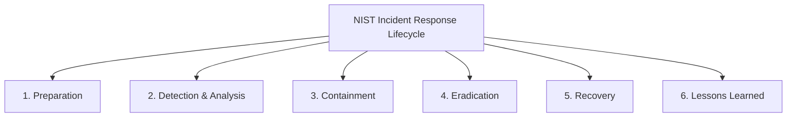
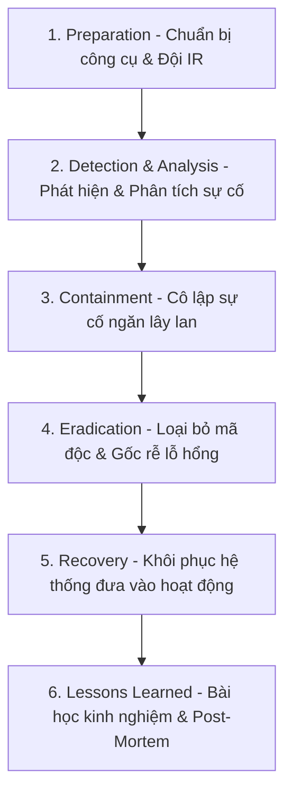

# 🛡 16.Incident_Response_and_Forensics: Ứng Phó Sự Cố (Incident Response) & Điều Tra Kỹ Thuật Số Forensics - Chuyên Sâu CompTIA Security+ Cho DevSecOps

> 💡 **Bản chất 1 câu**: Quy trình Incident Response NIST SP 800-61 (Preparation, Detection & Analysis, Containment, Eradication, Recovery, Lessons Learned), Order of Volatility, Chain of Custody và Memory Forensics.  
> 🎯 **Trọng tâm thực chiến DevSecOps**: Nắm vững thứ tự tính dễ biến mất của dữ liệu (Order of Volatility: RAM -> Swap -> Disk -> Media -> Archival) và Chain of Custody (Nhật ký niêm phong bằng chứng chứng cứ pháp lý).

---



---

## 2. 📚 Lý Thuyết Chuyên Sâu & Bản Chất Hệ Thống (Under The Hood Architecture)

### 2.1 Quy Trình 6 Bước Ứng Phó Sự Cố NIST SP 800-61 (OBJ 4.2)



---

### 2.2 Thứ Tự Dễ Biến Mất Của Dữ Liệu (Order of Volatility - OBJ 4.5)
Khi trích xuất bằng chứng kỹ thuật số, BẮT BUỘC phải thu thập dữ liệu theo thứ tự từ **Dễ biến mất nhất đến Bền vững nhất**:
1. **CPU Registers & Cache** (Biến mất trong nanosecond).
2. **Routing Table, ARP Cache, Process Table, RAM Memory** (Biến mất khi tắt nguồn!).
3. **Temporary File Systems / Swap space**.
4. **Hard Disk / SSD / NVMe Storage**.
5. **Remote Logging Data / Backups**.
6. **Physical Media (CD/DVD, Tapes)**.

- **Chain of Custody**: Tài liệu ghi chép chi tiết ai thu thập bằng chứng, thời gian, mã Hash SHA-256 xác minh bằng chứng không bị thay đổi.


---


### 2.4 Cơ Chế Hoạt Động Bên Dưới Kernel & Kiến Trúc Hệ Thống Chi Tiết (Deep Under The Hood Architecture)
- **Tầng Giao Tiếp Mạng & Bắt Gói Tin**: Mọi gói tin đi qua Network Interface Card (NIC) đều trải qua quá trình xử lý Ring Buffer, ngắt phần cứng (Hardware Interrupts), Ring Buffer DMA và chồng giao thức Socket Buffers (`sk_buff`) trong Linux Kernel.
- **Tối Ưu Hóa & Cấu Trúc Dữ Liệu**: Hệ thống duy trì các bảng băm dữ liệu (Routing Table, ARP Cache Table, Connection Tracking Table `conntrack`, Socket Inode Tables) giúp chuyển tiếp gói tin ở tốc độ dây (Line-rate processing).
- **Phân Lập An Ninh & Phân Vùng**: Sử dụng cơ chế Linux Network Namespaces (`ip netns`), iptables/nftables hooks và mã hóa phần cứng để cách ly lưu lượng mạng tuyệt đối.

---

## 3. ⚡ Bảng Tra Cứu Khái Niệm & Câu Lệnh Thực Hành (Reference Table)

| Công cụ / Khái niệm / Lệnh | Phân loại / Standard | Ý nghĩa chi tiết bản chất | Ứng dụng thực tế DevSecOps |
| :--- | :--- | :--- | :--- |
| **`NIST 800-61`** | `IR Framework` | Quy trình 6 bước ứng phó sự cố an ninh mạng chuẩn quốc tế | `Khung quy trình ứng phó sự cố IR` |
| **`Order of Volatility`** | `Forensic Concept` | Thứ tự thu thập bằng chứng từ RAM đến Đĩa cứng | `Trích xuất bằng chứng số đúng luật` |
| **`Chain of Custody`** | `Legal Concept` | Nhật ký lưu vết bảo quản bằng chứng kèm mã Hash SHA-256 | `Bảo vệ tính pháp lý của bằng chứng` |
| **`Volatility`** | `Forensic Tool` | Công cụ phân tích bộ nhớ RAM dump tìm mã độc nằm vùng | `Điều tra mã độc Fileless trên RAM` |


---

## 4. 🛠 Thao Tác Thực Chiến & Kịch Bản SecOps (Real-World Scenarios)

### 🛠 Các lệnh & công cụ thực hành gõ là ăn ngay:
```bash
# 1. Trích xuất dump bộ nhớ RAM live trên Linux bằng LiME hoặc dd:
sudo dd if=/dev/mem of=/tmp/ram_dump.raw bs=1M

# 2. Tạo mã Hash SHA-256 niêm phong bằng chứng:
sha256sum /tmp/ram_dump.raw > /tmp/ram_dump.raw.sha256
```

### 🚀 Kịch bản xử lý sự cố thực tế khi đi làm (Incident Response Playbook):
Sự cố Server nghi ngờ bị hack nằm vùng -> Cô lập mạng (Containment) nhưng giữ nguyên nguồn điện để dump RAM trích xuất bằng chứng trước khi tắt máy.

---


### 4.2 Chi Tiết Các Lỗi Thường Gặp & Kịch Bản Khắc Phục Lỗi (Troubleshooting Deep-Dive)
1. **Sự cố 1: Lỗi Mất Gói Tin & Mất Kết Nối Cổng Mạng (Packet Loss & Port Unreachable)**:
   - **Triệu chứng**: Gửi HTTP Request bị Timeout, SSH không kết nối được hoặc gói tin bị nảy rải rác.
   - **Các bước xử lý khẩn cấp**:
     ```bash
     # 1. Kiểm tra trạng thái cổng mạng TCP/UDP đang lắng nghe:
     sudo ss -tulpn | grep :80
     
     # 2. Bắt gói tin trực tiếp trên Interface để kiểm tra bắt tay 3 bước TCP:
     sudo tcpdump -i eth0 port 80 -nn -vv
     
     # 3. Phân tích đường đi của gói tin tìm điểm đứt gãy bằng MTR:
     mtr -n --report --report-cycles=10 8.8.8.8
     
     # 4. Kiểm tra xem gói tin có bị Firewall Drop không:
     sudo iptables -L -n -v | grep DROP
     ```

2. **Sự cố 2: Lỗi Sai Cấu Hình DNS & Chuyển Tiếp IP (DNS Resolution & IP Routing Error)**:
   - **Triệu chứng**: Ping IP thành công nhưng ping Domain Name báo `Could not resolve host`.
   - **Các bước xử lý khẩn cấp**:
     ```bash
     # 1. Tra cứu thử nghiệm phân giải DNS qua server cụ thể:
     dig @8.8.8.8 company.com +trace
     
     # 2. Kiểm tra file cấu hình DNS resolver địa phương:
     cat /etc/resolv.conf
     
     # 3. Kiểm tra bảng định tuyến Kernel IP Routing Table:
     ip route show default
     ```

---

## 5. 🚀 Bộ Câu Hỏi Phỏng Vấn DevSecOps & Security Thực Tế (Interview Q&A)

> **Q: Tại sao không được TẮT NGUỒN máy tính ngay lập tức khi phát hiện sự cố máy bị nhiễm mã độc Fileless?**  
> **A**: Vì tắt nguồn sẽ làm mất hoàn toàn dữ liệu trong bộ nhớ RAM (nơi chứa bằng chứng duy nhất của Fileless Malware và các khóa mã hóa tiến trình theo Order of Volatility).

> **Q: Tài liệu Chain of Custody đóng vai trò gì trong điều tra tội phạm mạng?**  
> **A**: Đảm bảo tính pháp lý của bằng chứng số bằng cách chứng minh ai đã thu thập, bảo quản, lưu trữ bằng chứng kèm mã Hash SHA-256 xác nhận bằng chứng không bị tráo đổi hay thay đổi.


> **Q: Làm thế nào để điều tra và dập tắt sự cố một Server bị tấn công làm tràn bộ đệm kết nối TCP SYN Flood DoS?**  
> **A**:  
> 1. **Nhận biết**: Lệnh `ss -ant | grep SYN_RECV | wc -l` trả về hàng ngàn kết nối ở trạng thái `SYN_RECV`.  
> 2. **Xử lý khẩn cấp**: Bật ngay cơ chế **SYN Cookies** của Linux Kernel bằng lệnh `sudo sysctl -w net.ipv4.tcp_syncookies=1`. Kích hoạt bộ lọc Firewall drop các gói tin SYN có tần suất bất thường: `sudo iptables -A INPUT -p tcp --syn -m limit --limit 1/s --limit-burst 3 -j ACCEPT`.

> **Q: Sự khác biệt về mặt bản chất giữa Stateful Firewall và Stateless Firewall là gì?**  
> **A**: Stateless Firewall chỉ kiểm tra từng gói tin riêng rẻ dựa trên IP nguồn/đích và Port mà KHÔNG nhớ ngữ cảnh. Stateful Firewall duy trì một bảng theo dõi trạng thái kết nối (**Connection Tracking Table `conntrack`**), tự động nhận diện gói tin thuộc về một kết nối hợp lệ đã được chấp nhận trước đó (như trạng thái `ESTABLISHED,RELATED`), giúp bảo mật và tối ưu hiệu năng vượt trội.

---

## 6. 📝 Cheat Sheet Ghi Nhớ Nhanh (Summary)

- [x] NIST IR: Preparation -> Detection -> Containment -> Eradication -> Recovery -> Lessons Learned
- [x] Order of Volatility: CPU/RAM -> Swap -> Disk -> Archival
- [x] Tắt máy làm MẤT dữ liệu RAM!
- [x] Chain of Custody: Nhật ký bảo quản bằng chứng + Hash

