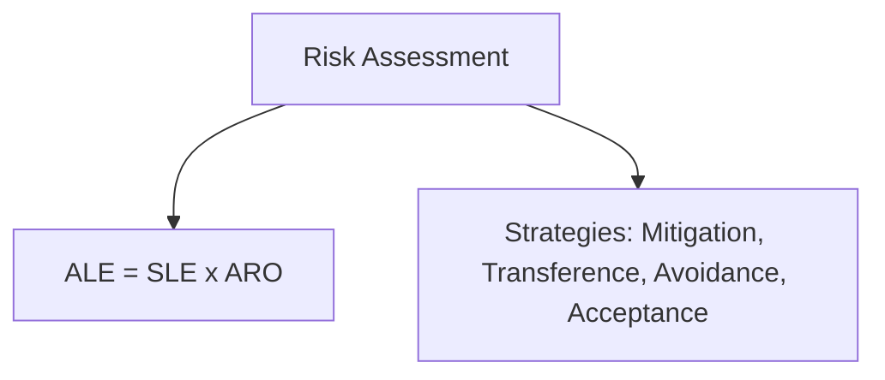
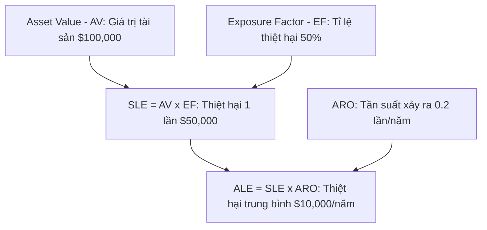

# 🛡 17.Risk_Management_and_Assessment: Quản Lý Rủi Ro An Ninh Mạng (Risk Assessment & Business Impact) - Chuyên Sâu CompTIA Security+ Cho DevSecOps

> 💡 **Bản chất 1 câu**: Công thức rủi ro (Risk = Threat x Vulnerability x Asset), Quantitative Risk Assessment (ALE = SLE x ARO, SLE = AV x EF), Qualitative Risk Assessment, Chiến lược ứng phó Rủi ro và Business Impact Analysis (BIA).  
> 🎯 **Trọng tâm thực chiến DevSecOps**: Thành thạo công thức tính toán tài chính Risk: Single Loss Expectancy (SLE), Annualized Rate of Occurrence (ARO), Annualized Loss Expectancy (ALE), và 4 chiến lược Rủi ro (Avoidance, Transference, Mitigation, Acceptance).

---



---

## 2. 📚 Lý Thuyết Chuyên Sâu & Bản Chất Hệ Thống (Under The Hood Architecture)

### 2.1 Đánh Giá Rủi Ro Định Lượng (Quantitative Risk Assessment - OBJ 5.2)



1. **Công Thức Tính Toán Chi Phí Rủi Ro**:
   - **AV (Asset Value)**: Giá trị tài sản (VD: Server $100,000).
   - **EF (Exposure Factor)**: Tỉ lệ phần trăm tổn thất khi có sự cố (VD: Cháy hư 50% = 0.5).
   - **SLE (Single Loss Expectancy)**: $SLE = AV 	imes EF = \$100,000 	imes 0.5 = \$50,000$.
   - **ARO (Annualized Rate of Occurrence)**: Tần suất xảy ra trong 1 năm (VD: 5 năm bị 1 lần = 0.2).
   - **ALE (Annualized Loss Expectancy)**: $ALE = SLE 	imes ARO = \$50,000 	imes 0.2 = \$10,000 / 	ext{năm}$.

---

### 2.2 Các Chiến Lược Ứng Phó Rủi Ro (Risk Response Strategies - OBJ 5.2)
- **Risk Mitigation (Giảm thiểu)**: Triển khai các biện pháp kiểm soát an ninh để giảm rủi ro (Mặt nạ, Firewall, Backup).
- **Risk Transference (Chuyển giao)**: Chuyển giao thiệt hại tài chính cho bên thứ 3 (Mua Bảo hiểm an ninh mạng Cyber Insurance, Thuê ngoài SOC).
- **Risk Avoidance (Né tránh)**: Hủy bỏ hoàn toàn dự án/hành động nguy hiểm.
- **Risk Acceptance (Chấp nhận)**: Chấp nhận rủi ro nếu chi phí khắc phục lớn hơn giá trị tài sản.


---


### 2.4 Cơ Chế Hoạt Động Bên Dưới Kernel & Kiến Trúc Hệ Thống Chi Tiết (Deep Under The Hood Architecture)
- **Tầng Giao Tiếp Mạng & Bắt Gói Tin**: Mọi gói tin đi qua Network Interface Card (NIC) đều trải qua quá trình xử lý Ring Buffer, ngắt phần cứng (Hardware Interrupts), Ring Buffer DMA và chồng giao thức Socket Buffers (`sk_buff`) trong Linux Kernel.
- **Tối Ưu Hóa & Cấu Trúc Dữ Liệu**: Hệ thống duy trì các bảng băm dữ liệu (Routing Table, ARP Cache Table, Connection Tracking Table `conntrack`, Socket Inode Tables) giúp chuyển tiếp gói tin ở tốc độ dây (Line-rate processing).
- **Phân Lập An Ninh & Phân Vùng**: Sử dụng cơ chế Linux Network Namespaces (`ip netns`), iptables/nftables hooks và mã hóa phần cứng để cách ly lưu lượng mạng tuyệt đối.

---

## 3. ⚡ Bảng Tra Cứu Khái Niệm & Câu Lệnh Thực Hành (Reference Table)

| Công cụ / Khái niệm / Lệnh | Phân loại / Standard | Ý nghĩa chi tiết bản chất | Ứng dụng thực tế DevSecOps |
| :--- | :--- | :--- | :--- |
| **`ALE`** | `Quantitative Risk` | Annualized Loss Expectancy - Thiệt hại ước tính hàng năm (ALE = SLE x ARO) | `Tính toán ngân sách an ninh` |
| **`SLE`** | `Quantitative Risk` | Single Loss Expectancy - Thiệt hại ước tính cho 1 lần sự cố (SLE = AV x EF) | `Đánh giá mức độ rủi ro` |
| **`Risk Mitigation`** | `Risk Strategy` | Giảm thiểu rủi ro bằng cách cài đặt công cụ bảo mật | `Cài Antivirus / Firewall` |
| **`Risk Transference`** | `Risk Strategy` | Chuyển giao rủi ro tài chính cho bảo hiểm Cyber Insurance | `Mua bảo hiểm sự cố an ninh` |


---

## 4. 🛠 Thao Tác Thực Chiến & Kịch Bản SecOps (Real-World Scenarios)

### 🛠 Các lệnh & công cụ thực hành gõ là ăn ngay:
```bash
# Sử dụng bảng tính Python tính toán ALE chi phí rủi ro hạ tầng:
python3 -c 'av=100000; ef=0.4; aro=0.1; sle=av*ef; ale=sle*aro; print(f"ALE: ${ale}")'
```

### 🚀 Kịch bản xử lý sự cố thực tế khi đi làm (Incident Response Playbook):
Đánh giá rủi ro máy chủ cũ chạy Windows Server 2008 hết hạn bảo trì -> Quyết định chọn Risk Avoidance (Loại bỏ máy chủ cũ ngắt kết nối).

---


### 4.2 Chi Tiết Các Lỗi Thường Gặp & Kịch Bản Khắc Phục Lỗi (Troubleshooting Deep-Dive)
1. **Sự cố 1: Lỗi Mất Gói Tin & Mất Kết Nối Cổng Mạng (Packet Loss & Port Unreachable)**:
   - **Triệu chứng**: Gửi HTTP Request bị Timeout, SSH không kết nối được hoặc gói tin bị nảy rải rác.
   - **Các bước xử lý khẩn cấp**:
     ```bash
     # 1. Kiểm tra trạng thái cổng mạng TCP/UDP đang lắng nghe:
     sudo ss -tulpn | grep :80
     
     # 2. Bắt gói tin trực tiếp trên Interface để kiểm tra bắt tay 3 bước TCP:
     sudo tcpdump -i eth0 port 80 -nn -vv
     
     # 3. Phân tích đường đi của gói tin tìm điểm đứt gãy bằng MTR:
     mtr -n --report --report-cycles=10 8.8.8.8
     
     # 4. Kiểm tra xem gói tin có bị Firewall Drop không:
     sudo iptables -L -n -v | grep DROP
     ```

2. **Sự cố 2: Lỗi Sai Cấu Hình DNS & Chuyển Tiếp IP (DNS Resolution & IP Routing Error)**:
   - **Triệu chứng**: Ping IP thành công nhưng ping Domain Name báo `Could not resolve host`.
   - **Các bước xử lý khẩn cấp**:
     ```bash
     # 1. Tra cứu thử nghiệm phân giải DNS qua server cụ thể:
     dig @8.8.8.8 company.com +trace
     
     # 2. Kiểm tra file cấu hình DNS resolver địa phương:
     cat /etc/resolv.conf
     
     # 3. Kiểm tra bảng định tuyến Kernel IP Routing Table:
     ip route show default
     ```

---

## 5. 🚀 Bộ Câu Hỏi Phỏng Vấn DevSecOps & Security Thực Tế (Interview Q&A)

> **Q: Nếu giá trị tài sản AV = $50,000, tỉ lệ tổn thất EF = 20%, tần suất sự cố ARO = 2 lần/năm thì ALE bằng bao nhiêu?**  
> **A**: SLE = $50,000 x 0.2 = $10,000. ALE = SLE x ARO = $10,000 x 2 = **$20,000 / năm**.

> **Q: Sự khác biệt giữa Risk Mitigation và Risk Transference là gì?**  
> **A**: Risk Mitigation triển khai các công cụ kiểm soát an ninh để giảm khả năng xảy ra sự cố. Risk Transference mua bảo hiểm hoặc thuê bên thứ 3 chịu trách nhiệm đền bù tài chính khi sự cố xảy ra.


> **Q: Làm thế nào để điều tra và dập tắt sự cố một Server bị tấn công làm tràn bộ đệm kết nối TCP SYN Flood DoS?**  
> **A**:  
> 1. **Nhận biết**: Lệnh `ss -ant | grep SYN_RECV | wc -l` trả về hàng ngàn kết nối ở trạng thái `SYN_RECV`.  
> 2. **Xử lý khẩn cấp**: Bật ngay cơ chế **SYN Cookies** của Linux Kernel bằng lệnh `sudo sysctl -w net.ipv4.tcp_syncookies=1`. Kích hoạt bộ lọc Firewall drop các gói tin SYN có tần suất bất thường: `sudo iptables -A INPUT -p tcp --syn -m limit --limit 1/s --limit-burst 3 -j ACCEPT`.

> **Q: Sự khác biệt về mặt bản chất giữa Stateful Firewall và Stateless Firewall là gì?**  
> **A**: Stateless Firewall chỉ kiểm tra từng gói tin riêng rẻ dựa trên IP nguồn/đích và Port mà KHÔNG nhớ ngữ cảnh. Stateful Firewall duy trì một bảng theo dõi trạng thái kết nối (**Connection Tracking Table `conntrack`**), tự động nhận diện gói tin thuộc về một kết nối hợp lệ đã được chấp nhận trước đó (như trạng thái `ESTABLISHED,RELATED`), giúp bảo mật và tối ưu hiệu năng vượt trội.

---

## 6. 📝 Cheat Sheet Ghi Nhớ Nhanh (Summary)

- [x] Risk = Threat x Vulnerability x Asset
- [x] SLE = AV x EF
- [x] ALE = SLE x ARO
- [x] Mitigation: Cài công cụ bảo vệ
- [x] Transference: Mua bảo hiểm Cyber Insurance
- [x] Avoidance: Hủy hành động nguy hiểm

