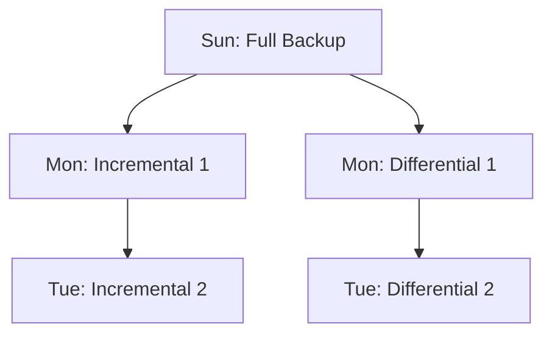
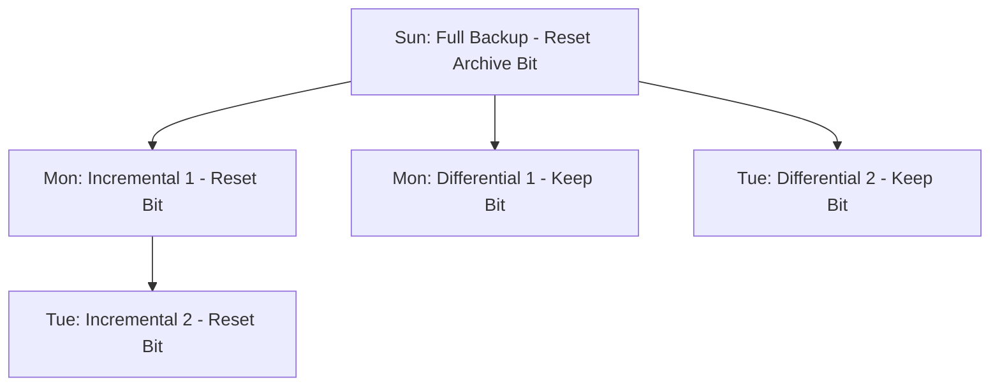

# 🛡 18.Disaster_Recovery_and_Business_Continuity: Khôi Phục Thảm Họa DRP & Liên Tục Kinh Doanh BCP - Chuyên Sâu CompTIA Security+ Cho DevSecOps

> 💡 **Bản chất 1 câu**: Kế hoạch BCP vs DRP, Chỉ số RTO & RPO, Redundant Sites (Hot Site, Warm Site, Cold Site), Các loại Backup (Full, Incremental, Differential) và High Availability.  
> 🎯 **Trọng tâm thực chiến DevSecOps**: Phân biệt Full Backup vs Incremental Backup (Chỉ backup file đổi từ lần Incremental trước, xóa archive bit) vs Differential Backup (Backup file đổi từ lần Full trước, KHÔNG xóa archive bit).

---



---

## 2. 📚 Lý Thuyết Chuyên Sâu & Bản Chất Hệ Thống (Under The Hood Architecture)

### 2.1 So Sánh Các Chiến Lược Sao Lưu Backup (OBJ 3.3)



| Loại Backup | Thời gian thực hiện Backup | Dung lượng đĩa Backup | Quy trình Restore Phục Hồi khi sập |
| :--- | :--- | :--- | :--- |
| **Full Backup** | Chậm nhất | Tốn dung lượng nhất | **Nhanh nhất**: Chỉ cần 1 bản Full duy nhất |
| **Incremental Backup**| **Nhanh nhất** | Ít tốn dung lượng nhất | **Chậm nhất**: Cần bản Full + **TẤT CẢ** các bản Incremental theo thứ tự |
| **Differential Backup**| Trung bình | Trung bình | Cần bản Full + **BẢN DIFFERENTIAL MỚI NHẤT** |

---

### 2.2 RTO & RPO & Redundant Sites
- **RPO (Recovery Point Objective)**: Mức độ tổn thất dữ liệu **TỐI ĐA** chấp nhận được (Data loss time).
- **RTO (Recovery Time Objective)**: Khoảng thời gian **TỐI ĐA** cho phép để bật lại hệ thống (Downtime duration).
- **Hot Site**: RTO gần như bằng 0 (Đồng bộ real-time, rất đắt). **Cold Site**: RTO mất vài ngày/tuần (Chỉ có vỏ nhà, rẻ).


---


### 2.4 Cơ Chế Hoạt Động Bên Dưới Kernel & Kiến Trúc Hệ Thống Chi Tiết (Deep Under The Hood Architecture)
- **Tầng Giao Tiếp Mạng & Bắt Gói Tin**: Mọi gói tin đi qua Network Interface Card (NIC) đều trải qua quá trình xử lý Ring Buffer, ngắt phần cứng (Hardware Interrupts), Ring Buffer DMA và chồng giao thức Socket Buffers (`sk_buff`) trong Linux Kernel.
- **Tối Ưu Hóa & Cấu Trúc Dữ Liệu**: Hệ thống duy trì các bảng băm dữ liệu (Routing Table, ARP Cache Table, Connection Tracking Table `conntrack`, Socket Inode Tables) giúp chuyển tiếp gói tin ở tốc độ dây (Line-rate processing).
- **Phân Lập An Ninh & Phân Vùng**: Sử dụng cơ chế Linux Network Namespaces (`ip netns`), iptables/nftables hooks và mã hóa phần cứng để cách ly lưu lượng mạng tuyệt đối.

---

## 3. ⚡ Bảng Tra Cứu Khái Niệm & Câu Lệnh Thực Hành (Reference Table)

| Công cụ / Khái niệm / Lệnh | Phân loại / Standard | Ý nghĩa chi tiết bản chất | Ứng dụng thực tế DevSecOps |
| :--- | :--- | :--- | :--- |
| **`Full Backup`** | `Backup Type` | Sao lưu toàn bộ dữ liệu hệ thống | `Chạy vào cuối tuần` |
| **`Incremental`** | `Backup Type` | Sao lưu dữ liệu thay đổi so với lần Incremental trước | `Chạy hàng đêm (Nhanh, tốn ít đĩa)` |
| **`Differential`** | `Backup Type` | Sao lưu dữ liệu thay đổi so với lần Full trước | `Chạy hàng đêm (Khôi phục nhanh)` |
| **`RTO / RPO`** | `DR Metrics` | RTO: Thời gian bật lại hệ thống / RPO: Mức dữ liệu chấp nhận mất | `Chỉ số cam kết thảm họa DRP` |


---

## 4. 🛠 Thao Tác Thực Chiến & Kịch Bản SecOps (Real-World Scenarios)

### 🛠 Các lệnh & công cụ thực hành gõ là ăn ngay:
```bash
# Thực thi backup rsync dạng Incremental cho dữ liệu Linux Server:
rsync -avz --link-dest=/backup/yesterday /data /backup/today
```

### 🚀 Kịch bản xử lý sự cố thực tế khi đi làm (Incident Response Playbook):
Sự cố hệ thống bị sập vào thứ 4: Nếu dùng Incremental -> Restore bản Full Chủ nhật + Inc Thứ 2 + Inc Thứ 3. Nếu dùng Differential -> Restore bản Full Chủ nhật + Diff Thứ 3.

---


### 4.2 Chi Tiết Các Lỗi Thường Gặp & Kịch Bản Khắc Phục Lỗi (Troubleshooting Deep-Dive)
1. **Sự cố 1: Lỗi Mất Gói Tin & Mất Kết Nối Cổng Mạng (Packet Loss & Port Unreachable)**:
   - **Triệu chứng**: Gửi HTTP Request bị Timeout, SSH không kết nối được hoặc gói tin bị nảy rải rác.
   - **Các bước xử lý khẩn cấp**:
     ```bash
     # 1. Kiểm tra trạng thái cổng mạng TCP/UDP đang lắng nghe:
     sudo ss -tulpn | grep :80
     
     # 2. Bắt gói tin trực tiếp trên Interface để kiểm tra bắt tay 3 bước TCP:
     sudo tcpdump -i eth0 port 80 -nn -vv
     
     # 3. Phân tích đường đi của gói tin tìm điểm đứt gãy bằng MTR:
     mtr -n --report --report-cycles=10 8.8.8.8
     
     # 4. Kiểm tra xem gói tin có bị Firewall Drop không:
     sudo iptables -L -n -v | grep DROP
     ```

2. **Sự cố 2: Lỗi Sai Cấu Hình DNS & Chuyển Tiếp IP (DNS Resolution & IP Routing Error)**:
   - **Triệu chứng**: Ping IP thành công nhưng ping Domain Name báo `Could not resolve host`.
   - **Các bước xử lý khẩn cấp**:
     ```bash
     # 1. Tra cứu thử nghiệm phân giải DNS qua server cụ thể:
     dig @8.8.8.8 company.com +trace
     
     # 2. Kiểm tra file cấu hình DNS resolver địa phương:
     cat /etc/resolv.conf
     
     # 3. Kiểm tra bảng định tuyến Kernel IP Routing Table:
     ip route show default
     ```

---

## 5. 🚀 Bộ Câu Hỏi Phỏng Vấn DevSecOps & Security Thực Tế (Interview Q&A)

> **Q: Nếu hệ thống dùng chiến lược Incremental Backup hàng đêm, khi sập vào thứ 5 quy trình khôi phục Restore phải làm như thế nào?**  
> **A**: Phải restore bản Full Backup gần nhất (Chủ Nhật) + Restore lần lượt TẤT CẢ các bản Incremental của Thứ 2, Thứ 3 và Thứ 4 theo đúng thứ tự thời gian.

> **Q: Sự khác biệt giữa RTO và RPO là gì?**  
> **A**: RPO đo lường mức độ tổn thất dữ liệu tối đa chấp nhận được tính theo thời gian. RTO đo lường khoảng thời gian tối đa cho phép để bật lại hệ thống sau thảm họa.


> **Q: Làm thế nào để điều tra và dập tắt sự cố một Server bị tấn công làm tràn bộ đệm kết nối TCP SYN Flood DoS?**  
> **A**:  
> 1. **Nhận biết**: Lệnh `ss -ant | grep SYN_RECV | wc -l` trả về hàng ngàn kết nối ở trạng thái `SYN_RECV`.  
> 2. **Xử lý khẩn cấp**: Bật ngay cơ chế **SYN Cookies** của Linux Kernel bằng lệnh `sudo sysctl -w net.ipv4.tcp_syncookies=1`. Kích hoạt bộ lọc Firewall drop các gói tin SYN có tần suất bất thường: `sudo iptables -A INPUT -p tcp --syn -m limit --limit 1/s --limit-burst 3 -j ACCEPT`.

> **Q: Sự khác biệt về mặt bản chất giữa Stateful Firewall và Stateless Firewall là gì?**  
> **A**: Stateless Firewall chỉ kiểm tra từng gói tin riêng rẻ dựa trên IP nguồn/đích và Port mà KHÔNG nhớ ngữ cảnh. Stateful Firewall duy trì một bảng theo dõi trạng thái kết nối (**Connection Tracking Table `conntrack`**), tự động nhận diện gói tin thuộc về một kết nối hợp lệ đã được chấp nhận trước đó (như trạng thái `ESTABLISHED,RELATED`), giúp bảo mật và tối ưu hiệu năng vượt trội.

---

## 6. 📝 Cheat Sheet Ghi Nhớ Nhanh (Summary)

- [x] Full Backup: Sao lưu toàn bộ (Restore nhanh nhất)
- [x] Incremental: Nhanh nhất, tốn ít đĩa (Restore cần tất cả các bản)
- [x] Differential: Restore cần bản Full + bản Diff cuối cùng
- [x] RPO: Dữ liệu mất
- [x] RTO: Thời gian bật lại

