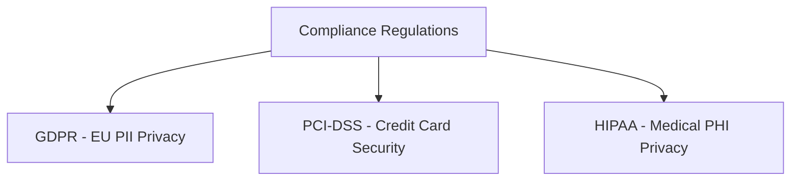
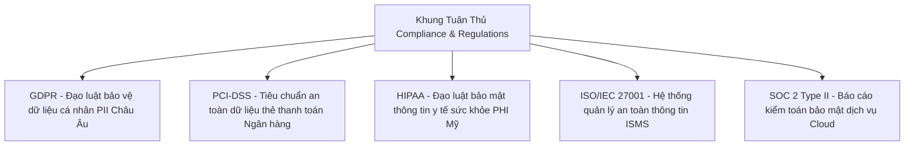

# 🛡 19.Governance_Compliance_and_Privacy: Quản Trị An Ninh (Governance), Tuân Thủ Compliance & Quyền Riêng Tư - Chuyên Sâu CompTIA Security+ Cho DevSecOps

> 💡 **Bản chất 1 câu**: Security Policies (AUP, Password, Data Retention), Đạo luật & Tiêu chuẩn (GDPR, PCI-DSS, HIPAA, SOC 2, ISO 27001, NIST CSF), Data Classification và Quyền riêng tư PII/PHI.  
> 🎯 **Trọng tâm thực chiến DevSecOps**: Phân biệt PII (Personally Identifiable Information) vs PHI (Protected Health Information) vs Anonymization (Vĩnh viễn không khôi phục được) vs Pseudonymization (Có thể mã hóa khôi phục lại).

---



---

## 2. 📚 Lý Thuyết Chuyên Sâu & Bản Chất Hệ Thống (Under The Hood Architecture)

### 2.1 Các Đạo Luật & Tiêu Chuẩn Tuân Thủ Quốc Tế (OBJ 5.1)



1. **GDPR (General Data Protection Regulation)**: Quy định bảo vệ quyền riêng tư cá nhân người dùng Châu Âu. Phạt tới **4% tổng doanh thu toàn cầu** nếu vi phạm lộ PII!
2. **PCI-DSS**: Bắt buộc mã hóa và bảo mật tuyệt đối cho mọi hệ thống lưu trữ/xử lý thông tin thẻ credit card.
3. **PII (Personally Identifiable Information)**: Thông tin định danh cá nhân (Số CCCD, Email, Tên, Địa chỉ).
4. **Anonymization vs Pseudonymization**:
   - **Anonymization**: Khử định danh vĩnh viễn (Xóa hoàn toàn cột tên/SSN khỏi DB), KHÔNG THỂ đảo ngược.
   - **Pseudonymization**: Thay thế thông tin định danh bằng mã giả (Alias/Token) có thể giải mã lại nếu có Private Key.


---


### 2.4 Cơ Chế Hoạt Động Bên Dưới Kernel & Kiến Trúc Hệ Thống Chi Tiết (Deep Under The Hood Architecture)
- **Tầng Giao Tiếp Mạng & Bắt Gói Tin**: Mọi gói tin đi qua Network Interface Card (NIC) đều trải qua quá trình xử lý Ring Buffer, ngắt phần cứng (Hardware Interrupts), Ring Buffer DMA và chồng giao thức Socket Buffers (`sk_buff`) trong Linux Kernel.
- **Tối Ưu Hóa & Cấu Trúc Dữ Liệu**: Hệ thống duy trì các bảng băm dữ liệu (Routing Table, ARP Cache Table, Connection Tracking Table `conntrack`, Socket Inode Tables) giúp chuyển tiếp gói tin ở tốc độ dây (Line-rate processing).
- **Phân Lập An Ninh & Phân Vùng**: Sử dụng cơ chế Linux Network Namespaces (`ip netns`), iptables/nftables hooks và mã hóa phần cứng để cách ly lưu lượng mạng tuyệt đối.

---

## 3. ⚡ Bảng Tra Cứu Khái Niệm & Câu Lệnh Thực Hành (Reference Table)

| Công cụ / Khái niệm / Lệnh | Phân loại / Standard | Ý nghĩa chi tiết bản chất | Ứng dụng thực tế DevSecOps |
| :--- | :--- | :--- | :--- |
| **`GDPR`** | `Privacy Regulation` | Đạo luật bảo vệ dữ liệu cá nhân Châu Âu (Phạt max 4% doanh thu) | `Quyền riêng tư dữ liệu người dùng` |
| **`PCI-DSS`** | `Banking Standard` | Tiêu chuẩn an toàn dữ liệu thẻ thanh toán ngân hàng | `Mã hóa số thẻ credit card` |
| **`PII`** | `Data Type` | Personally Identifiable Information - Thông tin định danh cá nhân | `Bảo vệ thông tin người dùng` |
| **`Anonymization`** | `Privacy Tech` | Khử định danh vĩnh viễn không thể đảo ngược | `Ẩn thông tin cá nhân trong Data Analytics` |


---

## 4. 🛠 Thao Tác Thực Chiến & Kịch Bản SecOps (Real-World Scenarios)

### 🛠 Các lệnh & công cụ thực hành gõ là ăn ngay:
```bash
# Tìm kiếm các thông tin PII (như số thẻ credit card) nhỡ bị ghi log ra file:
sudo grep -E '[0-9]{4}-[0-9]{4}-[0-9]{4}-[0-9]{4}' /var/log/app.log
```

### 🚀 Kịch bản xử lý sự cố thực tế khi đi làm (Incident Response Playbook):
Sự cố hệ thống Web bị phạt do lưu số credit card dạng văn bản rõ không tuân thủ PCI-DSS -> Sửa code ứng dụng dùng Tokenization bảo mật.

---


### 4.2 Chi Tiết Các Lỗi Thường Gặp & Kịch Bản Khắc Phục Lỗi (Troubleshooting Deep-Dive)
1. **Sự cố 1: Lỗi Mất Gói Tin & Mất Kết Nối Cổng Mạng (Packet Loss & Port Unreachable)**:
   - **Triệu chứng**: Gửi HTTP Request bị Timeout, SSH không kết nối được hoặc gói tin bị nảy rải rác.
   - **Các bước xử lý khẩn cấp**:
     ```bash
     # 1. Kiểm tra trạng thái cổng mạng TCP/UDP đang lắng nghe:
     sudo ss -tulpn | grep :80
     
     # 2. Bắt gói tin trực tiếp trên Interface để kiểm tra bắt tay 3 bước TCP:
     sudo tcpdump -i eth0 port 80 -nn -vv
     
     # 3. Phân tích đường đi của gói tin tìm điểm đứt gãy bằng MTR:
     mtr -n --report --report-cycles=10 8.8.8.8
     
     # 4. Kiểm tra xem gói tin có bị Firewall Drop không:
     sudo iptables -L -n -v | grep DROP
     ```

2. **Sự cố 2: Lỗi Sai Cấu Hình DNS & Chuyển Tiếp IP (DNS Resolution & IP Routing Error)**:
   - **Triệu chứng**: Ping IP thành công nhưng ping Domain Name báo `Could not resolve host`.
   - **Các bước xử lý khẩn cấp**:
     ```bash
     # 1. Tra cứu thử nghiệm phân giải DNS qua server cụ thể:
     dig @8.8.8.8 company.com +trace
     
     # 2. Kiểm tra file cấu hình DNS resolver địa phương:
     cat /etc/resolv.conf
     
     # 3. Kiểm tra bảng định tuyến Kernel IP Routing Table:
     ip route show default
     ```

---

## 5. 🚀 Bộ Câu Hỏi Phỏng Vấn DevSecOps & Security Thực Tế (Interview Q&A)

> **Q: Sự khác biệt giữa Anonymization (Khử định danh) và Pseudonymization (Giả định danh) là gì?**  
> **A**: Anonymization xóa bỏ hoàn toàn thông tin định danh vĩnh viễn không thể khôi phục lại. Pseudonymization thay thế bằng mã giả Token có thể giải mã khôi phục lại nếu có Secret Key.

> **Q: Mức phạt tối đa cho vi phạm nghiêm trọng đạo luật GDPR là bao nhiêu?**  
> **A**: Tối đa **4% tổng doanh thu toàn cầu hàng năm** của doanh nghiệp hoặc 20 triệu Euro (tùy theo con số nào lớn hơn).


> **Q: Làm thế nào để điều tra và dập tắt sự cố một Server bị tấn công làm tràn bộ đệm kết nối TCP SYN Flood DoS?**  
> **A**:  
> 1. **Nhận biết**: Lệnh `ss -ant | grep SYN_RECV | wc -l` trả về hàng ngàn kết nối ở trạng thái `SYN_RECV`.  
> 2. **Xử lý khẩn cấp**: Bật ngay cơ chế **SYN Cookies** của Linux Kernel bằng lệnh `sudo sysctl -w net.ipv4.tcp_syncookies=1`. Kích hoạt bộ lọc Firewall drop các gói tin SYN có tần suất bất thường: `sudo iptables -A INPUT -p tcp --syn -m limit --limit 1/s --limit-burst 3 -j ACCEPT`.

> **Q: Sự khác biệt về mặt bản chất giữa Stateful Firewall và Stateless Firewall là gì?**  
> **A**: Stateless Firewall chỉ kiểm tra từng gói tin riêng rẻ dựa trên IP nguồn/đích và Port mà KHÔNG nhớ ngữ cảnh. Stateful Firewall duy trì một bảng theo dõi trạng thái kết nối (**Connection Tracking Table `conntrack`**), tự động nhận diện gói tin thuộc về một kết nối hợp lệ đã được chấp nhận trước đó (như trạng thái `ESTABLISHED,RELATED`), giúp bảo mật và tối ưu hiệu năng vượt trội.

---

## 6. 📝 Cheat Sheet Ghi Nhớ Nhanh (Summary)

- [x] GDPR: Bảo vệ dữ liệu cá nhân PII (Phạt max 4% doanh thu)
- [x] PCI-DSS: Bảo mật thẻ ngân hàng Credit Card
- [x] PII: Thông tin định danh cá nhân
- [x] Anonymization: Khử định danh vĩnh viễn
- [x] Pseudonymization: Mã hóa giả định danh

