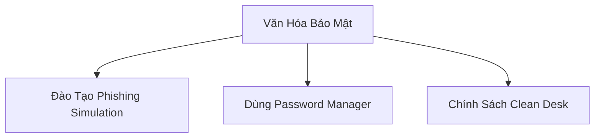
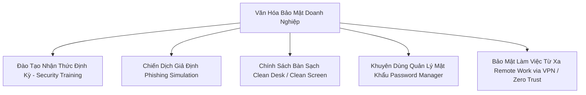

# 🛡 20.Security_Awareness_and_Culture: Đào Tạo Nhận Thức An Ninh & Văn Hóa Bảo Mật Doanh Nghiệp - Chuyên Sâu CompTIA Security+ Cho DevSecOps

> 💡 **Bản chất 1 câu**: Security Awareness Training, Anti-Phishing Campaigns, Password Managers, Clean Desk Policy, Bảo mật làm việc từ xa (Remote/Hybrid Work) và Xây dựng văn hóa bảo mật.  
> 🎯 **Trọng tâm thực chiến DevSecOps**: Tổ chức huấn luyện nhận thức an ninh định kỳ, chiến dịch giả định Phishing Simulation, chính sách bàn làm việc sạch Clean Desk / Clean Screen Policy, và thói quen sử dụng Password Manager.

---



---

## 2. 📚 Lý Thuyết Chuyên Sâu & Bản Chất Hệ Thống (Under The Hood Architecture)

### 2.1 Các Yếu Tố Xây Dựng Văn Hóa Bảo Mật Doanh Nghiệp (OBJ 5.6)



1. **Phishing Simulation Campaigns**: Gửi các email lừa đảo thử nghiệm cho nhân viên công ty để đánh giá tỉ lệ nhấp link và đào tạo lại các nhân viên mất cảnh giác.
2. **Clean Desk / Clean Screen Policy**: Đảm bảo không để tài liệu bảo mật trên bàn khi đứng dậy và tự động khóa màn hình (`Win + L`) khi đi ra ngoài.
3. **Password Managers**: Khuyến khích nhân viên dùng công cụ quản lý mật khẩu (1Password, Bitwarden) để tạo mật khẩu ngẫu nhiên độ dài > 16 ký tự mà không cần ghi nhớ gõ tay.


---


### 2.4 Cơ Chế Hoạt Động Bên Dưới Kernel & Kiến Trúc Hệ Thống Chi Tiết (Deep Under The Hood Architecture)
- **Tầng Giao Tiếp Mạng & Bắt Gói Tin**: Mọi gói tin đi qua Network Interface Card (NIC) đều trải qua quá trình xử lý Ring Buffer, ngắt phần cứng (Hardware Interrupts), Ring Buffer DMA và chồng giao thức Socket Buffers (`sk_buff`) trong Linux Kernel.
- **Tối Ưu Hóa & Cấu Trúc Dữ Liệu**: Hệ thống duy trì các bảng băm dữ liệu (Routing Table, ARP Cache Table, Connection Tracking Table `conntrack`, Socket Inode Tables) giúp chuyển tiếp gói tin ở tốc độ dây (Line-rate processing).
- **Phân Lập An Ninh & Phân Vùng**: Sử dụng cơ chế Linux Network Namespaces (`ip netns`), iptables/nftables hooks và mã hóa phần cứng để cách ly lưu lượng mạng tuyệt đối.

---

## 3. ⚡ Bảng Tra Cứu Khái Niệm & Câu Lệnh Thực Hành (Reference Table)

| Công cụ / Khái niệm / Lệnh | Phân loại / Standard | Ý nghĩa chi tiết bản chất | Ứng dụng thực tế DevSecOps |
| :--- | :--- | :--- | :--- |
| **`Phishing Simulation`** | `Training Tool` | Chiến dịch gửi email lừa đảo thử nghiệm đào tạo nhân viên | `Đánh giá nhận thức an ninh` |
| **`Clean Desk Policy`** | `Security Policy` | Quy định khóa màn hình và dọn tài liệu bảo mật khi rời bàn | `Phòng chống nghe lén vật lý` |
| **`Password Manager`** | `Security Tool` | Công cụ tạo & lưu trữ mật khẩu ngẫu nhiên mã hóa | `Bitwarden, 1Password` |
| **`Remote Work VPN`** | `Remote Sec` | Kết nối VPN mã hóa khi làm việc từ xa tại Quán Cafe/Home | `Bảo mật kết nối Remote Work` |


---

## 4. 🛠 Thao Tác Thực Chiến & Kịch Bản SecOps (Real-World Scenarios)

### 🛠 Các lệnh & công cụ thực hành gõ là ăn ngay:
```bash
# Script tự động phát hiện màn hình chưa khóa hoặc tài liệu nhạy cảm trên máy trạm:
python3 -c 'import os; print("Verify Auto-screen lock is configured!")'
```

### 🚀 Kịch bản xử lý sự cố thực tế khi đi làm (Incident Response Playbook):
Sự cố nhân viên làm việc tại quán Cafe kết nối Wi-Fi công cộng không dùng VPN bị nghe lén trộm Cookie Session -> Bắt buộc bật VPN / Zero Trust Client cho toàn bộ Remote Workers.

---


### 4.2 Chi Tiết Các Lỗi Thường Gặp & Kịch Bản Khắc Phục Lỗi (Troubleshooting Deep-Dive)
1. **Sự cố 1: Lỗi Mất Gói Tin & Mất Kết Nối Cổng Mạng (Packet Loss & Port Unreachable)**:
   - **Triệu chứng**: Gửi HTTP Request bị Timeout, SSH không kết nối được hoặc gói tin bị nảy rải rác.
   - **Các bước xử lý khẩn cấp**:
     ```bash
     # 1. Kiểm tra trạng thái cổng mạng TCP/UDP đang lắng nghe:
     sudo ss -tulpn | grep :80
     
     # 2. Bắt gói tin trực tiếp trên Interface để kiểm tra bắt tay 3 bước TCP:
     sudo tcpdump -i eth0 port 80 -nn -vv
     
     # 3. Phân tích đường đi của gói tin tìm điểm đứt gãy bằng MTR:
     mtr -n --report --report-cycles=10 8.8.8.8
     
     # 4. Kiểm tra xem gói tin có bị Firewall Drop không:
     sudo iptables -L -n -v | grep DROP
     ```

2. **Sự cố 2: Lỗi Sai Cấu Hình DNS & Chuyển Tiếp IP (DNS Resolution & IP Routing Error)**:
   - **Triệu chứng**: Ping IP thành công nhưng ping Domain Name báo `Could not resolve host`.
   - **Các bước xử lý khẩn cấp**:
     ```bash
     # 1. Tra cứu thử nghiệm phân giải DNS qua server cụ thể:
     dig @8.8.8.8 company.com +trace
     
     # 2. Kiểm tra file cấu hình DNS resolver địa phương:
     cat /etc/resolv.conf
     
     # 3. Kiểm tra bảng định tuyến Kernel IP Routing Table:
     ip route show default
     ```

---

## 5. 🚀 Bộ Câu Hỏi Phỏng Vấn DevSecOps & Security Thực Tế (Interview Q&A)

> **Q: Chiến dịch Phishing Simulation mang lại lợi ích gì cho tổ chức?**  
> **A**: Giúp đo lường thực tế tỉ lệ nhân viên mắc bẫy lừa đảo, phát hiện kịp thời các bộ phận có nguy cơ rò rỉ thông tin cao để tiến hành đào tạo lại nhận thức an ninh.

> **Q: Tại sao nên sử dụng công cụ Password Manager thay vì bắt nhân viên tự nhớ mật khẩu?**  
> **A**: Password Manager giúp tạo và lưu trữ các mật khẩu ngẫu nhiên cực mạnh (> 16 ký tự) hoàn toàn khác nhau cho từng dịch vụ mà không lo bị quên hay dùng lại mật khẩu cũ.


> **Q: Làm thế nào để điều tra và dập tắt sự cố một Server bị tấn công làm tràn bộ đệm kết nối TCP SYN Flood DoS?**  
> **A**:  
> 1. **Nhận biết**: Lệnh `ss -ant | grep SYN_RECV | wc -l` trả về hàng ngàn kết nối ở trạng thái `SYN_RECV`.  
> 2. **Xử lý khẩn cấp**: Bật ngay cơ chế **SYN Cookies** của Linux Kernel bằng lệnh `sudo sysctl -w net.ipv4.tcp_syncookies=1`. Kích hoạt bộ lọc Firewall drop các gói tin SYN có tần suất bất thường: `sudo iptables -A INPUT -p tcp --syn -m limit --limit 1/s --limit-burst 3 -j ACCEPT`.

> **Q: Sự khác biệt về mặt bản chất giữa Stateful Firewall và Stateless Firewall là gì?**  
> **A**: Stateless Firewall chỉ kiểm tra từng gói tin riêng rẻ dựa trên IP nguồn/đích và Port mà KHÔNG nhớ ngữ cảnh. Stateful Firewall duy trì một bảng theo dõi trạng thái kết nối (**Connection Tracking Table `conntrack`**), tự động nhận diện gói tin thuộc về một kết nối hợp lệ đã được chấp nhận trước đó (như trạng thái `ESTABLISHED,RELATED`), giúp bảo mật và tối ưu hiệu năng vượt trội.

---

## 6. 📝 Cheat Sheet Ghi Nhớ Nhanh (Summary)

- [x] Phishing Simulation: Đào tạo nhận thức
- [x] Clean Desk Policy: Khóa màn hình khi rời bàn
- [x] Password Manager: Mật khẩu ngẫu nhiên mạnh
- [x] Remote Work Sec: Bắt buộc VPN / Zero Trust Client

