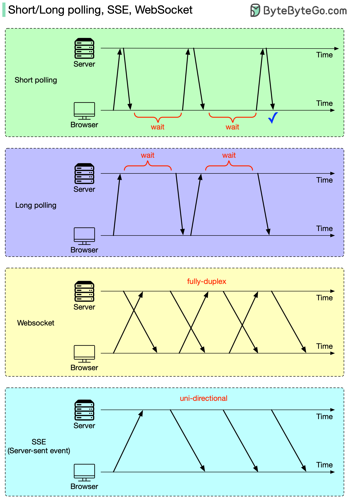

## **3 cơ chế real-time update trong web**: **Short Polling, Long Polling, SSE, và WebSocket**,

## ✅ **Vấn đề cốt lõi:**

HTTP là **giao thức theo mô hình request-response một chiều**, nghĩa là:

> **Trình duyệt (client)** luôn là bên **chủ động gửi request** > **Server** chỉ phản hồi khi có request → **không thể tự gửi dữ liệu sang client**

📌 Vì vậy, để **cập nhật dữ liệu theo thời gian thực (real-time)**, ta cần tìm **cách để server có thể gửi dữ liệu mới về phía client ngay khi có thay đổi**, thay vì phải đợi client hỏi lại.

---

## 🧠 **Giải pháp kỹ thuật:**

---

### 🔁 **1. Short Polling – Client tự hỏi liên tục**

#### 📌 Cách hoạt động:

- Trình duyệt gửi request đến server mỗi vài giây (ví dụ: 3s/lần)
- Server luôn phản hồi ngay lập tức với dữ liệu hiện tại (dù có hay không có gì mới)

#### ✅ Ưu điểm:

- Dễ cài đặt (dùng `setInterval + fetch`)
- Tương thích mọi trình duyệt

#### ❌ Nhược điểm:

- **Lãng phí tài nguyên** (gửi liên tục dù không có thay đổi)
- Tăng tải server, độ trễ không tối ưu

---

### ⏳ **2. Long Polling – Kéo dài request chờ dữ liệu mới**

#### 📌 Cách hoạt động:

- Client gửi request
- **Server giữ kết nối mở** cho đến khi có dữ liệu mới thì mới phản hồi
- Sau đó, client **lập tức gửi request mới**

#### ✅ Ưu điểm:

- **Giảm số lượng request**, phản hồi khi có thay đổi → **thời gian thực hơn short polling**

#### ❌ Nhược điểm:

- Cần server hỗ trợ giữ kết nối mở lâu
- Cần xử lý timeout, retry, lỗi kết nối

---

### 📡 **3. SSE (Server-Sent Events) – Server push đơn hướng**

#### 📌 Cách hoạt động:

- Client mở kết nối bằng `EventSource` (một loại request đặc biệt)
- Server giữ kết nối mở, và **stream dữ liệu dạng `text/event-stream`**
- Client **tự động nhận dữ liệu mỗi khi server gửi**

#### ✅ Ưu điểm:

- **Giao tiếp real-time thật sự** từ server → client
- Hỗ trợ reconnect tự động
- Dễ triển khai hơn WebSocket (vì vẫn dùng HTTP)

#### ❌ Nhược điểm:

- **Chỉ hỗ trợ một chiều** (server → client)
- Không tương thích với một số trình duyệt cũ (IE)
- Chỉ hỗ trợ giao thức HTTP (không dùng cho gRPC, WebSocket, v.v.)

---

### 🌐 **4. WebSocket – Kết nối 2 chiều thực sự**

#### 📌 Cách hoạt động:

- Client gửi HTTP request với `Upgrade: websocket`
- Nếu server đồng ý, hai bên thiết lập kết nối **WebSocket**
- Từ đó, **cả server và client đều có thể gửi/nhận dữ liệu bất kỳ lúc nào**

#### ✅ Ưu điểm:

- **Full-duplex real-time** (gửi/nhận hai chiều)
- Tối ưu cho ứng dụng như: chat, multiplayer game, trading, dashboard

#### ❌ Nhược điểm:

- **Phức tạp hơn** (cần server hỗ trợ WebSocket protocol)
- Có thể bị chặn bởi proxy hoặc firewall
- Không phải tất cả load balancer đều hỗ trợ tốt WebSocket (cần sticky session)

---

## 📊 **So sánh tổng quát**

| Kỹ thuật      | Hướng truyền | Real-time  | Phức tạp   | Ghi chú                              |
| ------------- | ------------ | ---------- | ---------- | ------------------------------------ |
| Short Polling | 1 chiều      | ❌         | Thấp       | Dễ triển khai nhưng tốn tài nguyên   |
| Long Polling  | 1 chiều      | ✅ Tạm ổn  | Trung bình | Giữ kết nối lâu, cần xử lý timeout   |
| SSE           | 1 chiều      | ✅ Tốt     | Trung bình | Dễ dùng, nhưng không gửi lên server  |
| WebSocket     | 2 chiều      | ✅ Rất tốt | Cao        | Real-time thật sự, cần cấu hình thêm |

---

## 🟦 **Kết luận khi trả lời phỏng vấn:**

> “Vì HTTP không cho phép server tự gửi dữ liệu, nên để cập nhật real-time, em sử dụng các phương pháp như polling, SSE, hoặc WebSocket tùy theo use-case.
> Với các ứng dụng đơn giản như thông báo hoặc stream dữ liệu từ server, em chọn **SSE** vì nhẹ, đơn giản và hiệu quả.
> Nhưng với các ứng dụng cần giao tiếp 2 chiều như chat, dashboard realtime hay game, em chọn **WebSocket** để có kết nối full-duplex, giảm độ trễ, tăng trải nghiệm người dùng.”
