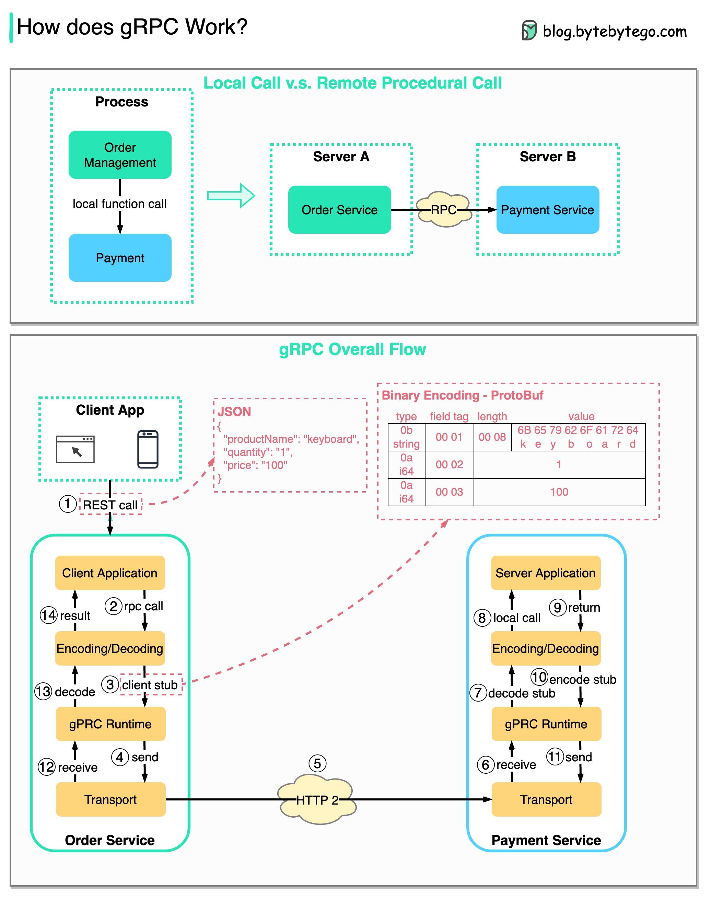

## ✅ **RPC (Remote Procedure Call) là gì và tại sao gọi là "Remote"?**

- **RPC** là mô hình cho phép một chương trình gọi một hàm hoặc thủ tục nằm ở **một máy chủ khác (remote server)** như thể nó là một hàm cục bộ.
- Từ góc độ của lập trình viên, nó giống như:

  ```go
  paymentService.ChargeCard(userId, amount)
  ```

  nhưng thực tế là lời gọi này sẽ **được mã hóa, gửi qua mạng** , thực thi ở phía server, sau đó kết quả được **gửi ngược lại** .

---

## 🌐 **Tại sao RPC phổ biến trong microservices?**

- Microservices thường được triển khai trên các server khác nhau → cần **giao tiếp qua mạng** .
- RPC giúp đơn giản hóa việc gọi qua mạng → giống như gọi hàm cục bộ.
- **gRPC** là một trong những framework RPC phổ biến nhất hiện nay, sử dụng:
  - **Protocol Buffers (protobuf)** để encode dữ liệu dạng nhị phân
  - **HTTP/2** làm giao thức truyền tải → hỗ trợ multiplexing, low-latency

---

## 🧭 **Giải thích sơ đồ dữ liệu gRPC từ client đến server**

---

### ✅ **Step 1: Client gọi REST API**

- Trình duyệt hoặc ứng dụng frontend gửi request dạng **HTTP + JSON** đến Order Service.
- Ví dụ: `POST /order` với body:
  ```json
  { "userId": 123, "amount": 50 }
  ```

---

### ✅ **Steps 2 - 4: Order Service (gRPC Client) chuẩn bị RPC call**

- **Order Service** nhận request REST → chuyển đổi dữ liệu JSON sang **protobuf format** .
- Gọi đến hàm client stub của gRPC:
  ```go
  paymentClient.Charge(userId, amount)
  ```
- gRPC **mã hóa request thành nhị phân** , và gửi xuống tầng transport.

---

### ✅ **Step 5: Gửi dữ liệu qua HTTP/2**

- gRPC sử dụng **HTTP/2** để gửi packet đi → tối ưu về tốc độ, đa luồng, và hiệu quả hơn HTTP/1.1.
- So với JSON + REST, **gRPC nhanh hơn gấp ~5 lần** nhờ:
  - Dữ liệu nhị phân nhẹ hơn
  - Ít tốn CPU và băng thông
  - HTTP/2 hỗ trợ multiplex (nhiều stream trên 1 kết nối TCP)

---

### ✅ **Steps 6 - 8: Payment Service (gRPC Server) xử lý**

- gRPC server **nhận packet** , giải mã từ binary thành object protobuf.
- Gọi vào logic ứng dụng phía server, ví dụ:
  ```go
  func (s *PaymentServer) Charge(...) { ... }
  ```

---

### ✅ **Steps 9 - 11: Trả kết quả về client**

- Server xử lý xong sẽ trả về object protobuf → gRPC **mã hóa thành binary** .
- Gửi ngược lại về phía Order Service qua HTTP/2.

---

### ✅ **Steps 12 - 14: Order Service trả kết quả cho client**

- Order Service **giải mã protobuf** , chuyển thành JSON (nếu cần).
- Trả lại cho frontend dưới dạng response HTTP như bình thường.

---

## 🧠 **Tóm tắt điểm mạnh của gRPC so với REST:**

| Tiêu chí         | REST (HTTP/JSON)   | gRPC (HTTP/2 + Protobuf)           |
| ---------------- | ------------------ | ---------------------------------- |
| **Tốc độ**       | Chậm hơn           | ✅ Nhanh hơn (binary)              |
| **Định dạng**    | JSON               | ✅ Protobuf (nhẹ hơn)              |
| **Streaming**    | Không tối ưu       | ✅ Hỗ trợ bidirectional            |
| **Code gen**     | Không tự sinh code | ✅ Sinh stub client/server tự động |
| **Hệ sinh thái** | Phổ biến, đơn giản | Cần setup thêm                     |

---

## 🟦 **Kết luận khi trả lời phỏng vấn:**

> “gRPC giúp các service giao tiếp với nhau một cách hiệu quả trong môi trường microservices. So với REST, gRPC mang lại **hiệu suất cao hơn** , **truyền dữ liệu nhẹ hơn** , và hỗ trợ nhiều tính năng như **streaming, code generation** . Nó giúp chúng ta giao tiếp qua mạng như gọi hàm nội bộ, nhưng vẫn đảm bảo hiệu quả, mở rộng, và chuẩn hóa.”
