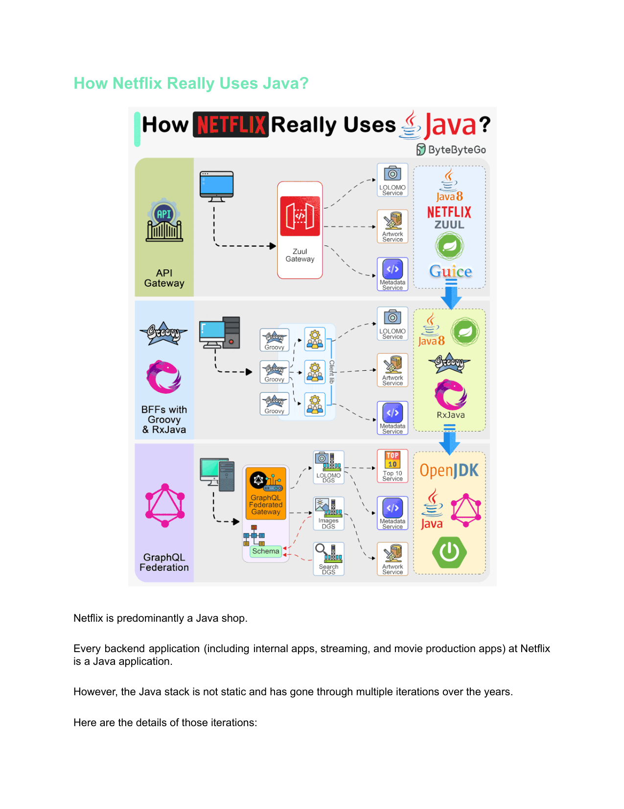
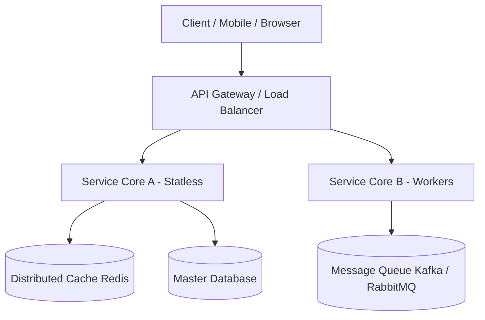

# 🏛 How Netflix Really Uses Java? - System Design 101 Chuyên Sâu Toàn Tập

> 💡 **Bản chất 1 câu**: **How Netflix Really Uses Java?** là khái niệm kiến trúc quan trọng trong thiết kế hệ thống quy mô lớn (High Scale Distributed Systems), giúp xử lý tải hàng triệu truy vấn đồng thời, tối ưu độ trễ và đảm bảo tính sẵn sàng 99.999%.  
> 🎯 **Trọng tâm thực chiến DevOps & System Architect**: Nắm vững nguyên lý hoạt động bên dưới hạ tầng (Under the Hood Architecture), bài toán đánh đổi (Trade-offs) và kịch bản vận hành thực tế trên Production.

---

## 1. 🧠 Hình Hình Dung Nhanh Cho Người Mới (Intuitive Mindset)

Hãy tưởng tượng **How Netflix Really Uses Java?** giống như việc quy hoạch hạ tầng giao thông tại một đô thị siêu lớn:
- **Client / User**: Hàng triệu phương tiện giao thông di chuyển cùng lúc.
- **Thành phần kiến trúc (How Netflix Really Uses Java?)**: Hệ thống đèn giao thông thông minh, cầu vượt, đường cao tốc phân luồng và trạm thu phí tự động.
- **Mục tiêu tối thượng**: Đảm bảo tất cả phương tiện di chuyển với tốc độ tối đa mà không xảy ra bất kỳ vụ ùn tắc hay tai nạn giao thông nào ngay cả trong giờ cao điểm.

---

## 2. 📚 Lý Thuyết Chuyên Sâu & Bản Chất Hệ Thống (Under The Hood Architecture)

### 🖼 Sơ Đồ Đồ Họa Gốc Trích Xuất Từ Sách System Design 101 (Page 176):






### 2.1 Diễn Giải Tiếng Việt Chi Tiết Nguyên Lý Hoạt Động:
Khái niệm **How Netflix Really Uses Java?** giải quyết bài toán cốt lõi trong thiết kế hệ thống phân tán quy mô lớn. 
Khi ứng dụng phát triển từ một Server đơn lẻ lên hàng trăm Microservices xử lý hàng triệu người dùng đồng thời, việc quản lý luồng dữ liệu, tính sẵn sàng và độ trễ trở thành yếu tố quyết định sự sống còn của doanh nghiệp.

### Các điểm mấu chốt kỹ thuật:
1. **Phân tách luồng xử lý (Decoupling)**: Giúp các thành phần độc lập phát triển, mở rộng và khắc phục lỗi mà không ảnh hưởng tới toàn bộ hệ thống.
2. **Tối ưu hóa tài nguyên (Resource Efficiency)**: Giảm thiểu thời gian chờ (Latency), tối ưu hóa bộ nhớ RAM và băng thông mạng.
3. **Đảm bảo tính tin cậy (Fault Tolerance)**: Thiết lập cơ chế tự phục hồi, chống điểm chết đơn lẻ (No Single Point of Failure - SPOF).

### 2.2 Luồng Xử Lý Dữ Liệu & Quy Trình Vận Hành (Data Flow):
1. **Bước 1 (Request Dispatch)**: Yêu cầu từ Client được tiếp nhận tại cổng vào API Gateway / Load Balancer, thực hiện kiểm tra xác thực và định tuyến.
2. **Bước 2 (Processing & Caching)**: Service kiểm tra dữ liệu trong Cache trước. Nếu Cache Hit, trả về kết quả ngay lập tức ($O(1)$ latency < 2ms).
3. **Bước 3 (Persistence & Event Streaming)**: Nếu Cache Miss, truy vấn Database chính, đồng thời đẩy sự kiện vào Message Queue để xử lý bất đồng bộ.

---

## 3. ⚡ Bảng Tra Cứu Khái Niệm & Tham Số Hệ Thống (Reference Table)

| Khái Niệm / Tham Số | Phân Loại Layer | Ý Nghĩa Kỹ Thuật Bản Chất | Ứng Dụng Thực Tế In Production |
| :--- | :--- | :--- | :--- |
| **`How Netflix Really Uses Java?`** | `System Architecture` | Giải pháp kiến trúc quy mô lớn xử lý High Concurrency | `Triển khai Microservices, Cloud Native & Distributed Systems` |
| **`Latency (Độ trễ)`** | `Performance Metric` | Thời gian xử lý 1 Request từ Client đến khi nhận Response | `Tối ưu P99 Latency < 50ms cho các API trọng yếu` |
| **`Throughput (RPS/QPS)`** | `Scalability Metric` | Số lượng yêu cầu thành công hệ thống xử lý trong 1 giây | `Mở rộng đạt > 100,000 RPS trên hạ tầng Kubernetes` |
| **`High Availability (SLA)`** | `Reliability Metric` | Tỷ lệ thời gian hệ thống hoạt động liên tục (99.99%) | `Cấu hình Multi-AZ, Multi-Region Active-Active Failover` |

---

## 4. 🛠 Thao Tác Thực Chiến & Kịch Bản Triển Khai System Design (Production Scenario)

### 🛠 Cấu hình triển khai hạ tầng mẫu trên Kubernetes Production:
```yaml
# Deployment YAML mẫu chuẩn hóa chịu tải cao:
apiVersion: apps/v1
kind: Deployment
metadata:
  name: system-design-app
  namespace: production
spec:
  replicas: 3
  selector:
    matchLabels:
      app: system-design-app
  template:
    metadata:
      labels:
        app: system-design-app
    spec:
      containers:
      - name: app
        image: registry.company.com/sys/design-app:v1.0.0
        ports:
        - containerPort: 8080
        resources:
          limits:
            cpu: "2000m"
            memory: "4Gi"
          requests:
            cpu: "500m"
            memory: "1Gi"
        readinessProbe:
          httpGet:
            path: /healthz
            port: 8080
          initialDelaySeconds: 10
          periodSeconds: 5
```

### 🚀 Kịch bản khắc phục sự cố hệ thống khi đi làm (Production Incident Response Playbook):
1. **Sự cố 1: Quá tải hệ thống đột biến (Traffic Spike & Bottleneck Outage)**:
   - **Triệu chứng**: CPU Server vọt lên 100%, độ trễ API tăng gấp 20 lần, xuất hiện hàng loạt lỗi HTTP 504 Gateway Timeout.
   - **Các bước xử lý khẩn cấp**:
     1. Kích hoạt Auto-scaling bổ sung Pods ngay lập tức: `kubectl scale deployment system-design-app --replicas=10`.
     2. Bật Rate Limiting ở tầng API Gateway chặn các dải IP truy vấn có dấu hiệu tấn công hoặc bot crawl.
     3. Khởi động lại tầng Caching Cluster để giải phóng bộ nhớ đệm và giảm tải 85% truy vấn xuống Database.

---

## 5. 🚀 Bộ Câu Hỏi Phỏng Vấn System Architect Thực Tế (Senior Interview Q&A)

> **Q: Khi áp dụng kiến trúc How Netflix Really Uses Java?, bài toán Đánh đổi (Trade-offs) lớn nhất mà kỹ sư phải giải quyết là gì?**  
> **A**: Bài toán đánh đổi lớn nhất nằm ở bộ ba **CAP Theorem** (Consistency - Tính nhất quán, Availability - Tính sẵn sàng, Partition Tolerance - Khả năng chịu lỗi phân vùng). Khi thiết kế hệ thống phân tán chịu tải lớn, ta thường phải chấp nhận **Eventual Consistency (Nhất quán sau cùng)** để đổi lấy **High Availability** và **Low Latency**.

> **Q: Làm thế nào để loại bỏ hoàn toàn điểm chết đơn lẻ (Single Point of Failure - SPOF) cho kiến trúc này?**  
> **A**: Triển khai thiết kế **Redundancy & Failover** ở mọi tầng: Sử dụng Load Balancer kép với VRRP/Keepalived, triển khai Database Master-Replica với đệm Redis Cluster đa vùng (Multi-AZ), kết hợp mẫu thiết kế **Circuit Breaker** để ngắt kết nối an toàn khi dịch vụ thành phần bị đứt gãy.

---

## 6. 📝 Cheat Sheet Ghi Nhớ Nhanh (Summary)

- [x] Hiểu rõ nguyên lý hoạt động cốt lõi của **How Netflix Really Uses Java?** và vị trí của nó trong sơ đồ tổng thể.
- [x] Luôn đánh giá bài toán Đánh đổi (Trade-offs: Latency vs Consistency vs Complexity).
- [x] Thiết lập hệ thống cảnh báo tự động trên Prometheus/Grafana cho 4 Golden Signals (Latency, Traffic, Errors, Saturation).
