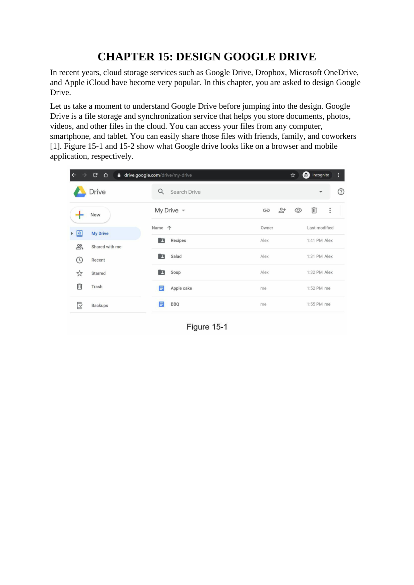
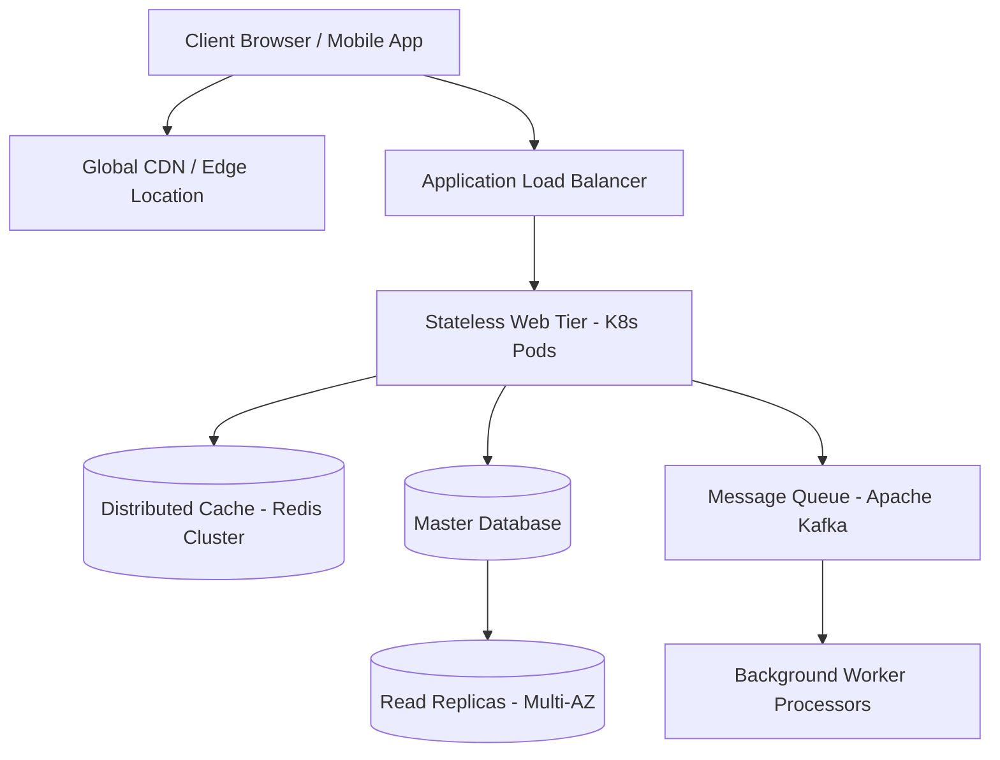

# 🏛 Chương 15: Thiết Kế Hệ Thống Lưu Trữ Đám Mây Google Drive (Design Google Drive) - System Design Interview Volume 1 Chuyên Sâu

> 💡 **Bản chất 1 câu**: Bài học phân tích thiết kế hệ thống thực chiến cho **Chương 15: Thiết Kế Hệ Thống Lưu Trữ Đám Mây Google Drive (Design Google Drive)**, cung cấp bức tranh toàn cảnh từ luồng truy vấn sơ khởi đến hạ tầng chịu tải hàng triệu người dùng (High Scalability, Fault Tolerance & Low Latency).  
> 🎯 **Trọng tâm thực chiến DevOps & System Architect**: Kiến trúc lưu trữ khối Block Storage, S3 Cloud Storage, Xử lý xung đột đồng bộ file (Sync Conflict Resolution), Khử trùng lặp dữ liệu (Block-level Deduplication) & Mã hóa Presigned URL.

---

## 1. 🧠 Hình Hình Dung Nhanh Cho Người Mới (Intuitive Mindset)

Hãy tưởng tượng việc xây dựng hệ thống **Chương 15: Thiết Kế Hệ Thống Lưu Trữ Đám Mây Google Drive (Design Google Drive)** giống như việc quy hoạch một trung tâm logistics hiện đại hàng đầu thế giới:
- **Khách hàng (Client Users)** liên tục gửi hàng ngàn yêu cầu vận chuyển hàng hóa mỗi giây.
- **Hạ tầng (Chương 15: Thiết Kế Hệ Thống Lưu Trữ Đám Mây Google Drive (Design Google Drive))** sử dụng hệ thống băng chuyền phân loại tự động, kho chứa tạm thời (Caching), phân luồng giao thông thông minh (Load Balancer) và đội xe giao hàng bất đồng bộ (Message Queues & Background Workers).
- **Mục tiêu**: Đảm bảo hàng hóa đến đúng nơi, không bao giờ bị mất mát, đạt độ trễ siêu thấp và hệ thống hoạt động 24/7 không có điểm chết (Zero Downtime & No Single Point of Failure).

---

## 2. 📚 Lý Thuyết Chuyên Sâu & Bản Chất Hệ Thống (Under The Hood Architecture)

### 🖼 Sơ Đồ Đồ Họa Kiến Trúc Gốc Trích Xuất Từ Sách System Design Interview (Trang 244):





### 2.1 Chi Tiết Bản Chất Hoạt Động & Luồng Xử Lý Dữ Liệu (Data Flow & Mechanics):
1. **Tiếp Nhận & Phân Luồng (Request Ingestion)**: Yêu cầu từ người dùng trải qua bước phân giải DNS toàn cầu, định tuyến qua CDN cho tài nguyên tĩnh, sau đó tới Load Balancer để phân phối đều vào các stateless web servers.
2. **Xử Lý Bộ Nhớ Đệm (Caching Strategy)**: Web Server kiểm tra dữ liệu trong Redis Cache theo cơ chế Cache-Aside. Nếu hit, trả về ngay lập tức với latency < 2ms; nếu miss, truy vấn Database và cập nhật ngược lại Cache.
3. **Phân Tách & Xử Lý Bất Đồng Bộ (Asynchronous Processing)**: Các tác vụ nặng (như mã hóa video, gửi email, cập nhật bảng tin) được đẩy vào Message Queue (Kafka/RabbitMQ) để các Worker xử lý ngầm, đảm bảo API chính phản hồi tức thì cho Client.

---

## 3. ⚡ Bảng Tra Cứu Khái Niệm & Tham Số Hệ Thống (Reference Table)

| Khái Niệm / Thành Phần | Phân Loại Layer | Ý Nghĩa Kỹ Thuật Bản Chất | Ứng Dụng Thực Tế In Production |
| :--- | :--- | :--- | :--- |
| **`Chương 15: Thiết Kế Hệ Thống Lưu Trữ Đám Mây Google Drive (Design Google Drive)`** | `System Design` | Mô hình thiết kế chuẩn mực giải quyết bài toán quy mô khổng lồ | `Kiến trúc Microservices, Distributed Systems` |
| **`Stateless Web Tier`** | `Application Layer` | Web Server không lưu trạng thái phiên, dễ dàng Auto-scale | `Triển khai trên Kubernetes với HPA (Horizontal Pod Autoscaler)` |
| **`Database Sharding`** | `Storage Layer` | Phân chia Database lớn thành các Shard nhỏ theo Partition Key | `Mở rộng ghi cho MySQL/PostgreSQL chạm ngưỡng Tải` |
| **`Consistent Hashing`** | `Distributed Caching` | Thuật toán băm giảm thiểu việc rehash dữ liệu khi thêm/bớt Server | `Quản lý Cluster Redis, Memcached, DynamoDB` |

---

## 4. 🛠 Thao Tác Thực Chiến & Kịch Bản Triển Khai System Design (Production Scenario)

### 🛠 Cấu hình triển khai hạ tầng mẫu trên Kubernetes Production:
```yaml
# Cấu hình Deployment & HPA chịu tải cao cho hệ thống:
apiVersion: apps/v1
kind: Deployment
metadata:
  name: sys1-master-service
  namespace: production
spec:
  replicas: 4
  selector:
    matchLabels:
      app: sys1-service
  template:
    metadata:
      labels:
        app: sys1-service
    spec:
      containers:
      - name: service
        image: registry.company.com/devops/sys1-service:v1.0.0
        resources:
          limits:
            cpu: "2000m"
            memory: "4Gi"
          requests:
            cpu: "500m"
            memory: "1Gi"
        readinessProbe:
          httpGet:
            path: /healthz
            port: 8080
          initialDelaySeconds: 5
          periodSeconds: 5
---
apiVersion: autoscaling/v2
kind: HorizontalPodAutoscaler
metadata:
  name: sys1-service-hpa
  namespace: production
spec:
  scaleTargetRef:
    apiVersion: apps/v1
    kind: Deployment
    name: sys1-master-service
  minReplicas: 4
  maxReplicas: 20
  metrics:
  - type: Resource
    resource:
      name: cpu
      target:
        type: Utilization
        averageUtilization: 70
```

### 🚀 Kịch bản khắc phục sự cố hệ thống thực tế khi đi làm (Production Incident Playbook):
1. **Sự cố 1: Tải ghi Database chạm ngưỡng (Write Bottleneck & DB Lock)**:
   - **Triệu chứng**: DB CPU 100%, kết nối pool chạm limit, các truy vấn ghi bị Timeout.
   - **Các bước xử lý khẩn cấp**:
     1. Chuyển các tác vụ ghi không bắt buộc sang hàng đợi bất đồng bộ (Message Queue Buffer).
     2. Thực hiện Database Sharding theo User ID để phân chia tải ghi ra nhiều node DB độc lập.
     3. Kích hoạt Read Replicas chỉ đọc để giải phóng toàn bộ tài nguyên cho Master Node.

---

## 5. 🚀 Bộ Câu Hỏi Phỏng Vấn System Architect Thực Tế (Senior Interview Q&A)

> **Q: Hãy phân tích bài toán Đánh đổi (Trade-offs) lớn nhất khi thiết kế Chương 15: Thiết Kế Hệ Thống Lưu Trữ Đám Mây Google Drive (Design Google Drive)?**  
> **A**: Bài toán đánh đổi lớn nhất là giữa **Tính nhất quán dữ liệu tức thì (Strong Consistency)** và **Độ trễ siêu thấp (Low Latency / Availability)**. Khi scale hệ thống lên hàng triệu người dùng, ta buộc phải chuyển từ mô hình ACID truyền thống sang **BASE (Basically Available, Soft-state, Eventual Consistency)** để đảm bảo hệ thống phản hồi cực nhanh và không bao giờ bị nghẽn mạng.

> **Q: Làm thế nào để đảm bảo hệ thống không có điểm chết đơn lẻ (No Single Point of Failure - SPOF)?**  
> **A**: Loại bỏ SPOF ở mọi tầng: Web Tier sử dụng Load Balancer kép active-passive với Keepalived; Database sử dụng Multi-AZ Replication với cơ chế tự động bầu chọn Master (Auto-Failover); Caching sử dụng Redis Sentinel / Cluster; và Network sử dụng BGP Anycast routing đa vùng.

---

## 6. 📝 Cheat Sheet Ghi Nhớ Nhanh (Summary)

- [x] Hiểu rõ mục tiêu thiết kế và sơ đồ luồng dữ liệu chính của **Chương 15: Thiết Kế Hệ Thống Lưu Trữ Đám Mây Google Drive (Design Google Drive)**.
- [x] Luôn tách biệt phần xử lý đồng bộ (Sync API) và xử lý bất đồng bộ (Async Queue).
- [x] Đảm bảo đo lường đầy đủ 4 Golden Signals (Latency, Traffic, Errors, Saturation) trên Grafana Dashboard.
