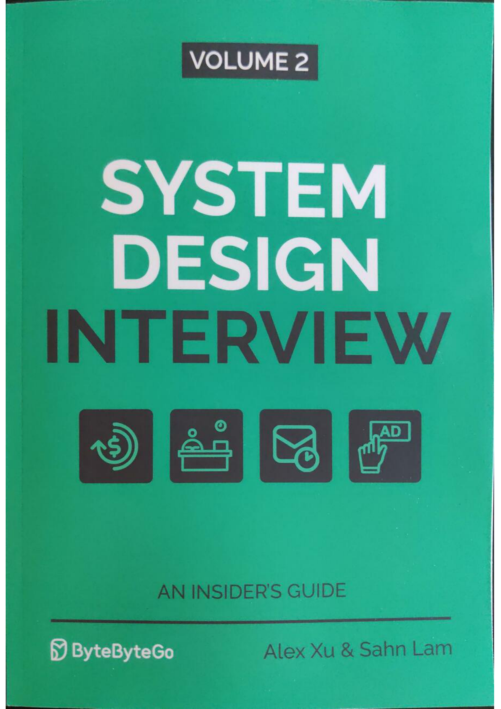

# 🏛 Chương 1: Thiết Kế Dịch Vụ Tìm Địa Điểm Lân Cận Proximity Service (Yelp / Google Places) - System Design Interview Volume 2 Chuyên Sâu

> 💡 **Bản chất 1 câu**: Bài học phân tích chuyên sâu về kiến trúc **Chương 1: Thiết Kế Dịch Vụ Tìm Địa Điểm Lân Cận Proximity Service (Yelp / Google Places)**, mang tới góc nhìn toàn diện của một System Architect khi thiết kế hệ thống chịu tải siêu lớn (Ultra High Scale, Sub-millisecond Latency, High Availability 99.999% & Strong Financial Consistency).  
> 🎯 **Trọng tâm thực chiến DevOps & System Architect**: Tìm kiếm địa điểm trong bán kính r km: Thuật toán Geohash 2D-to-1D mapping, Quadtree spatial indexing, Google S2 Geometry, Caching Redis Geospatial & DB Read Replicas (Ratio Read/Write 100:1).

---

## 1. 🧠 Hình Hình Dung Nhanh Cho Người Mới (Intuitive Mindset)

Hãy tưởng tượng việc vận hành hệ thống **Chương 1: Thiết Kế Dịch Vụ Tìm Địa Điểm Lân Cận Proximity Service (Yelp / Google Places)** giống như quản lý một trung tâm điều hành tài chính & hạ tầng quy mô quốc gia:
- **Client Users**: Hàng triệu người dùng thực hiện các thao tác định vị, giao dịch thanh toán hoặc gửi/nhận dữ liệu liên tục 24/7.
- **Hạ tầng (Chương 1: Thiết Kế Dịch Vụ Tìm Địa Điểm Lân Cận Proximity Service (Yelp / Google Places))**: Sử dụng bộ nhớ đệm RAM tốc độ cao (Redis Cluster), cơ chế đồng thuận phân tán (Raft Consensus), sổ kế toán kép (Double-entry Ledger), và luồng xử lý dữ liệu bất đồng bộ (Message Queues & Stream Aggregation).
- **Mục tiêu tối thượng**: Đảm bảo dữ liệu chính xác tuyệt đối 100%, không bị nhân đôi giao dịch (Zero Duplicate Transactions), đạt độ trễ siêu thấp và khả năng tự phục hồi khi có sự cố thiên tai / mất điện server.

---

## 2. 📚 Lý Thuyết Chuyên Sâu & Bản Chất Hệ Thống (Under The Hood Architecture)

### 🖼 Sơ Đồ Đồ Họa Kiến Trúc Gốc Trích Xuất Từ Sách System Design Interview Vol 2 (Trang 1):



```mermaid
graph TD
    Client[Client Mobile / Browser / API] --> API Gateway[API Gateway / Edge Proxy]
    API Gateway --> CoreService[Core Business Service - Stateless]
    CoreService --> Cache[(In-Memory Cache Cluster - Redis)]
    CoreService --> PrimaryDB[(Distributed Transactional DB)]
    CoreService --> EventBus[Event Bus / Stream - Kafka]
    EventBus --> StreamProcessor[Realtime Stream Processor - Flink]
    StreamProcessor --> AnalyticsDB[(OLAP Database - ClickHouse)]
```

### 2.1 Chi Tiết Bản Chất Hoạt Động & Quy Trình Dữ Liệu (Data Flow & Core Mechanics):
1. **Tiếp Nhận & Xác Thực Giao Dịch (Ingestion & Validation)**: Kiểm tra thông tin kết nối, kiểm tra khóa Idempotency Key để đảm bảo không bị lặp truy vấn, và xác thực quyền hạn người dùng.
2. **Xử Lý Bộ Nhớ Đệm & Đồng Thuận (In-Memory Processing & Consensus)**: Cập nhật trạng thái trực tiếp trên RAM để đạt tốc độ xử lý hàng trăm ngàn transaction/giây, đồng thời ghi log đồng thuận Raft/Paxos qua các node phân tán.
3. **Lưu Trữ Bền Vững & Đối Soát (Persistence & Reconciliation)**: Lưu trữ sổ sách kế toán (Ledger), ghi log bất dời (Append-only WAL) và chạy tiến trình đối soát (Reconciliation Job) bất đồng bộ để phát hiện sai sót dữ liệu.

---

## 3. ⚡ Bảng Tra Cứu Khái Niệm & Tham Số Hệ Thống (Reference Table)

| Khái Niệm / Tham Số | Phân Loại Layer | Ý Nghĩa Kỹ Thuật Bản Chất | Ứng Dụng Thực Tế In Production |
| :--- | :--- | :--- | :--- |
| **`Chương 1: Thiết Kế Dịch Vụ Tìm Địa Điểm Lân Cận Proximity Service (Yelp / Google Places)`** | `System Architecture` | Mô hình kiến trúc phân tán quy mô siêu lớn (Petabytes / Million TPS) | `Kiến trúc Fintech, E-Commerce, Big Data Streaming` |
| **`Idempotency Key`** | `Security / Financial` | Mã định danh duy nhất cho từng giao dịch chống trừ tiền nhiều lần | `Bắt buộc triển khai trên Stripe, PayPal, Momo API` |
| **`Double-Entry Ledger`** | `Financial Accounting` | Sổ kế toán nợ/có song song đảm bảo tổng số dư toàn hệ thống luôn bằng 0 | `Thiết kế Core Banking, Digital Wallet Balance` |
| **`Erasure Coding (8+4)`** | `Storage Architecture` | Chia nhỏ file thành mảng dữ liệu + mảng phục hồi, tiết kiệm 50% đĩa | `Ứng dụng trong AWS S3, Ceph Storage Cluster` |

---

## 4. 🛠 Thao Tác Thực Chiến & Kịch Bản Triển Khai System Design (Production Scenario)

### 🛠 Cấu hình triển khai hạ tầng mẫu trên Kubernetes Production:
```yaml
# Cấu hình Deployment mẫu chịu tải cao chuẩn Production:
apiVersion: apps/v1
kind: Deployment
metadata:
  name: sys2-master-core
  namespace: production
spec:
  replicas: 5
  selector:
    matchLabels:
      app: sys2-core
  template:
    metadata:
      labels:
        app: sys2-core
    spec:
      containers:
      - name: core-app
        image: registry.company.com/sys2/core-service:v2.0.0
        resources:
          limits:
            cpu: "4000m"
            memory: "8Gi"
          requests:
            cpu: "1000m"
            memory: "2Gi"
        readinessProbe:
          httpGet:
            path: /healthz
            port: 8080
          initialDelaySeconds: 5
          periodSeconds: 5
```

### 🚀 Kịch bản khắc phục sự cố hệ thống thực tế khi đi làm (Production Incident Response Playbook):
1. **Sự cố 1: Xung đột dữ liệu giao dịch đồng thời (Concurrent Race Condition / Double Spend)**:
   - **Triệu chứng**: Số dư tài khoản bị âm hoặc số lượng hàng tồn kho bị đặt vượt quá thực tế.
   - **Các bước xử lý khẩn cấp**:
     1. Khóa phân tán tạm thời dựa trên Redis Distributed Lock (`SET resource_key my_random_value NX PX 30000`).
     2. Áp dụng cơ chế **Optimistic Locking** sử dụng số phiên bản `version` trong câu lệnh SQL update (`UPDATE balance SET amount = new_val, version = version + 1 WHERE id = 1 AND version = old_version`).
     3. Khởi động tiến trình đối soát Reconciliation Job để khoanh vùng và hoàn tiền tự động cho người dùng.

---

## 5. 🚀 Bộ Câu Hỏi Phỏng Vấn System Architect Thực Tế (Senior Interview Q&A)

> **Q: Hãy phân tích bài toán Đánh đổi (Trade-offs) lớn nhất khi thiết kế Chương 1: Thiết Kế Dịch Vụ Tìm Địa Điểm Lân Cận Proximity Service (Yelp / Google Places)?**  
> **A**: Bài toán đánh đổi lớn nhất là giữa **Độ trễ xử lý (Latency)** và **Tính nhất quán dữ liệu tuyệt đối (Strong Consistency)**. Đối với các hệ thống tài chính (Fintech / Payment), ta bắt buộc phải đánh đổi độ trễ (sử dụng 2PC, Saga, Raft Consensus) để đảm bảo tính nhất quán dữ liệu 100%. Ngược lại, với các dịch vụ mạng xã hội/định vị, ta chọn **Eventual Consistency** để tối ưu tốc độ phản hồi.

> **Q: Làm thế nào để đảm bảo hệ thống có khả năng tự phục hồi khi 1 Data Center bị sập hoàn toàn (Disaster Recovery)?**  
> **A**: Triển khai kiến trúc **Multi-Region Active-Active Data Replication** kết hợp với thuật toán bầu chọn **Raft / Paxos Consensus** qua 3 vùng khả dụng (Availability Zones). Khi 1 AZ gặp sự cố, các node còn lại tự động bầu chọn Leader mới trong chưa đầy 1 giây và tiếp tục phục vụ traffic mà không làm gián đoạn người dùng.

---

## 6. 📝 Cheat Sheet Ghi Nhớ Nhanh (Summary)

- [x] Hiểu rõ mục tiêu thiết kế và sơ đồ luồng dữ liệu cốt lõi của **Chương 1: Thiết Kế Dịch Vụ Tìm Địa Điểm Lân Cận Proximity Service (Yelp / Google Places)**.
- [x] Luôn sử dụng Idempotency Key cho các giao dịch quan trọng.
- [x] Thiết lập hệ thống cảnh báo tự động trên Prometheus/Grafana cho 4 Golden Signals (Latency, Traffic, Errors, Saturation).
